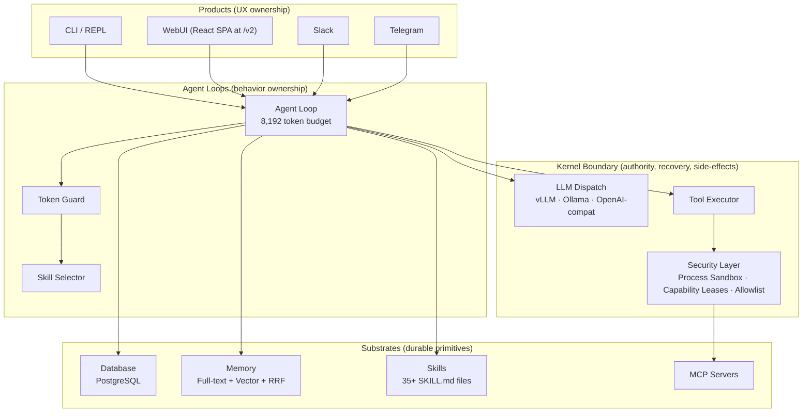

<p align="center">
  
</p>

<h1 align="center">BrassClaw</h1>

<p align="center">
  <strong>Your secure personal AI assistant — runs entirely on your hardware</strong>
</p>

<p align="center">
  <a href="https://github.com/chtugha/brassclaw/releases/latest"></a>
  <a href="#license"></a>
</p>

<p align="center">
  <a href="#philosophy">Philosophy</a> •
  <a href="#features">Features</a> •
  <a href="#quick-start">Quick Start</a> •
  <a href="#local-llm-setup">Local LLM Setup</a> •
  <a href="#configuration">Configuration</a> •
  <a href="#skills">Skills</a> •
  <a href="#architecture">Architecture</a> •
  <a href="#heritage">Heritage</a>
</p>

---

## Philosophy

BrassClaw is built on a simple principle: **your AI assistant should work for you, not against you**.

- **100% local operation** — runs on your own hardware with vLLM, Ollama, or any OpenAI-compatible server; no cloud account required
- **Your data stays yours** — all information stored locally, encrypted, never leaves your control
- **Fits consumer hardware** — tuned to work within an 8,192-token context window; 7B models work well with 4 GB VRAM
- **Defense in depth** — process sandbox, capability leases, prompt injection defense, and endpoint allowlisting
- **Open source** — fully auditable, no telemetry or data harvesting
- **Self learning mechanism** — the design aims to leave more and more tasks to the agent, and to reduce the involvement of an llm

- **The beast at home** - brassclaw is momentarily tailored for kv-caching - and will in the future concentrate to have a certain set of basic-prompts via lmcache that will be tailored together with the users query and some context to enables a small ornith 9b model, running on a budget 16bg vram RTX, to process a prompt with 200k tokens very fast (bc it actually just processes the few tokens you add as information, all the rest was already precalculated and can be accessed - like this you and can make a tiny system very powerful. And even more if you mainly use that power to get rid of as many llm calls as possible and empower the agent to perform tasks on its own.

---

## Features

### Home-Use Optimised

- **Token-aware engine** — hard budget of 8,192 total prompt tokens; automatically trims skill context, memory docs, and history to fit any local model
- **Knowledge-driven tools** — Skills (markdown files) teach the LLM how to use APIs via the `http` tool; no compilation needed for new integrations
- **Skill budgets** — each skill declares its token cost; the selector fits within the 2,048-token skill budget

### Security First

- **Process Sandbox** — untrusted tool subprocesses (shell, docker-exec, git) run in `brassclaw_process_sandbox` with capability leases, scoped filesystems, and endpoint allowlists (replaces the v1 WebAssembly sandbox removed in Phase 4)
- **Capability Leases** — fine-grained, revocable authority grants for every tool call
- **Credential Protection** — secrets never exposed to tools; injected at the host boundary with leak detection
- **Prompt Injection Defense** — pattern detection, content sanitisation, and policy enforcement
- **Endpoint Allowlisting** — HTTP requests only to explicitly approved hosts and paths

### Always Available

- **Multi-channel** — REPL, WebUI (React SPA at `/v2`), Slack, Telegram, HTTP webhooks, and API server
- **Routines** — cron schedules, event triggers, webhook handlers for background automation
- **Persistent memory** — hybrid full-text + vector search with Reciprocal Rank Fusion
- **Sub-agents** — spawn specialised child agents for complex tasks

### Self-Expanding

- **Knowledge-driven integrations** — add new API integrations by writing a `SKILL.md` file (no code required)
- **MCP Protocol** — connect to any Model Context Protocol server
- **Learning missions** — automatic skill extraction, repair, and self-improvement

---

## Quick Start

**Minimum requirements:** any machine with ~8 GB RAM, a modern 64-bit CPU, and about 4 GB of free disk space for models.

### Option A: Linux Server — one-line install (recommended)

Downloads the latest pre-built binary from GitHub Releases and registers it as a systemd service:

```bash
curl -fsSL https://raw.githubusercontent.com/chtugha/brassclaw/main/install.sh | sudo bash
```

Or download and review first (recommended):

```bash
curl -fsSL https://raw.githubusercontent.com/chtugha/brassclaw/main/install.sh -o install.sh
less install.sh
sudo bash install.sh
```

The installer will:
- Detect your platform (Linux x86\_64, macOS ARM64, macOS x86\_64)
- Download the latest binary from GitHub Releases and verify its SHA256 checksum
- Install to `/usr/local/bin/brassclaw-reborn`
- Create a systemd service at `/etc/systemd/system/brassclaw.service` (when run as root)
- Preserve your WebUI token and user ID on upgrades

Pin to a specific version with `-v`:

```bash
sudo bash install.sh -v 0.41.3
```

**Uninstallation:**

```bash
curl -fsSL https://raw.githubusercontent.com/chtugha/brassclaw/main/uninstall.sh | sudo bash
```

The uninstaller stops and disables the service, removes the binary, and optionally removes your configuration (you will be prompted).

To completely wipe everything (binary, service, config, and all data) without any prompts:

```bash
curl -fsSL https://raw.githubusercontent.com/chtugha/brassclaw/main/uninstall.sh | sudo bash -s -- --wipe
```

### Option B: macOS — manual binary install

```bash
# Apple Silicon (M1/M2/M3):
curl -fsSL -o brassclaw-reborn https://github.com/chtugha/brassclaw/releases/latest/download/brassclaw-macos-arm64
chmod +x brassclaw-reborn && sudo mv brassclaw-reborn /usr/local/bin/brassclaw-reborn

# Intel Mac:
curl -fsSL -o brassclaw-reborn https://github.com/chtugha/brassclaw/releases/latest/download/brassclaw-macos-amd64
chmod +x brassclaw-reborn && sudo mv brassclaw-reborn /usr/local/bin/brassclaw-reborn
```

All release artifacts are listed on the [GitHub Releases page](https://github.com/chtugha/brassclaw/releases/latest).

### Option C: Build from source

Requires [Rust 1.92+](https://rustup.rs).

```bash
git clone https://github.com/chtugha/brassclaw.git
cd brassclaw
cargo build --release --bin brassclaw
```

The binary is at `target/release/brassclaw`.

### Option D: Interactive REPL

```bash
export LLM_BACKEND=openai_compatible
export LLM_BASE_URL=http://localhost:8000/v1
export LLM_API_KEY=none
export LLM_MODEL=Qwen/Qwen2.5-7B-Instruct-AWQ

./target/release/brassclaw repl
```

---

## Local LLM Setup

### vLLM (recommended for GPU servers)

```bash
pip install vllm
vllm serve Qwen/Qwen2.5-7B-Instruct-AWQ --host 0.0.0.0 --port 8000 --max-model-len 8192
```

```env
LLM_BACKEND=openai_compatible
LLM_BASE_URL=http://localhost:8000/v1
LLM_API_KEY=none
LLM_MODEL=Qwen/Qwen2.5-7B-Instruct-AWQ
```

### Ollama (recommended for home use)

```bash
ollama serve
ollama pull qwen2.5:7b
```

```env
LLM_BACKEND=ollama
OLLAMA_MODEL=qwen2.5:7b
```

### Any OpenAI-compatible server (llama.cpp, LM Studio, etc.)

```env
LLM_BACKEND=openai_compatible
LLM_BASE_URL=http://localhost:1234/v1
LLM_API_KEY=none
LLM_MODEL=my-model-name
```

### Model Recommendations

| Model | Size | VRAM / RAM | Notes |
|-------|------|------------|-------|
| `Qwen/Qwen2.5-7B-Instruct-AWQ` | 7B | 4 GB | **Recommended** — AWQ quantized, best for vLLM |
| `qwen2.5:7b` | 7B | 6 GB | Recommended minimum for Ollama |
| `qwen2.5:14b` | 14B | 10 GB | Best quality within 8,192 tokens |
| `phi4` | 14B | 10 GB | Strong at coding and reasoning |
| `llama3.2` | 3B | 4 GB | Fast, good for simple tasks |

BrassClaw's default token budget is **8,192 total tokens** (including 2,048 for skill context). All models above fit comfortably.

---

## Configuration

### Config file

Primary configuration lives at `~/.brassclaw/reborn/config.toml`:

```toml
[llm.default]
provider_id = "openai_compatible"
model = "Qwen/Qwen2.5-7B-Instruct-AWQ"
api_key_env = "BRASSCLAW_VLLM_KEY"
base_url = "http://localhost:8000/v1"
```

Environment variables override config file values — see the table below.

### Environment variables

| Variable | Description |
|----------|-------------|
| `BRASSCLAW_REBORN_HOME` | Data directory (default: `~/.brassclaw/reborn`) |
| `BRASSCLAW_RUNTIME_PROFILE` | Per-invocation capability/security policy (default: `local_dev`). Valid values: `local_dev`, `local_safe`, `local_yolo`, `hosted_safe`. Controls security posture only — Postgres is always the storage backend. **`BRASSCLAW_REBORN_PROFILE` is a hard startup error — do not set it.** |
| `BRASSCLAW_REBORN_LOG` | Log level (`info`, `debug`, `trace`) |
| `BRASSCLAW_PG_URL` | External Postgres URL. Optional for local deployments (embedded Postgres used when absent). Required for hosted deployments. |
| `BRASSCLAW_REBORN_WEBUI_TOKEN` | Bearer token for WebUI authentication |
| `BRASSCLAW_REBORN_WEBUI_USER_ID` | User identity injected into sessions |

### Runtime Profiles

Runtime profiles control the per-invocation capability and security policy. They do **not** affect storage — Postgres is always used.

| Profile | Best for | Notes |
|---------|----------|-------|
| `local_dev` | Home use (default) | Tool confirmations enabled, trusted laptop host access |
| `local_safe` | Home use, restricted | More conservative capability grants |
| `local_yolo` | Home use, no confirmations | Tools execute without prompting. Requires `--confirm-host-access` |
| `hosted_safe` | Server deployments | Requires `BRASSCLAW_PG_URL`. Sandbox enforced. |

### Token budget

| Setting | Default | Description |
|---------|---------|-------------|
| `agent.max_prompt_tokens` | 8,192 | Total prompt token budget |
| `skills.max_context_tokens` | 2,048 | Skill injection budget |

The **Token Guard** automatically drops content in priority order when budget is exceeded:
1. Low-scoring memory docs
2. Low-scoring skills
3. Tool descriptions (truncated)
4. Droppable system-prompt sections
5. Old conversation history

### WebUI

The React SPA is served at the `/v2` path. Authenticate with a bearer token:

```bash
# Start the server
BRASSCLAW_REBORN_WEBUI_TOKEN=mytoken ./brassclaw serve --host 0.0.0.0 --port 3000

# Access the UI
open http://localhost:3000/v2
```

---

## Skills

Skills are markdown files that teach the LLM how to perform tasks. They live in the `skills/` directory and are injected into context only when relevant keywords are detected.

### Bundled skills

| Skill | Budget | Description |
|-------|--------|-------------|
| `caldav` | 384 tokens | CalDAV calendar management via HTTP |
| `notes` | 192 tokens | Local note storage in `~/.brassclaw/notes.md` |
| `local-search` | 256 tokens | Workspace file search |
| `web-browse` | 320 tokens | Playwright browser automation |
| `github` | 2,000 tokens | GitHub API integration |
| `plan-mode` | 2,500 tokens | Structured planning and execution |
| `coding` | varies | Code review and development |

35+ additional skills are bundled covering databases, cloud providers, messaging platforms, and more.

### Creating a skill

Create `skills/my-skill/SKILL.md` with a YAML frontmatter header:

```markdown
---
name: my-skill
version: "1.0.0"
description: What this skill does
activation:
  keywords: ["keyword1", "keyword2"]
  max_context_tokens: 256
---

# My Skill

Instructions for the LLM on how to use this skill.
```

The `activation.keywords` list controls when the skill is automatically injected. The `max_context_tokens` value is deducted from the 2,048-token skill budget.

### Built-in tools

Skills interact with the LLM through built-in tools including `echo`, `time`, `http`, `shell`, `memory`, and more. The `http` tool is the primary integration mechanism — skills teach the LLM which endpoints to call and how to format requests.

---

## Architecture

### V2 Architecture (Current)

BrassClaw v0.29.3 features the **Reborn V2** architecture with complete V1 to V2 transition:

- **47 capabilities** across 13 domains (filesystem, memory, network, processes, etc.)
- **WebUI v2** - Modern React-based interface at `/v2` endpoint
- **Enhanced LLM provider management** - Improved configuration and testing
- **Path validation** - Restored security checks for file operations
- **Skill installation** - Re-enabled with proper validation

The architecture uses a layered design of ~70 Rust crates with clear authority boundaries:



### Layer responsibilities

- **Products** — own the user experience: CLI renders output, WebUI serves the React SPA, Slack/Telegram handle messaging channels
- **Agent loops** — own behavior: the step loop, tool dispatch, Token Guard trimming, and skill selection
- **Kernel boundary** — owns authority: LLM provider abstraction, sandboxed subprocess execution (`brassclaw_process_sandbox`), credential injection, and security policy enforcement
- **Substrates** — own durable primitives: database persistence, hybrid memory search, skill knowledge files, and MCP server connections

---

## Heritage

BrassClaw is a fork of [IronClaw](https://github.com/nearai/ironclaw), optimised for local-first, privacy-respecting operation on consumer hardware. Key differences from upstream:

| | IronClaw | BrassClaw |
|---|---|---|
| **Context window** | 128K tokens | 8,192 tokens |
| **Primary deployment** | Cloud / high-end GPU | vLLM on consumer hardware |
| **Tool extensions** | WASM-only | Knowledge-driven Skills + process sandbox |
| **Server deployment** | Manual | DietPi automated setup |
| **Recommended model** | Large frontier models | Qwen2.5-7B-Instruct-AWQ (4 GB VRAM) |

---

## License

Licensed under either of:

- Apache License, Version 2.0 ([LICENSE-APACHE](LICENSE-APACHE))
- MIT License ([LICENSE-MIT](LICENSE-MIT))

at your option.
