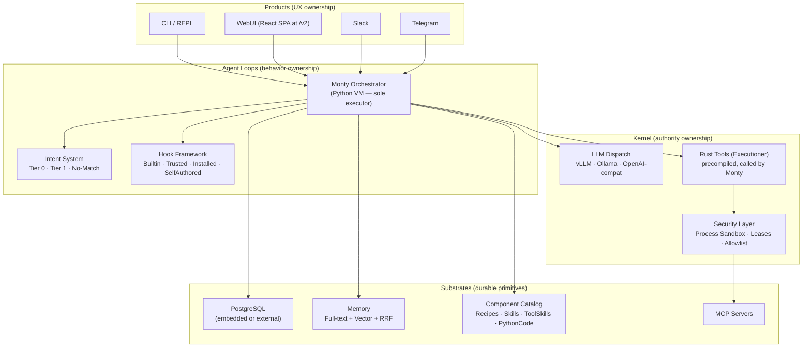

<p align="center">
  
</p>

<h1 align="center">BrassClaw</h1>

<p align="center">
  <strong>Your secure personal AI assistant — runs entirely on your hardware</strong>
</p>

<p align="center">
  <a href="https://github.com/chtugha/brassclaw/releases/latest"></a>
  <a href="#license"></a>
</p>

<p align="center">
  <a href="#philosophy">Philosophy</a> •
  <a href="#features">Features</a> •
  <a href="#quick-start">Quick Start</a> •
  <a href="#configuration">Configuration</a> •
  <a href="#architecture">Architecture</a> •
  <a href="#heritage">Heritage</a>
</p>

---

## Philosophy

BrassClaw is built on a simple principle: **your AI assistant should work for you, not against you**.

- **100% local operation** — runs on your own hardware with vLLM, Ollama, or any OpenAI-compatible server; no cloud account required
- **Your data stays yours** — all state stored locally in embedded Postgres, encrypted, never leaving your control
- **Fits consumer hardware** — tuned to work within small context windows; 7B models work well with 4 GB VRAM
- **Defense in depth** — process sandbox, capability leases, hook framework with four trust tiers, prompt injection defense, and endpoint allowlisting
- **Open source** — fully auditable, no telemetry or data harvesting
- **Orchestrator-first** — the Monty Python orchestrator is the execution engine; the LLM is consulted only when genuinely needed, leaving as many tasks as possible to deterministic Tier-0 recipes

---

## Features

### Home-Use Optimised

- **Orchestrator-first engine** — Monty (Python VM) sequences steps and calls tools directly; the LLM is involved only for creative reasoning, content composition, or irreversible decisions
- **Tier-0 recipes** — fully deterministic execution paths with zero LLM calls for known task patterns
- **Knowledge-driven integrations** — Skills (markdown files) teach the system how to use APIs; no Rust compilation needed for new integrations
- **Self-expanding** — Sempai/Kohai review loop automatically authors new components (Recipes, Skills, ToolSkills) and queues them for validation

### Security First

- **Process Sandbox** — untrusted tool subprocesses (shell, docker-exec, git) run in `brassclaw_process_sandbox` with capability leases, scoped filesystems, and endpoint allowlists
- **Hook Framework** — four trust tiers (Builtin, Trusted, Installed, SelfAuthored) for `before_capability` and `before_prompt` gates; self-authored hooks let the agent restrict its own future behavior at runtime
- **Capability Leases** — fine-grained, revocable authority grants for every tool call
- **Credential Protection** — secrets never exposed to tools; injected at the host boundary with leak detection
- **Prompt Injection Defense** — pattern detection, content sanitisation, and policy enforcement
- **Endpoint Allowlisting** — HTTP requests only to explicitly approved hosts and paths

### Always Available

- **Multi-channel** — REPL, WebUI (React SPA at `/v2`), Slack, Telegram, HTTP webhooks, and API server
- **Routines** — cron schedules, event triggers, webhook handlers for background automation
- **Persistent memory** — hybrid full-text + vector search with Reciprocal Rank Fusion, backed by embedded Postgres
- **Sub-agents** — spawn specialised child agents for complex tasks
- **MCP Protocol** — connect to any Model Context Protocol server

### Validation Pipeline

All user-authored and agent-authored components go through a two-gate validation pipeline:

- **Q1** — automated orchestrated sandbox check
- **Q2** — human review (operator only; never automated)

System builtins (seeded at boot) are exempt and insert as `validated` directly.

---

## Quick Start

**Minimum requirements:** any machine with ~8 GB RAM, a modern 64-bit CPU, and about 4 GB of free disk space.

### Option A: Linux Server — one-line install (recommended)

Downloads the latest pre-built binary from GitHub Releases and registers it as a systemd service:

```bash
curl -fsSL https://raw.githubusercontent.com/chtugha/brassclaw/main/install.sh | sudo bash
```

Or download and review first (recommended):

```bash
curl -fsSL https://raw.githubusercontent.com/chtugha/brassclaw/main/install.sh -o install.sh
less install.sh
sudo bash install.sh
```

The installer will:
- Detect your platform (Linux x86\_64, macOS ARM64, macOS x86\_64)
- Download the latest binary from GitHub Releases and verify its SHA256 checksum
- Install to `/usr/local/bin/brassclaw-reborn`
- Create a systemd service (when run as root)
- Preserve your WebUI token and user ID on upgrades

Pin to a specific version with `-v`:

```bash
sudo bash install.sh -v 0.9.0
```

**Uninstallation:**

```bash
curl -fsSL https://raw.githubusercontent.com/chtugha/brassclaw/main/uninstall.sh | sudo bash
```

To completely wipe everything (binary, service, config, and all data) without any prompts:

```bash
curl -fsSL https://raw.githubusercontent.com/chtugha/brassclaw/main/uninstall.sh | sudo bash -s -- --wipe
```

### Option B: macOS — manual binary install

```bash
# Apple Silicon (M1/M2/M3):
curl -fsSL -o brassclaw-reborn https://github.com/chtugha/brassclaw/releases/latest/download/brassclaw-macos-arm64
chmod +x brassclaw-reborn && sudo mv brassclaw-reborn /usr/local/bin/brassclaw-reborn

# Intel Mac:
curl -fsSL -o brassclaw-reborn https://github.com/chtugha/brassclaw/releases/latest/download/brassclaw-macos-amd64
chmod +x brassclaw-reborn && sudo mv brassclaw-reborn /usr/local/bin/brassclaw-reborn
```

All release artifacts are listed on the [GitHub Releases page](https://github.com/chtugha/brassclaw/releases/latest).

### Option C: Build from source

Requires [Rust 1.94+](https://rustup.rs).

```bash
git clone https://github.com/chtugha/brassclaw.git
cd brassclaw
cargo build --release --bin brassclaw
```

The binary is at `target/release/brassclaw`.

---

## Configuration

### Config file

Primary configuration lives at `~/.brassclaw/reborn/config.toml`. On first run an example is created.

```toml
[llm.default]
provider_id = "openai_compatible"
model = "Qwen/Qwen2.5-7B-Instruct-AWQ"
api_key_env = "MY_LLM_KEY"
base_url = "http://localhost:8000/v1"

[identity]
tenant = "my-instance"
```

### Environment variables (bootstrap tier)

These are fixed at startup, read before the database initialises, and set in the systemd unit's `Environment=` block:

| Variable | Description |
|----------|-------------|
| `BRASSCLAW_REBORN_HOME` | Data directory (default: `~/.brassclaw/reborn`) |
| `BRASSCLAW_RUNTIME_PROFILE` | Per-invocation capability/security policy (default: `local_dev`). Valid values: `local_dev`, `local_safe`, `local_yolo`, `hosted_safe`. Controls security posture only — Postgres is always the storage backend. **`BRASSCLAW_REBORN_PROFILE` is a hard startup error — do not set it.** |
| `BRASSCLAW_REBORN_LOG` | Log level filter (e.g. `brassclaw=debug`) |
| `BRASSCLAW_PG_URL` | External Postgres URL. Optional for single-host local deployments (embedded Postgres used when absent). Required for all non-local runtime profiles. |
| `BRASSCLAW_EMBEDDED_PG_PORT` | Override embedded Postgres port (default: `5434`) |
| `BRASSCLAW_SECRETS_PASSPHRASE_FILE` | Path to master-key file when using passphrase-wrapped ceremony |

### Environment variables (operator-trusted tier)

These are read by name from the environment after the database is up. Set them in a `secrets.env` file loaded via the systemd `EnvironmentFile=` directive:

| Variable | Description |
|----------|-------------|
| `BRASSCLAW_REBORN_WEBUI_TOKEN` | Bearer token for WebUI authentication |
| `BRASSCLAW_REBORN_WEBUI_USER_ID` | User identity injected into sessions |
| LLM provider API keys | Named in `config.toml` via `api_key_env = "MY_KEY"` |

### Runtime Profiles

| Profile | Best for | Notes |
|---------|----------|-------|
| `local_dev` | Home use (default) | Tool confirmations enabled, trusted laptop host access |
| `local_safe` | Home use, restricted | More conservative capability grants |
| `local_yolo` | Home use, no confirmations | Tools execute without prompting |
| `hosted_safe` | Server deployments | Requires `BRASSCLAW_PG_URL`. Sandbox enforced. |

### WebUI

The React SPA is served at the `/v2` path. Authenticate with a bearer token:

```bash
BRASSCLAW_REBORN_WEBUI_TOKEN=mytoken brassclaw-reborn serve --host 0.0.0.0 --port 3000
```

Then open `http://localhost:3000/v2` in your browser.

---

## LLM Provider Setup

LLM providers are configured via the WebUI (`Settings → Providers`) or directly in `config.toml`. BrassClaw supports any OpenAI-compatible API endpoint.

### vLLM (recommended for GPU servers)

```bash
pip install vllm
vllm serve Qwen/Qwen2.5-7B-Instruct-AWQ --host 0.0.0.0 --port 8000
```

In `config.toml`:
```toml
[llm.default]
provider_id = "openai_compatible"
model = "Qwen/Qwen2.5-7B-Instruct-AWQ"
base_url = "http://localhost:8000/v1"
```

### Ollama (recommended for home use)

```bash
ollama serve
ollama pull qwen2.5:7b
```

In `config.toml`:
```toml
[llm.default]
provider_id = "ollama"
model = "qwen2.5:7b"
```

### Model Recommendations

| Model | Size | VRAM / RAM | Notes |
|-------|------|------------|-------|
| `Qwen/Qwen2.5-7B-Instruct-AWQ` | 7B | 4 GB | **Recommended** — AWQ quantized, best for vLLM |
| `qwen2.5:7b` | 7B | 6 GB | Recommended minimum for Ollama |
| `qwen2.5:14b` | 14B | 10 GB | Best quality |
| `phi4` | 14B | 10 GB | Strong at coding and reasoning |
| `llama3.2` | 3B | 4 GB | Fast, good for simple tasks |

---

## Architecture

BrassClaw uses a three-layer model with ~70 Rust crates:



### Layer responsibilities

- **Products** — own the user experience: CLI renders output, WebUI serves the React SPA, Slack/Telegram handle messaging channels
- **Loops** — Monty is the sole execution authority. It sequences recipe steps, assembles LLM prompts, and calls host tools by name. The hook framework gates capability invocations and prompt mutations across four trust tiers
- **Kernel** — owns authority: LLM provider abstraction, sandboxed subprocess execution, credential injection, and security policy enforcement. Rust Tools are the Executioner — they only run when Monty calls them
- **Substrates** — own durable primitives: embedded or external Postgres, hybrid memory search, the component catalog (Recipes, Skills, ToolSkills, PythonCode, ExtensionCatalogues), and MCP server connections

### Component Catalog

BrassClaw stores all reusable knowledge artifacts in Postgres by class code:

| Class | Type | Description |
|-------|------|-------------|
| 1–3 | Skill | Orchestrator-facing prose describing a task pattern |
| 13 | ToolSkill | Binding descriptor — param schema, preconditions, error handling |
| 21 | Recipe | Complete turn script: `RecipeVariant`s, intent examples, step links |
| 22 | PythonCode | Executor — calls `host.<tool>(...)` to dispatch Rust |
| 23 | ExtensionCatalogue | Domain overview: task groups pointing to recipe names |

All user-authored and Sempai-authored components enter the two-gate validation pipeline (Q1 automated → Q2 human-only) before activation. System builtins are seeded at boot and exempt.

### Orchestrator + Executioner model

- **Monty (Orchestrator)** — the Python VM that runs one long-persisting process per user input. It reads Recipes, sequences steps, and calls tools by name (`host.<tool>(...)`). Never executes Rust directly.
- **Rust (Executioner)** — precompiled Tools and ToolSkills. Executes exactly when Monty calls; does no step sequencing.
- **Tier 0** — deterministic, no LLM. Tool calls baked into `PythonCode` leaves.
- **Tier 1** — LLM-guided. Recipe hands the LLM prior-knowledge; post-LLM steps run by Monty.

---

## Heritage

BrassClaw is a fork of [IronClaw](https://github.com/nearai/ironclaw), optimised for local-first, privacy-respecting operation on consumer hardware.

| | IronClaw | BrassClaw |
|---|---|---|
| **Primary deployment** | Cloud / high-end GPU | vLLM / Ollama on consumer hardware |
| **Execution model** | LLM-centric agent loop | Orchestrator-first (Monty + Tier-0 recipes) |
| **Tool extensions** | WASM-only | Process sandbox + host tools + MCP |
| **Storage** | SQLite / libSQL | Embedded or external Postgres |
| **Recommended model** | Large frontier models | Qwen2.5-7B-Instruct-AWQ (4 GB VRAM) |

---

## License

Licensed under either of:

- Apache License, Version 2.0 ([LICENSE-APACHE](LICENSE-APACHE))
- MIT License ([LICENSE-MIT](LICENSE-MIT))

at your option.
