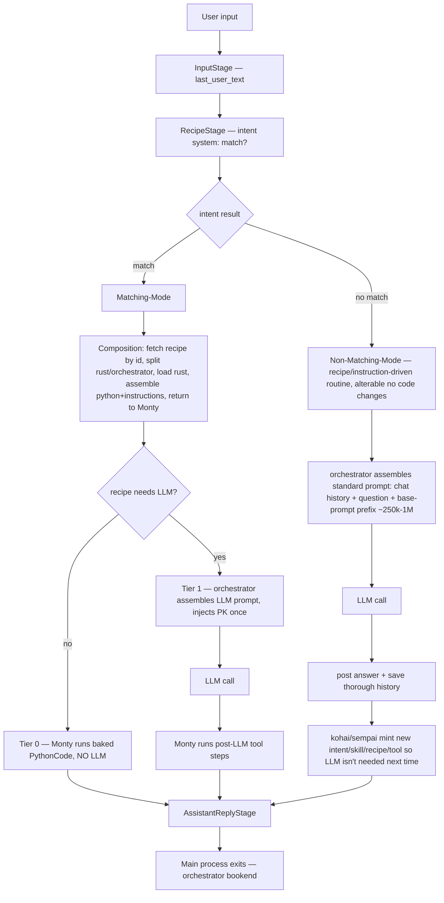

# Mindmap — Phase H (and overall v3 Plan)

> **Living thinking aid.** Re-read before every step. Update after every
> thinking pass (big picture → categorize → detail). Keeps reasoning shallow +
> fast, prevents OOM, prevents re-deriving settled decisions. Add new thoughts
> under the right section; keep entries short. This is the single source of
> "what we already decided" so we never loop.

---

## 0. How to use this file

1. Before each action: re-read **§1 (locked philosophy)** + **§3 (tiers)** +
   the **§5 redundancy map**.
2. Never re-derive a locked principle (§1) or an already-collapsed redundancy (§5).
3. When a new question appears, write the question + its resolution here, then act.
4. If a change is large/complex → write a nested subplan in this folder and link
   it from §8; run it before resuming the parent step.

---

## 1. Locked architectural philosophy (do NOT re-derive)

1. **ONE main process per user input.** From InputStage to the posted answer,
   the whole processing is **one sole process**, orchestrated + supervised by
   Monty from the start. It runs **until the user's prompt is answered** (best
   possible answer = the kohai/sempai system's main purpose). Then history is
   stored and the main process exits. The agent-loop IS this one process.
2. **ONE authority** = Monty (the Python orchestrator). Every tool invocation
   runs inside Monty's sandbox via `__execute_action__`. An LLM **never**
   executes anything itself — it only writes Python that Monty runs. (Future:
   an MCP bridge lets the LLM call tools / gather info **through Monty** —
   still routed via the orchestrator, never a classical direct-MCP path.)
3. **Only the basic mode's beginning is built-in.** Phase 1 (receive the
   prompt, start the main process, **start the intent-matching-system**) is
   the ONE built-in exception. Everything else is **Instructions** — a
   component, most often a **Recipe**, but also possibly an **Action** or
   other instruction component. From Phase 2 onward (intent, Matching-Mode,
   Non-Matching-Mode, validation, component-creation, kohai-sempai) it is all
   instruction/recipe-driven, so functionality changes need **no code changes
   — only the recipe is altered**. (Pragmatic now: the intent system itself
   uses the already-existing Rust `resolve_intent` / `fetch_for_turn`; the
   recipe/instruction-driven second-VM version is **future work**.)
4. **Two modes, not three runtimes:**
   - **Matching-Mode** (intent matched) → composition fetches the recipe by id,
     splits **rust part / orchestrator part**, loads rust, assembles the
     python+instructions, **returns the assembled plan to Monty**; Monty runs
     it step by step. The recipe decides Tier 0 (no LLM) vs Tier 1 (LLM-guided).
   - **Non-Matching-Mode** (no match) → recipe/instruction-driven (only the
     basic mode's *beginning* is built-in): orchestrator assembles chat-history
     + question + **base-prompt prefix (~250k→1M tokens, precompiled)**, calls
     the LLM, posts the answer, saves a thorough history, then kohai/sempai
     mint new components so the LLM is not needed next time. Alterable with no
     code changes (prompt additions per query type, different prefixes).
5. **Rust first-party handlers stay permanently** (shell, memory, …) — they
   ARE the tools. v3 artifacts (recipes / skills / toolskills / tools / python
   leaves) are the **knowledge of how to use** the tools.
6. **Complexity lives in recipes, not Rust.** "What to inject / prepend vs
   replace / which tools to call / how to format" is **encoded in the
   recipe**, not in Rust prompt-path variants. No "extra version of
   everything" in Rust.
7. **Tiny reusable components are the crucial thing.** A task = compose small
   modules + tell Monty how to use them. Reuse / recycle across many recipes.
   Goal: a library of **hundreds** of components so any task is "add modules +
   recipe". Good components → many tasks via different recipes calling the
   same components.
8. **Every LLM prompt is assembled by the orchestrator**, step by step,
   telling each system what to do (recipe / non-match / validation /
   component-creation / kohai-sempai). The **kohai is always last** — it swaps
   **placeholders → prefix (base-prompt) chunks**.
9. **Recipe syntax is dual-nature.** Recipes (+ the composition system) need a
   **clever syntax** that is **human-readable + logically constructed** AND
   **machine-readable exact logic** that **always reproduces the same
   orchestrator + Rust results**. Goal: change behaviour with **no code
   changes — only the recipe is altered**.

---

## 2. Big picture (one main process, one authority)

Key: **Matching-Mode = Tier 0 (deterministic) + Tier 1 (LLM-guided)**;
**Non-Matching-Mode = Tier 2 (built-in)**. All three are **orchestrated by
Monty**.

---

## 3. The three tiers (Matching-Mode = Tier 0/1; Non-Matching-Mode = Tier 2)

| Tier | Trigger | LLM? | Shape | Monty's job |
|------|---------|------|-------|-------------|
| **0** | match + `!llm_call_required` | none | tool calls baked into `PythonCode` leaves | run the PythonCode in the sandbox, emit reply |
| **1** | match + `llm_call_required` | yes (guided) | recipe hands the LLM prior-knowledge / a plan; post-LLM tool steps baked | assemble the LLM prompt + inject PK once → after LLM, run the baked tool steps |
| **2** | no match | yes (Non-Matching-Mode) | **recipe/instruction-driven** non-match routine (only the basic mode's *beginning* is built-in): chat-history + question + base-prompt prefix (~250k→1M); alterable with no code changes; after reply, kohai/sempai mint new components | orchestrate the non-match routine + the creation routine |

**Tier 2 is NOT "raw LLM".** It is a **recipe/instruction-driven** non-match
routine — only the basic mode's *beginning* is built-in. The orchestrator
assembles chat-history + question + base-prompt prefix, calls the LLM, posts
the answer, saves a thorough history, then kohai/sempai mint new components so
the LLM is not needed next time. Because it is recipe-driven, it is alterable
with no code changes. The LLM never executes tools itself — future MCP calls
route back through Monty.

---

## 4. Component library vision

- **Hundreds** of tiny components: `Tool` (class 0, Rust handler), `Skill`,
  `ToolSkill`, `PythonCode` leaf, `Recipe`, `Extension`, `Intent`.
- A task = pick modules + write a recipe that tells Monty how to compose them.
- Reuse aggressively: the same `ls` ToolSkill feeds a Tier-0 listing recipe, a
  Tier-1 search-and-summarize recipe, a Tier-2 exploratory turn.
- Validation components (Q2) are themselves just more components in the same
  library, validated by the base trusted extensions (chicken-and-egg solved).

---

## 5. Redundancy collapse map (R1–R11 → resolution)

| ID | Redundancy | Resolution (new philosophy) |
|----|------------|------------------------------|
| **R1** | engine→composition→engine round-trip (items fetched by engine, stashed as JSON, handed back to re-assemble via `assemble_pkr_from_items`) | **ONE assembly** in composition (Matching-Mode step 2); agent-loop consumes the carried result once. No re-assembly. |
| **R2** | `override_content` parallel Rust prompt path | **DROPPED** (already reverted). Replace-vs-prepend is a **recipe-encoded** signal, not a port branch. |
| **R3** | `TierZeroLlmGuard` fake always-erroring LLM stuffed into the Tier-0 facade | **DROP** the guard. Tier-0 is deterministic — the facade must **not require** an `LlmBackend`. (Engine builder refactor → nested subplan if large.) |
| **R4** | two `OrchestratorLookup` methods (`run_step_zero` + `run_tier_zero`) both `load_thread` + degrade | **one shared `load_thread`** helper; keep two **thin** entrypoints (Tier-0 runs PythonCode, Tier-1 assembles the PK bundle). |
| **R5** | 4+1 duplicate `recipe_hint: None` request-build sites | **one real copy site** (PromptStage reads the stash); the rest stay `None`. |
| **R6** | six vestigial Q2 fields on `PkrAssemblyResult`, built in 3 places, dropped at the map | **remove the dead fields** from the struct → stop building-then-dropping. |
| **R7** | `recipe_hint` + `recipe_rust_context` as two stashes traveling together | **one `RecipeStash { orchestrator_items, rust_items }`** (touches agent-loop state serialization → nested subplan if risky). |
| **R8** | two execution models (Model A engine `ExecutionLoop` vs Model B/C agent-loop) | **RESOLVED**: agent-loop owns production (the one main process); **Model A retired**. (Large deletion → nested subplan.) |
| **R9** | dead `None`-branch of `assemble_prior_knowledge_with_hint` (never hit in prod Tier-1) | thin test helper or **delete** once Model A is gone. |
| **R10** | over-built `TierZeroOrchestrator` facade (6 deps, composition sets 1) | **slim** to what production actually wires. |
| **R11** | Tier-1 dual injection (FIND-15) — recipe reaches the LLM **twice** (prepended into prompt AND re-assembled by Python step-0) | **ONE injection**: the orchestrator assembles the LLM prompt once (per ground-truth 2), injects PK once; post-LLM execution **carries** the same assembled PK (does not re-assemble). |

---

## 6. New Phase H proposal (simplified)

**Already done (stand):** H.0–H.12.5 (recipe struct, retrieval/intent wiring,
V061, three-tier stage scaffolding, H.10/H.11 dispatch, H.12.1–H.12.5
engine↔agent-loop bridge + `PgOrchestratorLookup` + `PgThreadEngineStore`).
These are the **machinery**; the rethink changes **how it is driven**, not the
plumbing.

### H.12.6 (reshaped) — Tier-1 single injection + small collapses

- Composition **assembles prior-knowledge once** (Matching-Mode step 2) and
  **carries one result** (R1). No engine→comp→engine round-trip.
- The orchestrator **assembles the Tier-1 LLM prompt once** and **injects the
  assembled `orchestrator_content` once** (prepend) (R11). Honor
  `override_prompt_creation` **uniformly** as a recipe-encoded replace flag —
  no separate Rust port path (R2 stays dropped).
- Post-LLM `CapabilityStage` **carries** the same assembled PK and hands the
  baked tool steps to **Monty** (R11 second half).
- **Fold** the shared `load_thread` (R4); **remove dead `PkrAssemblyResult`
  fields** (R6).
- **Slim** the `TierZeroOrchestrator` facade so Tier-0 does not need the fake
  LLM (R3/R10). If the engine-builder refactor is large → nested subplan.

### H.12.7 — Tests + final verification + mark Phase H done

- Tests through the caller (agent-loop Tier-0 / Tier-1 / Tier-2) per testing rules.
- Both configs green (default + `--features skills-db`).
- Mark Zenflow steps `9d94d6cb` / `1a0a9eac` / `d401cc45` Completed.

### Model A retirement (nested subplan, run before Phase H closes)

- Delete the engine `ExecutionLoop` recipe path (R8).
- Delete the Python step-0 shims: `__retrieve_docs__`, `__list_skills__()` /
  `select_skills()`, the `__assemble_prior_knowledge__` re-assembly entry
  (R9). The agent-loop becomes the **only** production runtime (the one main
  process).
- Reframe Tier 2 in the plan as a **recipe/instruction-driven non-match
  routine** (only the basic mode's *beginning* is built-in; alterable with no
  code changes); not raw LLM.
- Update the "two execution models" notes throughout `saved_plan_to_v3.md` →
  "one main process (agent-loop); Model A retired".
- Note the future **MCP bridge** phase (LLM calls tools via Monty).

### R7 stash merge (nested subplan only if serialization-risky)

- Merge `recipe_hint` + `recipe_rust_context` → one `RecipeStash` on
  `LoopExecutionState`. If the state-serialization/SEC-02 clear touches too
  many sites → spin a subplan; else fold into H.12.6.

---

## 7. Overall plan adjustments (post-rethink)

- **One main process** language everywhere; remove "Model A production / Model
  B/C tests-only until switchover" framing.
- **Only the basic mode's beginning is built-in** (the one exception);
  everything else is **Instructions** (Recipe / Action / other component).
- **Tier 2 = recipe/instruction-driven non-match routine** (orchestrated by
  Monty, alterable with no code changes); only the basic mode's *beginning* is
  built-in. Not raw LLM.
- **LLM = helper only**; every LLM prompt assembled by the orchestrator;
  **kohai always last** (placeholders → prefix chunks); future MCP bridge
  routes tool calls through Monty.
- **Component library** is the long-term lever: more tiny modules + recipes,
  fewer Rust branches.
- Validation-system + self-improvement phases (Q1–Q7) build on the same
  recipe/component model — no separate machinery.

---

## 8. Open items / needs a subplan

- [ ] **R3/R10 facade slim** — engine `TierZeroOrchestrator` builder no longer
  requires `LlmBackend` for the no-LLM path. (Likely nested subplan.)
- [ ] **R8 Model A retirement** — delete engine `ExecutionLoop` recipe path +
  Python step-0 shims. (Large → nested subplan.) Run before Phase H closes.
- [ ] **R7 stash merge** — only if H.12.6 folding proves serialization-risky.
- [ ] **Intent system recipe/instruction-driven second-VM version** — FUTURE;
  for now use the already-existing Rust `resolve_intent` / `fetch_for_turn`.
- [x] **B — Dual-nature recipe syntax** (subplan
  `subplan_problem_stepB_recipe_syntax_of_saved_plan_to_v3.md`): keep
  `step_link`/IBS as the machine form (untouched); add a concise
  human-readable explanation per variant (`RecipeVariant.description`) + Q1
  gate + WebUI surface. **Run FIRST.** **DONE (B.1–B.5; both configs green).**
- [ ] **C — Model A retirement** subplan (R8): delete engine `ExecutionLoop`
  recipe path + Python step-0 shims. Run after B.
- [ ] **A — reshaped H.12.6** (collapse R1/R4/R6/R11, Tier-1 single injection)
  then **H.12.7**. Run after C.

---

## 9. Decision log (append-only)

- **R8 (execution model):** agent-loop owns production (the one main process);
  Model A retired. Monty orchestrates every case; future MCP bridge routes LLM
  tool calls through Monty. — *locked prior turn.*
- **Ground-truth correction (this turn):** ONE main process per user input,
  supervised by Monty start-to-answer. **Basic mode is built-in** (the one
  exception); everything else is a recipe. Two modes: **Matching-Mode**
  (intent match → composition fetches recipe, splits rust/orchestrator,
  returns assembled plan; recipe decides Tier 0 vs 1) and **Non-Matching-Mode**
  (no match → built-in LLM + base-prompt prefix ~250k–1M + thorough history →
  kohai/sempai mint new components). **Every LLM prompt is assembled by the
  orchestrator** step-by-step; **kohai is always last** (swaps placeholders →
  prefix chunks). Tier 2 is NOT a recipe and NOT raw LLM. `CLAUDE.md`
  upgraded with the full ground truth.
- **Second correction (this turn):** narrowed the built-in surface to **only
  the basic mode's beginning** (Phase 1). Everything else is **Instructions**
  (Recipe / Action / other component), so **Phase 2 + Non-Matching-Mode are
  recipe/instruction-driven and alterable with no code changes** (different
  prompt additions per query type, different prefixes). Added the **dual-nature
  recipe syntax** requirement (human-readable + machine-readable deterministic).
  `CLAUDE.md` + this mindmap updated.
- **Intent system (this turn):** the basic mode's built-in knowledge is to
  **start the intent-matching-system**. The intent system is recipe/instruction-
  driven **in principle** (ideally a second Python VM), but since most intent
  code already exists in Rust, we **use the existing Rust** `resolve_intent` /
  `fetch_for_turn` for now and leave the recipe-driven second-VM version as
  **future work** — only do what is necessary for a working intent system.
- **Sequencing + B scope (this turn):** order is **B → C → A**. **B** scope
  narrowed — the `step_link` formula stays as-is; the dual-nature requirement
  is met by a concise **human-readable explanation** of what happens, carried
  alongside the machine `step_link`/IBS form. Main gap: `RecipeVariant` has no
  prose description (only `variant_key`). Subplan written
  (`subplan_problem_stepB_recipe_syntax_of_saved_plan_to_v3.md`). Decisions
  D-B1 (add `RecipeVariant.description`) + D-B2 (required at Q1, legacy exempt)
  pending user confirmation.
- **B done (this turn):** D-B1 + D-B2 confirmed (add `RecipeVariant.description`,
  required at Q1 for v3 variants, legacy exempt, `step_link` untouched). B.1 field
  + 2 round-trip tests; B.2 Q1 gate `check_variant_descriptions` + 3 unit + 1
  integration test through `component_validator`; B.3 verification-only (read
  rides along via opaque `RecipeDetail.recipe` JSON; no authoring route yet);
  B.4 docs (`CLAUDE.md` + `03-recipe-system.md` §1.1); B.5 both configs green
  (default 599 / skills-db 610 lib tests, clippy clean). Next: **C** (Model A
  retirement subplan).
