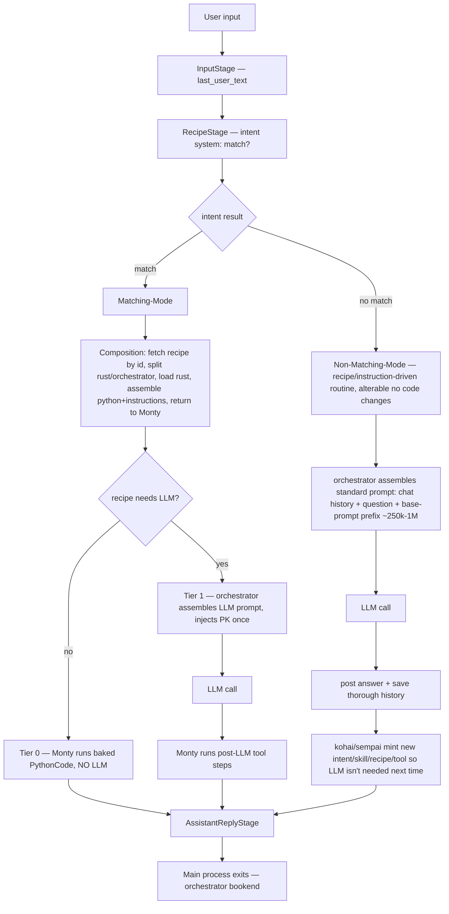

# Mindmap — Phase H (and overall v3 Plan)

> **Living thinking aid.** Re-read before every step. Update after every
> thinking pass (big picture → categorize → detail). Keeps reasoning shallow +
> fast, prevents OOM, prevents re-deriving settled decisions. Add new thoughts
> under the right section; keep entries short. This is the single source of
> "what we already decided" so we never loop.

---

## 0. How to use this file

1. Before each action: re-read **§1 (locked philosophy)** + **§3 (tiers)** +
   the **§5 redundancy map**.
2. Never re-derive a locked principle (§1) or an already-collapsed redundancy (§5).
3. When a new question appears, write the question + its resolution here, then act.
4. If a change is large/complex → write a nested subplan in this folder and link
   it from §8; run it before resuming the parent step.

---

## 1. Locked architectural philosophy (do NOT re-derive)

1. **ONE main process per user input.** From InputStage to the posted answer,
   the whole processing is **one sole process**, orchestrated + supervised by
   Monty from the start. It runs **until the user's prompt is answered** (best
   possible answer = the kohai/sempai system's main purpose). Then history is
   stored and the main process exits. The agent-loop IS this one process.
2. **ONE authority** = Monty (the Python orchestrator). Every tool invocation
   runs inside Monty's sandbox via `__execute_action__`. An LLM **never**
   executes anything itself — it only writes Python that Monty runs. (Future:
   an MCP bridge lets the LLM call tools / gather info **through Monty** —
   still routed via the orchestrator, never a classical direct-MCP path.)
3. **Only the basic mode's beginning is built-in.** Phase 1 (receive the
   prompt, start the main process, **start the intent-matching-system**) is
   the ONE built-in exception. Everything else is **Instructions** — a
   component, most often a **Recipe**, but also possibly an **Action** or
   other instruction component. From Phase 2 onward (intent, Matching-Mode,
   Non-Matching-Mode, validation, component-creation, kohai-sempai) it is all
   instruction/recipe-driven, so functionality changes need **no code changes
   — only the recipe is altered**. (Pragmatic now: the intent system itself
   uses the already-existing Rust `resolve_intent` / `fetch_for_turn`; the
   recipe/instruction-driven second-VM version is **future work**.)
4. **Two modes, not three runtimes:**
   - **Matching-Mode** (intent matched) → composition fetches the recipe by id,
     splits **rust part / orchestrator part**, loads rust, assembles the
     python+instructions, **returns the assembled plan to Monty**; Monty runs
     it step by step. The recipe decides Tier 0 (no LLM) vs Tier 1 (LLM-guided).
   - **Non-Matching-Mode** (no match) → recipe/instruction-driven (only the
     basic mode's *beginning* is built-in): orchestrator assembles chat-history
     + question + **base-prompt prefix (~250k→1M tokens, precompiled)**, calls
     the LLM, posts the answer, saves a thorough history, then kohai/sempai
     mint new components so the LLM is not needed next time. Alterable with no
     code changes (prompt additions per query type, different prefixes).
5. **Rust first-party handlers stay permanently** (shell, memory, …) — they
   ARE the tools. v3 artifacts (recipes / skills / toolskills / tools / python
   leaves) are the **knowledge of how to use** the tools.
6. **Complexity lives in recipes, not Rust.** "What to inject / prepend vs
   replace / which tools to call / how to format" is **encoded in the
   recipe**, not in Rust prompt-path variants. No "extra version of
   everything" in Rust.
7. **Tiny reusable components are the crucial thing.** A task = compose small
   modules + tell Monty how to use them. Reuse / recycle across many recipes.
   Goal: a library of **hundreds** of components so any task is "add modules +
   recipe". Good components → many tasks via different recipes calling the
   same components.
8. **Every LLM prompt is assembled by the orchestrator**, step by step,
   telling each system what to do (recipe / non-match / validation /
   component-creation / kohai-sempai). The **kohai is always last** — it swaps
   **placeholders → prefix (base-prompt) chunks**.
9. **Recipe syntax is dual-nature.** Recipes (+ the composition system) need a
   **clever syntax** that is **human-readable + logically constructed** AND
   **machine-readable exact logic** that **always reproduces the same
   orchestrator + Rust results**. Goal: change behaviour with **no code
   changes — only the recipe is altered**.

---

## 2. Big picture (one main process, one authority)

Key: **Matching-Mode = Tier 0 (deterministic) + Tier 1 (LLM-guided)**;
**Non-Matching-Mode = Tier 2 (built-in)**. All three are **orchestrated by
Monty**.

---

## 3. The three tiers (Matching-Mode = Tier 0/1; Non-Matching-Mode = Tier 2)

| Tier | Trigger | LLM? | Shape | Monty's job |
|------|---------|------|-------|-------------|
| **0** | match + `!llm_call_required` | none | tool calls baked into `PythonCode` leaves | run the PythonCode in the sandbox, emit reply |
| **1** | match + `llm_call_required` | yes (guided) | recipe hands the LLM prior-knowledge / a plan; post-LLM tool steps baked | assemble the LLM prompt + inject PK once → after LLM, run the baked tool steps |
| **2** | no match | yes (Non-Matching-Mode) | **recipe/instruction-driven** non-match routine (only the basic mode's *beginning* is built-in): chat-history + question + base-prompt prefix (~250k→1M); alterable with no code changes; after reply, kohai/sempai mint new components | orchestrate the non-match routine + the creation routine |

**Tier 2 is NOT "raw LLM".** It is a **recipe/instruction-driven** non-match
routine — only the basic mode's *beginning* is built-in. The orchestrator
assembles chat-history + question + base-prompt prefix, calls the LLM, posts
the answer, saves a thorough history, then kohai/sempai mint new components so
the LLM is not needed next time. Because it is recipe-driven, it is alterable
with no code changes. The LLM never executes tools itself — future MCP calls
route back through Monty.

---

## 4. Component library vision

- **Hundreds** of tiny components: `Tool` (class 0, Rust handler), `Skill`,
  `ToolSkill`, `PythonCode` leaf, `Recipe`, `Extension`, `Intent`.
- A task = pick modules + write a recipe that tells Monty how to compose them.
- Reuse aggressively: the same `ls` ToolSkill feeds a Tier-0 listing recipe, a
  Tier-1 search-and-summarize recipe, a Tier-2 exploratory turn.
- Validation components (Q2) are themselves just more components in the same
  library, validated by the base trusted extensions (chicken-and-egg solved).

---

## 5. Redundancy collapse map (R1–R11 → resolution)

| ID | Redundancy | Resolution (new philosophy) |
|----|------------|------------------------------|
| **R1** | engine→composition→engine round-trip (items fetched by engine, stashed as JSON, handed back to re-assemble via `assemble_pkr_from_items`) | **ONE assembly** in composition (Matching-Mode step 2); agent-loop consumes the carried result once. No re-assembly. |
| **R2** | `override_content` parallel Rust prompt path | **DROPPED** (already reverted). Replace-vs-prepend is a **recipe-encoded** signal, not a port branch. |
| **R3** | `TierZeroLlmGuard` fake always-erroring LLM stuffed into the Tier-0 facade | **DROP** the guard. Tier-0 is deterministic — the facade must **not require** an `LlmBackend`. (Engine builder refactor → nested subplan if large.) |
| **R4** | two `OrchestratorLookup` methods (`run_step_zero` + `run_tier_zero`) both `load_thread` + degrade | **one shared `load_thread`** helper; keep two **thin** entrypoints (Tier-0 runs PythonCode, Tier-1 assembles the PK bundle). |
| **R5** | 4+1 duplicate `recipe_hint: None` request-build sites | **one real copy site** (PromptStage reads the stash); the rest stay `None`. |
| **R6** | six vestigial Q2 fields on `PkrAssemblyResult`, built in 3 places, dropped at the map | **remove the dead fields** from the struct → stop building-then-dropping. |
| **R7** | `recipe_hint` + `recipe_rust_context` as two stashes traveling together | **one `RecipeStash { orchestrator_items, rust_items }`** (touches agent-loop state serialization → nested subplan if risky). |
| **R8** | two execution models (Model A engine `ExecutionLoop` vs Model B/C agent-loop) | **RESOLVED**: agent-loop owns production (the one main process); **Model A retired**. (Large deletion → nested subplan.) |
| **R9** | dead `None`-branch of `assemble_prior_knowledge_with_hint` (never hit in prod Tier-1) | thin test helper or **delete** once Model A is gone. |
| **R10** | over-built `TierZeroOrchestrator` facade (6 deps, composition sets 1) | **slim** to what production actually wires. |
| **R11** | Tier-1 dual injection (FIND-15) — recipe reaches the LLM **twice** (prepended into prompt AND re-assembled by Python step-0) | **ONE injection**: the orchestrator assembles the LLM prompt once (per ground-truth 2), injects PK once; post-LLM execution **carries** the same assembled PK (does not re-assemble). |

---

## 6. New Phase H proposal (simplified)

**Already done (stand):** H.0–H.12.5 (recipe struct, retrieval/intent wiring,
V061, three-tier stage scaffolding, H.10/H.11 dispatch, H.12.1–H.12.5
engine↔agent-loop bridge + `PgOrchestratorLookup` + `PgThreadEngineStore`).
These are the **machinery**; the rethink changes **how it is driven**, not the
plumbing.

### H.12.6 (reshaped) — Tier-1 single injection + small collapses

- Composition **assembles prior-knowledge once** (Matching-Mode step 2) and
  **carries one result** (R1). No engine→comp→engine round-trip.
- The orchestrator **assembles the Tier-1 LLM prompt once** and **injects the
  assembled `orchestrator_content` once** (prepend) (R11). Honor
  `override_prompt_creation` **uniformly** as a recipe-encoded replace flag —
  no separate Rust port path (R2 stays dropped).
- Post-LLM `CapabilityStage` **carries** the same assembled PK and hands the
  baked tool steps to **Monty** (R11 second half).
- **Fold** the shared `load_thread` (R4); **remove dead `PkrAssemblyResult`
  fields** (R6).
- **Slim** the `TierZeroOrchestrator` facade so Tier-0 does not need the fake
  LLM (R3/R10). If the engine-builder refactor is large → nested subplan.

### H.12.7 — Tests + final verification + mark Phase H done

- Tests through the caller (agent-loop Tier-0 / Tier-1 / Tier-2) per testing rules.
- Both configs green (default + `--features skills-db`).
- Mark Zenflow steps `9d94d6cb` / `1a0a9eac` / `d401cc45` Completed.

### Model A retirement (nested subplan, run before Phase H closes)

- Delete the engine `ExecutionLoop` recipe path (R8).
- Delete the Python step-0 shims: `__retrieve_docs__`, `__list_skills__()` /
  `select_skills()`, the `__assemble_prior_knowledge__` re-assembly entry
  (R9). The agent-loop becomes the **only** production runtime (the one main
  process).
- Reframe Tier 2 in the plan as a **recipe/instruction-driven non-match
  routine** (only the basic mode's *beginning* is built-in; alterable with no
  code changes); not raw LLM.
- Update the "two execution models" notes throughout `saved_plan_to_v3.md` →
  "one main process (agent-loop); Model A retired".
- Note the future **MCP bridge** phase (LLM calls tools via Monty).

### R7 stash merge (nested subplan only if serialization-risky)

- Merge `recipe_hint` + `recipe_rust_context` → one `RecipeStash` on
  `LoopExecutionState`. If the state-serialization/SEC-02 clear touches too
  many sites → spin a subplan; else fold into H.12.6.

---

## 7. Overall plan adjustments (post-rethink)

- **One main process** language everywhere; remove "Model A production / Model
  B/C tests-only until switchover" framing.
- **Only the basic mode's beginning is built-in** (the one exception);
  everything else is **Instructions** (Recipe / Action / other component).
- **Tier 2 = recipe/instruction-driven non-match routine** (orchestrated by
  Monty, alterable with no code changes); only the basic mode's *beginning* is
  built-in. Not raw LLM.
- **LLM = helper only**; every LLM prompt assembled by the orchestrator;
  **kohai always last** (placeholders → prefix chunks); future MCP bridge
  routes tool calls through Monty.
- **Component library** is the long-term lever: more tiny modules + recipes,
  fewer Rust branches.
- Validation-system + self-improvement phases (Q1–Q7) build on the same
  recipe/component model — no separate machinery.

---

## 8. Open items / needs a subplan

- [ ] **R3/R10 facade slim** — engine `TierZeroOrchestrator` builder no longer
  requires `LlmBackend` for the no-LLM path. (Likely nested subplan.)
- [ ] **R8 Model A retirement** — delete engine `ExecutionLoop` recipe path +
  Python step-0 shims. (Large → nested subplan.) Run before Phase H closes.
- [ ] **R7 stash merge** — only if H.12.6 folding proves serialization-risky.
- [ ] **Intent system recipe/instruction-driven second-VM version** — FUTURE;
  for now use the already-existing Rust `resolve_intent` / `fetch_for_turn`.
- [x] **B — Dual-nature recipe syntax** (subplan
  `subplan_problem_stepB_recipe_syntax_of_saved_plan_to_v3.md`): keep
  `step_link`/IBS as the machine form (untouched); add a concise
  human-readable explanation per variant (`RecipeVariant.description`) + Q1
  gate + WebUI surface. **Run FIRST.** **DONE (B.1–B.5; both configs green).**
- [ ] **C — Monty-as-main-process reframe (Option 2, LOCKED).** Supersedes the
  "Model A retirement" framing. Neither current model fits: Model A (Python
  `run_loop` outer loop but LLM-driven) nor H.12 Model B/C (Rust agent-loop +
  per-step Python sandbox — "Rust running the show"). Target: Monty (Python) is
  THE one main process, recipe/intent-driven; **retire the Rust agent-loop stage
  pipeline as the driver entirely**; Rust = pure host. Reworks shipped H.10–H.12.
  Subplan rewritten
  `subplan_problem_stepC_model_a_retirement_of_saved_plan_to_v3.md`.
  Locked sub-decisions: D-C1 = **cross-turn persistent** (one VM/conversation) +
  D-C2 = **restructure `default.py`** + **componentize host calls into
  orchestrator skills** behind a uniform **HostSkill interface** (future
  MCP-extension exposes them as MCP tools to an LLM helper; Rust loads
  tools/toolskills on demand). Run after B (done).
- [ ] **A — reshaped H.12.6** (collapse R1/R4/R6/R11, Tier-1 single injection)
  then **H.12.7**. Run after C.

---

## 9. Decision log (append-only)

- **R8 (execution model):** agent-loop owns production (the one main process);
  Model A retired. Monty orchestrates every case; future MCP bridge routes LLM
  tool calls through Monty. — *locked prior turn.*
- **Ground-truth correction (this turn):** ONE main process per user input,
  supervised by Monty start-to-answer. **Basic mode is built-in** (the one
  exception); everything else is a recipe. Two modes: **Matching-Mode**
  (intent match → composition fetches recipe, splits rust/orchestrator,
  returns assembled plan; recipe decides Tier 0 vs 1) and **Non-Matching-Mode**
  (no match → built-in LLM + base-prompt prefix ~250k–1M + thorough history →
  kohai/sempai mint new components). **Every LLM prompt is assembled by the
  orchestrator** step-by-step; **kohai is always last** (swaps placeholders →
  prefix chunks). Tier 2 is NOT a recipe and NOT raw LLM. `CLAUDE.md`
  upgraded with the full ground truth.
- **Second correction (this turn):** narrowed the built-in surface to **only
  the basic mode's beginning** (Phase 1). Everything else is **Instructions**
  (Recipe / Action / other component), so **Phase 2 + Non-Matching-Mode are
  recipe/instruction-driven and alterable with no code changes** (different
  prompt additions per query type, different prefixes). Added the **dual-nature
  recipe syntax** requirement (human-readable + machine-readable deterministic).
  `CLAUDE.md` + this mindmap updated.
- **Intent system (this turn):** the basic mode's built-in knowledge is to
  **start the intent-matching-system**. The intent system is recipe/instruction-
  driven **in principle** (ideally a second Python VM), but since most intent
  code already exists in Rust, we **use the existing Rust** `resolve_intent` /
  `fetch_for_turn` for now and leave the recipe-driven second-VM version as
  **future work** — only do what is necessary for a working intent system.
- **Sequencing + B scope (this turn):** order is **B → C → A**. **B** scope
  narrowed — the `step_link` formula stays as-is; the dual-nature requirement
  is met by a concise **human-readable explanation** of what happens, carried
  alongside the machine `step_link`/IBS form. Main gap: `RecipeVariant` has no
  prose description (only `variant_key`). Subplan written
  (`subplan_problem_stepB_recipe_syntax_of_saved_plan_to_v3.md`). Decisions
  D-B1 (add `RecipeVariant.description`) + D-B2 (required at Q1, legacy exempt)
  pending user confirmation.
- **B done (this turn):** D-B1 + D-B2 confirmed (add `RecipeVariant.description`,
  required at Q1 for v3 variants, legacy exempt, `step_link` untouched). B.1 field
  + 2 round-trip tests; B.2 Q1 gate `check_variant_descriptions` + 3 unit + 1
  integration test through `component_validator`; B.3 verification-only (read
  rides along via opaque `RecipeDetail.recipe` JSON; no authoring route yet);
  B.4 docs (`CLAUDE.md` + `03-recipe-system.md` §1.1); B.5 both configs green
  (default 599 / skills-db 610 lib tests, clippy clean). Next: **C** (Model A
  retirement subplan).
- **C reframe (this turn — Option 2 LOCKED):** the H.12 production path
  (`execute_tier_zero_channel`'s Rust `for step in &steps { execute_code }`) is
  "Rust running the show, using Python only to execute each step separately" —
  architecturally wrong. Neither Model A (Python `run_loop` but LLM-driven) nor
  H.12 Model B/C (Rust drives) fits. Target: Monty (Python) = THE one
  long-persisting main process, recipe/intent-driven; **retire the Rust
  agent-loop stage pipeline as the driver entirely**; Rust = pure host
  (capabilities/stores/retrieval/LLM-as-helper/sandbox); Rust must not do step
  sequencing. Reworks shipped H.10–H.12. Grounded: host-fn surface (existing +
  missing: `__resolve_intent__`/`__fetch_recipe__`/`__compose_orchestrator__`/
  `__post_reply__`/`__save_history__`); current driver `TurnRunnerWorker` →
  agent-loop stages (`canonical.rs`). CLAUDE.md + C subplan rewritten. Pending
  sub-decisions D-C1 (per-turn vs cross-turn Monty session) + D-C2 (restructure
  `default.py` vs new built-in orchestrator).
- **Host-call dissection (this turn — for C.1 / builtin_stuff_v3 Step 27):** the
  19 existing `__host_call__` intrinsics + 4 missing (`__resolve_intent__`/
  `__compose_orchestrator__`/`__post_reply__`/`__save_history__`) dissected into
  the EXISTING v3 vocab (Tool/ToolSkill/PythonCode/Skill/Recipe/Catalogue) — NO
  invented "HostSkill". Disposition: **17 new `host.*` Tool rows**
  (resolve_intent, compose_orchestrator, post_reply, llm_complete, retrieve_docs,
  get_reduction_rules, get_actions, record_skill_usage, fetch_component,
  resolve_component_by_name, validate_component, check_signals, emit_event,
  save_checkpoint, transition_to, check_budget, log_budget_warning); **2 reuse**
  (`__list_skills__`→`builtin.skill_list` Step 16; `__regex_match__`→`pc-regex-match`
  Step 20.x.2); **3 meta-primitives** (no Tool row: `__execute_action__`/
  `__execute_actions_parallel__`/`__execute_code_step__` — they ARE the dispatcher,
  reusing Steps 1–19 + 27.*); **2 recipe-only over existing tools**
  (`host-save-history`→`builtin.memory_write`; `host-assemble-prior-knowledge`→
  `host.retrieve_docs`+`host.get_reduction_rules`+PythonCode). New catalogue
  `builtin-host` (class 23). Rust `handle_*` backing fns STAY as the impl behind
  the `host.*` Tool rows; Monty + future MCP share one `__execute_action__`
  surface. **Authored (COMPLETE):** Step 27.0 reuse-map + 27.1 (resolve_intent) +
  27.2 (compose_orchestrator) + 27.3 (post_reply) + 27.4 (save-history recipe) +
  27.5 (llm_complete/retrieve_docs/get_reduction_rules) + 27.6 (dispatch
  meta-primitives + get_actions) + 27.7 (component-store: record_skill_usage/
  fetch_component/resolve_component_by_name/validate_component) + 27.8
  (regex_match + list_skills reuse unification) + 27.9 (VM-control: check_signals/
  emit_event/save_checkpoint/transition_to/check_budget/log_budget_warning) +
  27.10 (recipes: host-assemble-prior-knowledge + host-non-match-llm-answer) +
  27.11 (ExtensionCatalogue `builtin-host`) — all in `builtin_stuff_v3.md`, in
  order. Next: Phase C Rust implementation (C.1–C.5).
- **Orchestrator/Executioner re-think (this turn — user rejected the "two-layer
  Rust-engine + recipe-layer" model as wrong):** BrassClaw has an **Orchestrator**
  (Monty/Python — the brain; runs the one main process; reads Recipes/Instructions;
  decides sequencing; assembles prompts; calls tools by name) and an **Executioner**
  (Rust — the muscle; holds precompiled **Tools + ToolSkills**; executes one when
  called; does NOT sequence; has NO recipes). Consequences that correct Step 27:
  (1) **A host call is EITHER a Rust Tool/ToolSkill OR an Orchestrator Recipe —
  not both.** Step 27's "Tool+ToolSkill+PythonCode+Skill+Recipe per host call"
  5-tuple is a category error → bloat. (2) **`__host_call__`'s 23-arm `match`
  (orchestrator.rs:641-801) IS the over-engineering** — it is a second, hardcoded
  dispatch path parallel to `__execute_action__(name)` (:1064). The "complete
  overhaul" = **one tool registry** so host capabilities register like any
  first-party tool and the orchestrator invokes them by name through the SAME
  `__execute_action__` surface. (3) **Bare Rust helpers must be dissected into
  Tools/ToolSkills**, not hidden as intrinsics: `intent_system::resolve_intent`
  → registered `host.resolve_intent`; `format_orchestrator_content` +
  `parse_orchestrator_channel_steps` → registered `host.compose_orchestrator`.
  (4) **Reclassify the 23:** genuine execution primitives (llm_complete,
  retrieve_docs, get_reduction_rules, fetch_component, resolve_component_by_name,
  record_skill_usage, validate_component, get_actions, check_signals, emit_event,
  save_checkpoint, transition_to, check_budget, log_budget_warning) → registered
  Tools/ToolSkills, NO recipe; multi-step compositions (non-match-llm-answer,
  save-history, assemble-prior-knowledge) → **Orchestrator Recipes** calling
  EXISTING tools, NO new Rust; `post_reply` → **Orchestrator Skill** (the act of
  emitting the answer), not a Tool+Recipe pair; `__execute_action__`/
  `__execute_actions_parallel__`/`__execute_code_step__` → the dispatcher itself
  (meta-primitives, no row). (5) **"Rust created on call" = Rust only EXECUTES on
  orchestrator call; new Rust = a new Tool/ToolSkill; there are NO recipes for
  the Executioner.** (6) **Precompilation/on-demand answer:** Rust is AOT — true
  runtime code-loading needs cdylib+`dlopen` plugins (future). PRACTICAL now:
  tools are **statically precompiled into the binary** but held in a **registry**
  and **resolved+bound by name on demand** via `__execute_action__`. "Loaded like
  modules on demand" = registry lookup + lazy binding, NOT runtime compilation.
  (7) **The Composition-System simplification the user is probing:** the IBS
  two-channel split (`rust_steps` pre-loads ToolSkill binding / `orchestrator_steps`
  runs PythonCode) may be **collapsible to one orchestrator channel** IF tools are
  registry-resolved+bound inside `__execute_action__` in one step — the separate
  `rust_steps` pre-load channel becomes redundant. This touches `build_instruction`
  / `BuildInstruction` / `retrieval_source` / every Tier-0 recipe → a real design
  decision, not a quick fix. **OPEN (need user lock):** D-C3 = unify host-call
  match into the `__execute_action__` tool registry (the overhaul) AND D-C4 =
  collapse IBS to single-channel orchestrator recipes (drop `rust_steps`
  pre-load) — or keep two-channel and only do the registry unification.
- **Meta-primitive challenge (this turn — user: "why would the orchestrator call
  __execute_action__?"):** grounded that ALL THREE intrinsics
  (`__execute_action__`/`__execute_code_step__`/`__execute_actions_parallel__`)
  are consumed ONLY by `default.py` (the Model-A Python orchestrator being
  retired) — `__execute_action__` :740/:807/:889, `__execute_code_step__` :1123
  (the per-step Tier-0 executor = the retired Rust/Python per-step loop),
  `__execute_actions_parallel__` :837/:1454. Proposal (pending user confirm):
  (a) **`__execute_action__` string-intrinsic → GONE**; tools become
  **first-class callables in the Monty namespace** — recipe PythonCode calls
  `host.resolve_intent(user_input=...)` directly. The ONE thing that survives is
  the **policy/lease/gate/event wrapper** now inside `handle_execute_action`
  (:1254) — it moves INTO each `host.*` callable binding (transparent to the
  orchestrator). (b) **Unification: the Monty namespace IS the tool registry** —
  bind=load (static precompiled fn OR cdylib-loaded fn), call=execute (wrapper
  runs), unbind=unload at end of main-process task. ONE mechanism; the future MCP
  bridge uses the SAME registry (no Python intrinsic needed). (c)
  **`__execute_code_step__` → GONE** (Model-A per-step relic; under Option 2 the
  VM runs the recipe's PythonCode as one continuous program). (d)
  **`__execute_actions_parallel__` → either a small Python helper
  `pc-host-execute-parallel` calling several `host.*` callables concurrently, OR
  a thin Rust intrinsic if shared gate/lease is easier** — OPEN (user pick).
- **Two Tool Systems (this turn — user LOCKED):** (1) **built-in** tools +
  ToolSkills precompiled into the Rust binary from the start; (2) **kohai/sempai-
  minted** tools + ToolSkills compiled as **separate cdylib crates**, **loaded
  dynamically at runtime, on demand by a Recipe, unloaded at the end of the
  orchestrator main-process task.** Same registry/namespace mechanism as built-ins
  — only the load source differs (static fn vs `dlopen`-ed cdylib). This is the
  Composition-System de-bloat lever. TODO (next): add this as a plan step in
  `saved_plan_to_v3.md`; rewrite `CLAUDE.md` + all plan steps to this architecture
  (delete obsolete wrong-idea text).
- **Wrapper removal → mode-driven security (this turn — user LOCKED):** the
  `handle_execute_action` security wrapper (policy/lease/gate/event) is NOT
  deleted; it becomes **mode-driven + operator-toggleable**. **Matching-Mode
  (intent match → validated recipe): wrapper OFF by default** — a validated
  recipe follows a distinct path; its tool calls (incl. outbound HTTP) execute as
  intended, no runtime babysitter. **Non-Matching-Mode (LLM involved): wrapper ON
  by default** — the LLM generates the path, so the runtime guard engages.
  **WebUI: a global security-settings panel where each wrapper layer can be
  disabled separately** (operator control per deployment). So the wrapper layers
  exist as code, dispositioned by mode + operator toggles, not unconditionally
  applied and not universal. **LOCKED (user final):** no babysitting of validated
  components — **ALL runtime security OFF in Matching-Mode**, including
  sensitive-tool self-scoping (filesystem/subprocess/HTTP/secret do NOT
  scope-check on intent-match); validated Q2+ components execute as intended,
  full stop. **Non-Matching-Mode (LLM involved): wrapper ON.** **Q1 components
  are NEVER accessible** — they sit in the Queue-System; the SEC-01 gate returns
  only Validated (Q2+) components to Rust/Orchestrator, so Q1 can never run and
  is irrelevant to runtime security (no grace-period needed). **WebUI global
  security panel: each wrapper layer operator-toggleable per deployment.**
  Policy for the LLM-involved path = **bind-time namespace filtering** (compose
  binds only profile+grant-permitted tools); Matching-Mode bypasses it.
- **Mechanism classification LOCKED (this turn — user answered the 5 open
  points); stale Step 27.0 table is re-fixed as follows:**
  (1) **LLM invocation = Kohai-mediated; NOT a Rust tool.** Orchestrator composes
  the prompt (Recipe) + adds a prefix-placeholder → sends to **Kohai** (Python).
  Kohai saves the prompt. **Case 1 (Sempai connected):** Kohai adds an
  optimization-prefix → Sempai optimizes → returns WITHOUT prefix → Kohai saves
  the optimized prompt beside the original → Kohai adds the provider-LLM prefix
  (the one for that placeholder) → sends to provider LLM. **Case 2 (no Sempai):**
  Kohai saves the prompt → adds the provider prefix → sends. Both: Kohai receives
  the answer, saves it beside its prompt, returns it to the Orchestrator.
  **`handle_llm_complete` / `LlmBackend` RETIRE as Rust host tools.** Rust↔LLM
  never talk directly — only over the orchestrator/Kohai.
  (2) **`fetch_component` + `resolve_component_by_name` = Tools (KEPT).** Not
  obsolete — components aren't only tools; prior knowledge still assembles.
  (3) **`retrieve_docs` + `get_reduction_rules` = DROPPED.**
  `assemble_prior_knowledge` → **Recipe, fallback when NO prefix is present**
  (adds basic "what is going on" info so the LLM understands context).
  (4) **`compose_orchestrator` = Tool (REWRITE — Rust part significantly reduced;
  Recipe + Component structure reworked to match).** `post_reply` = **conditional**:
  Rust-only chat access → Tool; orchestrator may post directly → Skill + Recipe +
  PythonCode component. **(RESOLVED = A1 → Tool; see below.)**
  (5) **`memory_write` = Recipe** that saves chat content via a **shared
  SQL-saving tool** to the **same store Kohai saved the LLM prompt** (same
  SQL-saving tool). Storage-not-DB is what we avoid. If every interaction in a
  chat were a matched process, the chat wouldn't need saving at all.
- **Grounded this turn (informs the residual forks):** a generic Rust HTTP
  first-party tool ALREADY exists — `crates/brassclaw_host_runtime/src/
  first_party_tools/http.rs` (so Kohai can reach the provider LLM by calling it,
  no new Rust needed for transport). The Kohai/Sempai system already lives in
  `crates/brassclaw_interceptor` (mode/packet/proposal_sink/pg_store/config).
- **Residual forks RESOLVED (this turn — user + code grounding); Step 27 intro
  + 27.0 table re-authored to the locked classification:**
  **(A) = A1 — `post_reply` is a Tool.** Grounded: Monty VM is sandboxed
  (`orchestrator.rs:568-582` — `ResourceLimits` + `PrintWriter::CollectString`,
  no socket); the chat/WebUI is fed by Rust-side `ThreadEvent` broadcast
  (`event_tx`) consumed by the ingress. Python reaches the chat ONLY via a Rust
  host fn or the `FINAL` return — both Rust-mediated. So only Rust touches the
  chat window → `post_reply` = Tool. **(B) = yes —** Kohai (Python) calls the
  existing `first_party_tools/http.rs` HTTP tool to send the prompt to the
  provider LLM; no new Rust. **(C) = reuse `builtin.memory_write` (Step 11) —** it
  IS the existing SQL-saving Tool; both Kohai (persist prompts+answers) and the
  `host-save-history` Recipe call it; no new SQL tool. **(D) = ALL stage-machinery
  verbs RETIRED —** `save_checkpoint`/`transition_to`/`check_budget`/
  `log_budget_warning`/`emit_event`/`get_actions`/`record_skill_usage`: the
  Orchestrator owns thread state (it knows where it is in its own step sequence);
  the agent-loop stage pipeline is no longer the driver; chat event emission goes
  via `host.post_reply`. **Next:** re-author substeps 27.1–27.11 one-by-one to
  this locked classification.

- **Step 27 re-authoring PASS COMPLETE (this turn).** All 7 todos done:
  - **27.5** → RETIRED `host.llm_complete` (+ `handle_llm_complete`/`LlmBackend`);
  DROPPED `host.retrieve_docs` + `host.get_reduction_rules` (prior knowledge =
  fallback Recipe, no retrieval verbs).
  - **27.6** → RETIRED `__execute_action__` (+ `handle_execute_action` per-call
  wrapper → mode-driven security), `__execute_code_step__`, `host.get_actions`;
  KEPT `__execute_actions_parallel__` as the Python helper
  `pc-host-execute-parallel` (fans out to bound `host.*` callables, not a Rust
  intrinsic).
  - **27.7.1** → RETIRED `host.record_skill_usage` (Q-D); 27.7 header "Three host
  calls" (fetch_component / resolve_component_by_name / validate_component kept).
  - **27.9.2–27.9.6** → ALL RETIRED (Q-D): emit_event / save_checkpoint /
  transition_to / check_budget / log_budget_warning; 27.9 header "One KEPT host
  call" (check_signals only); chat event emission goes via host.post_reply.
  - **27.10.1** → `host-assemble-prior-knowledge` = FALLBACK Recipe (only when NO
  prefix present), no tool bindings, one PythonCode formatter adding basic context.
  - **27.10.2** → `host-non-match-llm-answer` = Kohai-mediated Recipe (assemble
  prompt + prefix-PLACEHOLDER → hand to Kohai → answer back); NO `host.llm_complete`.
  - **27.10.3 (NEW)** → introduced `host.kohai_complete` Tool (the ONE new tool
  implied by the Kohai-mediated LLM model) — wraps the existing
  `brassclaw_interceptor` ingress (wiring only, like `host.resolve_intent`); Kohai
  does save / optional-Sempai / provider-prefix / `first_party_tools/http` /
  save-answer. Added to the 27.0 Tools table; net-new `host.*` count 7 → 8.
  - **First-class-callee sweep** → all 8 `__execute_action__("host.X", …)` calls
  in Step 27 converted to `host.X(…)` (resolve_intent, compose_orchestrator,
  post_reply, fetch_component, resolve_component_by_name, validate_component,
  regex_match, check_signals). `__execute_action__("shell", …)` in the already-
  shipped Steps 1–26 left as-is (out of scope: user scoped the obsolescence pass
  to not-yet-done steps only).
  - **27.11 `builtin-host` catalogue** → rewritten to the locked classification:
  8 net-new Tools, 4 reused, 3 Recipes, 1 Python helper, RETIRED/DROPPED section;
  task_groups trimmed (main-process-control / llm-via-kohai / component-store /
  vm-control); child_component_ids pruned to KEPT components only; closing note
  updated. Consistency grep: all remaining Step-27 mentions of retired names are
  in RETIRED/DROPPED markers or "No host.llm_complete" notes — no stale ACTIVE
  references.
- **Net Step-27 classification (LOCKED + authored):** Tools = resolve_intent,
  compose_orchestrator (rewrite), post_reply, fetch_component,
  resolve_component_by_name, validate_component, check_signals, kohai_complete
  (8). Reused = builtin.memory_write, first_party_tools/http, builtin.skill_list,
  pc-regex-match. Recipes = host-non-match-llm-answer (Kohai-mediated),
  host-assemble-prior-knowledge (fallback), host-save-history. DROPPED =
  retrieve_docs, get_reduction_rules. RETIRED = llm_complete (Rust) + 7 stage
  verbs (Q-D) + __execute_action__/__execute_code_step__.
- **Next:** Phase C Rust implementation — C.1 tool registry + first-class
  callables, C.2 reclassify host calls, C.3 cdylib dynamic loading, C.4 mode-driven
  security + WebUI panel, C.5 basic-mode orchestrator script, C.6 production driver
  switch, C.7 retire dead Model-A code + both configs green; then A (reshaped
  H.12.6) + H.12.7.

- **C.1 FEASIBILITY RESOLVED (this turn) — the `host.X(...)` first-class-callable
  mechanism, grounded in the unmodifiable monty v0.0.16 source**
  (`/Users/ollama/.cargo/git/checkouts/monty-1fcd393c2a7c36ca/142807b/crates/monty`):
  - `RunProgress` has only 5 variants — `FunctionCall`, `OsCall`, `ResolveFutures`,
    `NameLookup`, `Complete`. **There is NO `AttributeLookup` variant**; attribute
    access (`LoadAttr` op) is handled INTERNALLY by Monty via `py_getattr` on known
    heap types — it never suspends to the host.
  - `MontyObject::Function{name,docstring}` is the host-callable stub: returned from
    `NameLookup` → when called → `RunProgress::FunctionCall`. This is the EXISTING
    scripting.rs pattern (registers flat tool names like "shell").
  - `MontyObject::Dataclass{name,type_id,field_names,attrs,frozen}` is
    host-constructible and supports attribute access reading `attrs`. **BUT** the
    compiler emits `CallAttr` (NOT `LoadAttr`+`CallFunction`) for `obj.m(args)`
    (compiler.rs:1771-1815; kwargs→`CallAttrKw`; *args→`CallAttrExtended`).
    `CallAttr`→`py_call_attr` (dataclass.rs:267) returns **TypeError "not callable"**
    for any attr stored in `attrs` (dataclass.rs:295-297). So storing `Function`s in
    a `host` Dataclass's attrs **BREAKS**.
  - **The ONLY viable `host.X(...)` path:** inject a `host` Dataclass with **EMPTY
    attrs** via `NameLookup("host")`. Then `host.resolve_intent(prompt=…)` →
    `CallAttr` → `py_call_attr` → attr not in (empty) attrs + public (no `_`) →
    `MethodCall("resolve_intent", [self, …])` → surfaces as
    `FunctionCall{function_name:"resolve_intent", method_call:true, args[0]=<self>,
    kwargs=[…]}` (run_progress.rs:678-686). Host dispatches on the **bare tool name**
    with `method_call==true`, **skipping args[0] (self)**. Namespace "host." is
    implicit (the Dataclass name); recipe PythonCode still writes `host.X(...)` exactly
    as locked. Confirmed all 8 net-new tool names are public (no underscore) → all
    take the MethodCall branch.
  - **Net C.1 mechanism (LOCKED by feasibility, not a new design choice):**
    (1) orchestrator `NameLookup` arm returns a `host` Dataclass (empty attrs) for
    "host"; (2) `FunctionCall` match adds bare-name arms for the 8 net-new + reused
    tools, each skipping `args[0]` when `method_call==true`; (3) retire
    `__execute_action__`/`__execute_code_step__` arms; (4) `__execute_actions_parallel__`
    RETIRED entirely (NOT a Python helper — Monty is single-threaded, so "call N tools"
    = a sequential recipe with N steps; a `pc-host-execute-parallel` helper would
    degrade to sequential anyway); (5) dissect
    `intent_system::resolve_intent` → `handle_resolve_intent`; fetch/split formatters
    → `handle_compose_orchestrator`; add `handle_kohai_complete` (interceptor ingress)
    + `handle_post_reply`. **Next:** implement C.1 starting with the `host` namespace
    injection + registry dispatch skeleton.
- **C.1 SLICE 1 SHIPPED (`6a1d9d63`, this turn) — `host.resolve_intent` first-class
  callable.** First net-new handler: wraps the existing
  `intent_system::resolve_intent` SQL fn (the whole intent system = ONE Tool —
  wiring, not new logic). Mirrors `handle_fetch_component`'s cfg pattern:
  `#[cfg(feature="skills-db")] { … }` + `#[cfg(not)] -> no_match`. Returns a
  Python dict the orchestrator dispatches on — `match {component_id,
  component_class_code, step_link, component_name}` / `disambiguation
  {candidates}` / `no_match` / `error {error}`. Bare-name arm
  (`"resolve_intent" if call.method_call`, self-skip `args[1..]`, kwargs
  passed). Scope from thread identity (tenant/user/agent/project). clippy green
  both configs (default 5.13s, skills-db 5.21s). Disk rule applied (95%/11Gi →
  scoped `cargo clean -p brassclaw_engine`).
- **compose_orchestrator scope observation (DEFER candidate):** the locked plan
  flags `host.compose_orchestrator` a **REWRITE** ("Rust part significantly
  reduced; Recipe + Component structure reworked to match"). That rewrite is
  coupled to the Recipe/Component-structure rework (a larger cross-cutting
  change), so it is NOT a pure C.1 wiring slice like resolve_intent. Wiring the
  OLD `fetch_recipe_split_result` behind the callable would preserve the old
  architecture the user rejected. → compose_orchestrator's working handler lands
  WITH its rewrite in a later C substep (after the Recipe/Component rework); C.1
  ships the registry mechanism + resolve_intent + post_reply + kohai_complete
  (all wiring) + retired meta-primitives. post_reply (chat-socket reply event)
  + kohai_complete (wraps `brassclaw_interceptor` ingress) are independent of
  compose_orchestrator and proceed now.
- **C.1 SLICE 2 SHIPPED (`post_reply`, this turn) — `host.post_reply` first-class
  callable.** Sync handler (no `.await`). Appends `ThreadMessage::assistant(text)`
  to `thread.messages` + emits `EventKind::MessageAdded { role:"assistant",
  content_preview }` via `event_tx` + `thread.events` (the chat-window surface).
  Wiring over the existing `handle_emit_event` tail path (`ThreadEvent::new` +
  `tx.send` + `thread.events.push` + `updated_at`). A1-locked: only Rust owns the
  chat socket, so the Orchestrator hands its final answer to this Tool. Empty text
  → no-op. Bare-name arm `"post_reply" if call.method_call` (self-skip `args[1..]`,
  kwargs + `thread` + `event_tx` passed). clippy green both configs.
- **C.1 PLACEMENT RESOLVED (this turn) — where the `host.*` registry lives.** The
  23-arm `match` C.1 replaces is in `execute_orchestrator` (orchestrator.rs:527,
  called ONLY from `loop_engine.rs:476` — the Model-A engine path). The LIVE
  production Tier-0 path is `execute_tier_zero_channel` → `scripting::
  execute_code_with_skills`, which dispatches tools as **bare-name** `MontyObject::
  Function` stubs (scripting.rs:1363-1380) — it does NOT use `__execute_action__`
  (scripting.rs:2679 "Dispatch logic moved to orchestrator.rs"). So: the C.1
  `host.X(...)` arms are in `execute_orchestrator` = the **future production
  dispatch that C.6 activates** (C.6 replaces `TurnRunnerWorker→canonical.rs` with
  a cross-turn persistent Monty session running the basic-mode orchestrator; C.7
  retires `loop_engine`/`ThreadManager`/`ExecutionLoop` scaffolding + reworks the
  H.12 bridge). The current `scripting.rs` Tier-0 path is what C.6 RETIRES as the
  driver. → C.1 arms are correctly placed (plan-correct: C.1 targets the
  `execute_orchestrator` match per saved_plan C.1 text); they are dormant now and
  activated by C.6. Do NOT also add the registry to `scripting.rs` (that path is
  being retired). `execute_orchestrator` has NO direct unit tests.
- **META-PRIMITIVE RETIREMENT EXECUTED (this turn — all 3 retire uniformly, NOT to a
  Python helper).** User course-corrected: `__execute_actions_parallel__` RETIRES
  entirely (Monty is single-threaded → a `pc-host-execute-parallel` helper would
  degrade to sequential; "call N tools" = a sequential recipe with N steps). Deleted:
  (1) the 3 match arms (orchestrator.rs:665-708); (2) the 3 handler fns
  (`handle_execute_code_step`, `handle_execute_action` [the security wrapper —
  policy/gate/lease/event, retired by mode-driven security], `handle_execute_actions_parallel`)
  + the 2 now-dead helpers they exclusively owned (`execute_single_action`,
  `execute_single_action_with_inline_retry`) + `interrupted_result_needs_refund`;
  (3) the 2 direct-call tests (`execute_action_does_not_set_empty_snapshots...`,
  `execute_code_step_emits_code_execution_failed_event`) + their `InventoryErrorEffects`
  helper; (4) `tail_chars` (only used by the deleted `handle_execute_code_step`) + its
  dangling intra-doc link in `tail_utf8_bytes`; (5) `execute_orchestrator`'s now-unused
  `policy`/`gate_controller` params prefixed `_` (still passed by `loop_engine.rs:476`,
  the Model-A caller C.7 retires). Cascade verified bounded: `summarize_action_calls_for_log`,
  `python_json_to_action_calls`, `ModelCapturingLlm`, `PythonActionCall`,
  `build_orchestrator_inputs`, `parse_outcome`, `json_to_thread_messages`,
  `tail_utf8_bytes`, `bounded_return_value` all STAY alive (kept arms + direct unit
  tests). `default.py` (`DEFAULT_ORCHESTRATOR`) still calls the retired names — it is
  Model-A-only (loaded solely by `execute_orchestrator`, which has NO direct unit
  tests; its `run_loop` is not exercised by the segment-reduction tests that slice
  `..helpers_end` before `run_loop`) → latent runtime breakage absorbed by C.7 which
  deletes `default.py` + `execute_orchestrator` together. Docs swept: module header +
  scripting.rs:2679 comment + saved_plan C.1 + builtin_stuff 27.11. **C.1 code complete;
  next C.2** (reclassify remaining `__*__` arms → `host.*` / recipes / retired).
- **MODEL-A TEST MODS DELETED (this turn — pulled C.7 forward; user-authorized).** The
  retirement broke 14 lib tests in `executor::loop_engine::tests::*` (13) +
  `runtime::manager::tests::running_thread_can_install_then_use_new_tool_without_user_bounce`
  (1): those tests drive `loop_engine` → `execute_orchestrator` → `default.py`, whose
  `run_loop` calls the now-retired `__execute_action__`/`__execute_code_step__` →
  NameError → `ThreadOutcome ≠ Completed`. They are C.7's explicit "Model-A engine
  tests" deletion targets, inseparable from the meta-primitive retirement (default.py
  is the sole caller). User authorized deleting the ENTIRE `loop_engine::tests` mod
  (−1599 lines) + ENTIRE `runtime::manager::tests` mod (−955 lines), pulling C.7's
  test-deletion forward. The ~17 passing tests in those mods go too (all Model-A engine
  path). No production code touched (test-only `#[cfg(test)] mod`). No dead-code cascade
  in loop_engine/runtime production (still wired into the agent-loop until C.6/C.7).
  **Verified green both configs:** clippy `--all-targets -D warnings` + `cargo test --lib`
  (default 545 passed / skills-db 556 passed, 0 failed) + `cargo check -p
  brassclaw_reborn_composition` (full downstream chain compiles). C.7 now only needs to
  delete the loop_engine/runtime/execute_orchestrator PRODUCTION code + default.py.
- **C.2 GROUNDING + PLACEMENT FORK (this turn — needs user steer before editing).** The 16
  remaining `__*__` arms live in `execute_orchestrator`'s match (`orchestrator.rs:640-752`),
  alongside the 8 C.1 `host.*` arms (`:763-811`) which already reuse the same Rust handlers.
  Step-27 classification of the 16: RETIRE 8 (`__llm_complete__`, `__emit_event__`,
  `__save_checkpoint__`, `__transition_to__`, `__check_budget__`, `__log_budget_warning__`,
  `__get_actions__`, `__record_skill_usage__`) + DROP 2 (`__retrieve_docs__`,
  `__get_reduction_rules__`) = delete arm + handler; KEEP 6 (`__check_signals__`,
  `__list_skills__`, `__regex_match__`, `__validate_component__`, `__fetch_component__`,
  `__resolve_component_by_name__`) = delete the `__x__` arm (redundant — the C.1 `host.x`
  arm already calls the same handler) but KEEP the handler. Fork: C.7 text says "Delete
  `execute_orchestrator`" (so C.2 arm work there would be wasted / moved to the C.6 driver),
  BUT portion-101 placed the C.1 `host.*` arms IN `execute_orchestrator` as "the future C.6
  driver, plan-correct". Caller facts: `execute_orchestrator` has ONE caller
  (`loop_engine.rs:476` = `ExecutionLoop::run`); `loop_engine`/`ExecutionLoop` is NOT
  referenced in `brassclaw_agent_loop` (agent-loop = production driver, does NOT use Model-A
  path); `CLAUDE.md:496` states `ThreadManager → ExecutionLoop → execute_orchestrator` "was
  Model-A and is retired". So the Model-A path is dormant in production (still compiles via
  `runtime::manager.rs:411` ThreadManager + `scripting.rs:2053` child-ExecutionLoop spawn).
  → ASK USER: (α) `execute_orchestrator` IS the future C.6 driver (portion-101 right): C.2
  deletes RETIRED/DROPPED/KEEP-redundant `__*__` arms + RETIRED/DROPPED handlers in place now;
  C.7 only deletes `default.py` + Model-A callers (loop_engine/runtime/ThreadManager/
  ExecutionLoop), NOT `execute_orchestrator`; correct C.7's stale "delete execute_orchestrator"
  text. OR (β) `execute_orchestrator` IS deleted in C.7 (C.7 text right): C.2 does NOT touch
  `execute_orchestrator` arms — only authors the 3 Recipes + registers the 8 `host.*` tool
  rows; arm reclassification + the C.1 `host.*` arms move into the NEW C.6 driver fn; correct
  portion-101's placement note.
- **C.2 FORK — FINAL-DESIGN SYNTHESIS (this turn, per user "ask again with more info").**
  Authoritative = CLAUDE.md:244-275 (Orchestrator/Executioner locked 2026-09-02). It says the
  `__host_call__` 23-arm **match** "is retired into this registry" (the `host.*` first-class
  callables) — i.e. the **match** retires, NOT necessarily the whole `execute_orchestrator` fn.
  But the C subplan `:86-87` (Retire/rework, written in the same reframe) lists
  `execute_orchestrator`/`ExecutionLoop`/`ThreadManager`/`runtime` as "dead test-only code;
  **delete**". C.6 = replace agent-loop stages with "one cross-turn persistent Monty session
  (D-C1) running the basic-mode orchestrator". REACHABILITY: the C.1 `host.*` arms + `host`
  NameLookup injection live ONLY in `execute_orchestrator`'s body; the H.12 production path
  (`execute_tier_zero_channel` → `execute_code`) does NOT inject `host` (its NameLookup →
  `Undefined`), so the C.1 arms are reachable ONLY via `execute_orchestrator` (Model-A, dormant).
  So: (α) `execute_orchestrator` skeleton STAYS → becomes the C.6 cross-turn-persistent driver;
  its `__host_call__` match retires into the `host.*` registry (C.1+C.2); C.7 deletes only
  `default.py` + Model-A CALLERS (loop_engine/ExecutionLoop/ThreadManager/runtime); corrects C
  subplan `:86-87` "delete execute_orchestrator" as stale. (β) `execute_orchestrator` IS deleted
  in C.7 (C subplan `:86-87` right); C.2 does NOT touch its arms; the `host.*` registry dispatch
  + arm reclassification move into the NEW C.6 driver fn; C.2 now only authors the 3 Recipes +
  registers the 8 `host.*` tool catalogue rows (data, no Rust); corrects portion-101 placement.
  **Re-asked user with this synthesis.**
- **C.2 PLACEMENT FORK RESOLVED = β (user-locked this turn).** `execute_orchestrator` IS deleted
  in C.7 (C subplan `:86-87` affirmed). C.2 does NOT touch its arms. C.2 = **spec + seed (data
  only, no Rust)**: build an idempotent boot seed `seed_builtin_host_components` that inserts the
  Step 27 component stacks (8 `host.*` tools × 5 components + 3 Recipes + 1 `builtin-host`
  ExtensionCatalogue) into the DB at startup. The C.1 `host.*` arms + `host` namespace injection
  currently in `execute_orchestrator` are **temporarily placed** (it's the only Monty-driver fn
  with a FunctionCall match today) and **MOVE to the NEW C.6 cross-turn-persistent driver fn**
  when built; they're dormant now (execute_orchestrator is Model-A, not reached by the agent-loop).
  Portion-101's "arms in execute_orchestrator = future C.6 driver" note is STALE → corrected to
  "temporary placement, moves in C.6." Scope magnitude: ~45 component rows across 6 class tables
  (0/1/13/21/22/23) + ~900 lines of Step 27 spec to encode → multi-turn → nested subplan written
  (`docs/agents-v3/subplan_problem_stepC2_builtin_seed_of_saved_plan_to_v3.md`). 27.6.1
  `pc-host-execute-parallel` in the spec is STALE (user retired `__execute_actions_parallel__`
  entirely in portion 102/103) → correct to RETIRED, do NOT seed.
- **C.2 SLICE 0 — MECHANISM GROUNDING (this turn, read-only).** Read the FULL Step 27 spec
  (`builtin_stuff_v3.md:12439-13449`): 8 net-new `host.*` Tool rows (cl 0) + their ToolSkills
  (cl 13) + PythonCode (cl 22) + leaf Skills (cl 1) + 6 internal Recipes (cl 21) [resolve-intent,
  compose-and-run-orchestrator, post-reply, save-history, assemble-prior-knowledge, non-match-llm-answer]
  + 1 `builtin-host` catalogue (cl 23) + 1 `pc-host-execute-parallel` helper (STALE→drop). Storage
  map CONFIRMED: cl 0 → `reborn_tools` (V030; cols name/description/param_schema/param_template/
  effect_type/preconditions/error_handling/consumer_tags/source/validation_status; NOT in the V061
  components registry → `class_code_to_table(0)==None`, no retrieval, but the table EXISTS); cl 1 →
  `reborn_skills` (`DbSkillStore::insert`, brassclaw_skills/src/db_store.rs:416); cl 13 →
  `reborn_tool_skills` (V037); cl 21 → `reborn_recipes` (`PgRecipeStore::insert`+`NewPgRecipe`,
  pg_recipe_store.rs:281); cl 22 → `reborn_python_code` (`NewPgPythonCode`+`insert`,
  pg_python_code_store.rs:140/228); cl 23 → `reborn_extension_catalogues`
  (`PgExtensionCatalogueStore::insert`+`NewPgExtensionCatalogue`, pg_extension_catalogue_store.rs:255).
  **Validated-status bypass = direct insert with `validation_status='validated'`** (confirmed: every
  class table has `'validated'` in its CHECK enum; tests insert rows with `'validated'` directly,
  e.g. fetch_for_turn.rs:226 — no `update_validation_status` call needed for builtins). **Boot wiring
  point = `webui.rs:135-149`** (`#[cfg(all(root-llm-provider,postgres))]` block has `services.pg_pool`;
  the host-components seed only needs `postgres` → its own `#[cfg(feature="postgres")] if let Some(pool)`
  block alongside, `seed_builtin_host_components(pool, tenant_id)`). **INSERT-API GAP:** cl 1/21/22/23
  have typed `New*`+insert store fns; cl 0 `reborn_tools` is READ-ONLY (`DbToolSource::
  fetch_tool_names`, skills-db gated — NO insert fn) and cl 13 `reborn_tool_skills` has NO production
  insert (only test raw-SQL); `component_import.rs` inserts into NEITHER (no reusable helper). → FORK
  for the seed's cl 0/13 inserts: (A) raw SQL `INSERT ... ON CONFLICT (scope,name) DO NOTHING` inside
  the seed fn (matches the test pattern; leanest; no new store module) OR (B) create `pg_tool_store.rs`
  + `pg_tool_skill_store.rs` with `NewPgTool`/`NewPgToolSkill` insert structs (idiomatic, mirrors
  `NewPgRecipe`, but +2 store modules for a one-off seed). User steer pending. Also: 27.6.1 + the 27.11
  catalogue (line 13392 + child_component_ids 13427) must drop `pc-host-execute-parallel` (STALE).
- **C.2 INSERT-API FORK RESOLVED = B (user-locked).** Create two new store modules
  `pg_tool_store.rs` (cl 0) + `pg_tool_skill_store.rs` (cl 13) with `NewPgTool`/`NewPgToolSkill`
  insert structs mirroring `NewPgRecipe`/`NewPgPythonCode` (idiomatic, reusable).
- **C.2 BUILTIN-SCOPE FORK RESOLVED = B (user-locked this turn).** Retrieval is strictly
  per-(tenant,user,agent,project) (`fetch_for_turn` + `DbToolSource::fetch_tool_names`); a
  per-scope seed is invisible to other scopes. User locked **global builtins in retrieval NOW**:
  `fetch_for_turn` + `DbToolSource::fetch_tool_names` UNION `source='system' AND
  validation_status='validated'` rows **tenant-anchored** (keep `tenant_id=$1`; drop
  user/agent/project predicates for system rows; preserve consumer-tag + validator-tag filters).
  Seed rows carry a marker scope (tenant=runtime tenant, user=`SYSTEM_RESERVED_ID`=`\x1fSYSTEM\x1f`,
  agent=runtime agent, project=`system`). This expands C.2 beyond "data-only" → adds (1a) a
  migration + (1b) the retrieval UNION. `TurnScope` model confirmed (`brassclaw_turns::scope`):
  tenant_id required; agent_id/project_id Option; user_id from actor/explicit-owner else
  `SYSTEM_RESERVED_ID`; `build_component_scope` (retrieval_lookup_impl.rs:113) is the live
  agent-loop retrieval scope (agent falls back to `"default"`, project to `""`).
- **C.2 SLICE 1a — V066 MIGRATION (DONE this turn).** `source='system'` CHECK audit: allowed in
  `reborn_python_code` (V052) + `reborn_extension_catalogues` (V053); `reborn_tool_skills` (V037)
  + `reborn_recipes` (V033) have NO CHECK (any value ok); `reborn_tools` (V030) + `reborn_skills`
  (V027) + `reborn_actions` (V029) FORBID 'system'. The "V057" referenced in V052/V053 comments
  was NEVER WRITTEN. Wrote `V066__allow_system_source_on_tools_and_skills.sql`: DROP+ADD CONSTRAINT
  `reborn_tools_source_check` / `reborn_skills_source_check` widening the CHECK to include 'system'.
  Only the two tables C.2 seeds into (cl 0 + cl 1) altered; `reborn_actions` left alone (C.2 seeds
  no actions). refinery `embed_migrations!("migrations")` auto-discovers the file (no manifest);
  `cargo check -p brassclaw_pg` GREEN (embed verified). C.2 slices renumbered: 1a=V066 (done), 1b=
  retrieval UNION, 1c=two store modules, 1d=seed fn skeleton + `builtin-host` catalogue + boot
  wiring, 2–12=the 8 tool stacks + 3 recipes, 13=final verify. No live PG locally (Docker/
  testcontainers SKIP) → migration apply + seed insert verified in CI/user env, not locally.
- **C.2 SLICE 1b — RETRIEVAL UNION (DONE this turn).** `fetch_for_turn`
  (retrieval_source.rs:~414) — all 14 sub-selects (skills/extensions_unified/actions/
  specs/tool_skills/plans/summaries/docus/lessons/issues/notes/recipes/python_code/
  extension_catalogues) WHERE rewritten (single `replace_all` — the 4-line WHERE was
  identical across all 14): keep `tenant_id=$1 AND validation_status='validated' AND
  '05:validator'!=ALL(consumer_tags) AND $5=ANY(consumer_tags)`, then
  `AND ( (user_id=$2 AND agent_id=$3 AND project_id=$4) OR source='system' )` → system
  rows tenant-global, exact-scope rows unchanged. `DbToolSource::fetch_tool_names`
  (db_tool_source.rs:52) — same union for class-0 tool discovery. All 14 tables +
  reborn_tools confirmed to have a `source` column. Both fns are
  `#[cfg(feature="skills-db")]`-gated → only skills-db config compiles them. Security:
  tenant_id anchoring preserved (no cross-tenant leak); validator-tag + consumer-tag
  filters still apply to system rows; `source='system'` set only by the seed fn (stores
  default to 'authored'/'migrated'). **Verified green both configs:** clippy
  `--all-targets -D warnings` (default + skills-db) + `cargo test --lib` (default 545 /
  skills-db 556 passed, 0 failed). No live PG locally → query execution verified in CI.
- **C.2 SLICE 1c — TWO STORE MODULES (DONE this turn).** Insert-API fork = B (user-locked):
  two new seed/CRUD-side store modules mirroring the lean-insert pattern of `pg_recipe_store`
  / `pg_python_code_store` (retrieval-side projection stays in `db_tool_source.rs` /
  `retrieval_source.rs`). Added `lib.rs` mod decls: `#[cfg(feature="postgres")]
  pub(crate) mod pg_tool_skill_store;` + `pg_tool_store;` (after `pg_recipe_store`). Both
  modules carry `#![allow(dead_code)]` + `#![forbid(unsafe_code)]` (insert/lookup exercised
  by the boot seed in slice 1d; full CRUD later if a non-seed authoring path needs it).
  `pg_tool_store.rs` (cl 0): `NewPgTool` (scope-4 + name/description + param_schema/
  param_template(Option<Value>) + effect_type + preconditions/error_handling(Option<String>)
  + consumer_tags(Vec<String>) + source + validation_status); `PgToolStore::insert` sets 14
  cols, `ON CONFLICT (tenant_id,user_id,agent_id,project_id,name) DO NOTHING RETURNING id` →
  `Option<Uuid>` (idempotent); `get_id_by_name` → `Option<Uuid>` (recover existing id on
  re-seed). class_code(0)/prompt_uid(seq)/validation_errors('{}') via DDL defaults.
  `pg_tool_skill_store.rs` (cl 13): `NewPgToolSkill` (scope-4 + name/description/content +
  prior_knowledge_content(Option<String>) + override_prompt_creation(bool) +
  tool_name(Option<String>) + param_schema/param_template(Option<Value>) + consumer_tags +
  intent_examples(Option<Value>) + source + validation_status); `insert` sets 16 cols, same
  ON CONFLICT idempotent pattern; `get_id_by_name`. class_code(13)/prompt_uid(seq)/
  tier('seedling')/scoring(0)/validation_errors('{}') via DDL defaults. **Verified green
  both configs:** clippy `-p brassclaw_reborn_composition --all-targets -D warnings`
  (default + `--features skills-db`), scoped `cargo clean -p brassclaw_reborn_composition`
  first (disk 95%/10Gi). Next: slice 1d = `seed_builtin_host_components` skeleton + the
  class-23 `builtin-host` catalogue row + boot wiring in `webui.rs:143` block.
- **C.2 SLICE 1d — SEED FN SKELETON + `builtin-host` CATALOGUE + BOOT WIRING (DONE this turn).**
  New module `seed_builtin_host.rs` (`#[cfg(feature="postgres")]`, `#![allow(dead_code)]` +
  `#![forbid(unsafe_code)]`) + `lib.rs` mod decl after `secrets_master`. `seed_builtin_host_
  components(pool: Arc<PgPool>, tenant_id: &str) -> Result<(), SeedBuiltinHostError>`:
  idempotent — `PgExtensionCatalogueStore::get_by_name` skip-if-exists; else `insert` a class-23
  `builtin-host` row (empty `child_component_ids`, filled incrementally in slices 2–12) then
  `update_validation_status("validated")` to bypass Q1 pending. Marker scope = (tenant=runtime,
  user=`SYSTEM_RESERVED_ID`=`\x1fSYSTEM\x1f` via `brassclaw_host_api::SYSTEM_RESERVED_ID`,
  agent=`"default"` [aligns with `build_component_scope` fallback], project=`"system"`); retrieval
  UNION is agnostic on user/agent/project for `source='system'` rows so the marker is just the
  stable storage key. `consumer_tags=["02:orchestrator"]` (NO `05:validator` — builtins skip Q1 +
  graduate directly to validated → SEC-01 filter surfaces them immediately). `source="system"`.
  Boot wiring in `webui.rs` (new `#[cfg(feature="postgres")]` block right after the
  `seed_builtin_providers` block, before the safety-config wiring): grabs `services.pg_pool` +
  `runtime.webui_tenant_id()`, calls the seed, logs a warn on failure (non-fatal — mirrors the
  provider-seed pattern). Only needs `postgres` (independent of `root-llm-provider`). **Verified
  green both configs:** clippy `-p brassclaw_reborn_composition --all-targets -D warnings`
  (default + `--features skills-db`), scoped `cargo clean -p` first. Next: slices 2–12 = the 8
  `host.*` tool 5-component stacks (27.1/27.2/27.3/27.7.2/27.7.3/27.7.4/27.9.1/27.10.3) + 3 Recipes
  (27.4/27.10.1/27.10.2), each inserted via the new stores + appended to
  `builtin-host.child_component_ids`.
- **C.2 SLICES-2-12 FORK LOCKS (user-locked this turn).**
  - **Fork 1 (leaf-skill `05:validator` vs retrieval):** spec 27.1.4/27.2.4 give leaf skills
    `consumer_tags:["02:orchestrator","05:validator"]`, but the slice-1b UNION filter
    `'05:validator' != ALL(consumer_tags)` EXCLUDES any row carrying `05:validator` → validated
    builtin leaf skills would be invisible. A literal rename of `05:validator`→`05:validation` is
    NOT clean (it's the load-bearing Q1 grey-out tag; renaming would un-grey all pending rows).
    **LOCK = new distinct tag `05:validation`** on validated builtin leaf skills (retrieval excludes
    only `05:validator`, so `05:validation`-tagged leaf skills stay retrievable + keep a
    validation-system marker). Q1 grey-out mechanism untouched.
  - **Fork 2 (class-1 Skill store): LOCK = yes** → new `pg_skill_store.rs`.
  - **Fork 3 (catalogue append-children): LOCK = add the fn** →
    `PgExtensionCatalogueStore::append_child_component_ids`.
  - **Fork 4 (Recipe `steps` JSON shape): LOCK = B** — define the canonical new-architecture
    `steps` shape NOW; the 27.2 `compose_orchestrator` rewrite later implements a splitter for
    exactly that shape. User note: "rust steps are now very different, but need to prepare/handle
    builtin AND dynamically-addable (cdylib) tools" → `rust_steps` bindings are tool-NAME-based so
    they work for builtin (precompiled) + cdylib (dynamically loaded) tools alike.
- **C.2 SLICE 1e — SLICES-2-12 INFRASTRUCTURE (DONE this turn).** Three pieces:
  (1) **Latent-bug fix in `retrieval_source.rs` reborn_skills sub-select:** it referenced
  `prior_knowledge_content` + `override_prompt_creation`, which DO NOT EXIST on `reborn_skills`
  (V027 lacks them; V046 added them to 8 other component tables — specs/tool_skills/plans/
  summaries/docus/lessons/issues/notes — but NOT reborn_skills; no later ALTER adds them). Latent
  because the fn is `#[cfg(feature="skills-db")]` + no live PG locally → never exercised. Fixed to
  `body AS effective_content, false AS override_prompt_creation` (matches the existing comment
  "reborn_skills uses `body` as the content column"). This unblocks fork 1 (leaf-skill retrieval).
  (2) **New `pg_skill_store.rs` (class 1, `reborn_skills`)** + `lib.rs` mod decl (alphabetical,
  after `pg_recipe_store`). `NewPgSkill` = scope-4 + name/description/body + class_code(i16) +
  consumer_tags(Vec<String>) + intent_examples(Value, NOT NULL — seed passes `json!([])`) +
  source + validation_status. `insert` (12 cols, `ON CONFLICT (scope,name) DO NOTHING RETURNING id`
  → `Option<Uuid>`, idempotent) + `get_id_by_name`. Only V027-verified columns written
  (no prior_knowledge_content/override_prompt_creation). `#![allow(dead_code)]`+
  `#![forbid(unsafe_code)]`. `source='system'` allowed via V066.
  (3) **`PgExtensionCatalogueStore::append_child_component_ids(scope,id,&[Uuid])`** — idempotent
  dedup append via `array_agg(DISTINCT x ORDER BY x)` over `unnest(COALESCE(child_component_ids,
  ARRAY[]::uuid[]) || $1::uuid[])`; early-returns on empty. Used by slices 2–12 to register minted
  component ids on the `builtin-host` catalogue row. `&[Uuid]` ToSql compiles (tokio-postgres
  array impl). **Verified green both configs:** clippy `brassclaw_engine --features skills-db` +
  `brassclaw_reborn_composition` (default + `--features skills-db`) `--all-targets -D warnings`,
  incremental (no clean — artifacts cached from slice 1d; disk stable 10Gi). Next: define the
  fork-4 canonical `steps` shape + seed slice 2 (27.1 `host.resolve_intent` 5-component stack).
- **C.2 FORK-4 CANONICAL `steps` SHAPE — USER CONFIRMED.** The Recipe `steps` JSON for all seeded
  stacks: `{ "llm_call_required": <bool>, "tier": <0|1>, "rust_steps": [ { "tool": "<host.* name>",
  "tool_skill": "<ts-* name>" } ], "orchestrator_steps": [ { "python_code": "<pc-* name>" } ] }`.
  `rust_steps` = ToolSkills the host pre-binds into the Monty namespace; `tool` = `host.*` name
  (Rust dispatch for builtin; bound-after-`dlopen` for cdylib) — name-based → works for builtin +
  dynamic tools. Optional `"source":"cdylib"` + `"crate":"<name>"` for dynamic tools. `orchestrator_
  steps` = PythonCode component names Monty runs in order as one continuous program (IBS bakes
  `{{vars.slotN}}`). `llm_call_required`+`tier` = LLM-tier (0=none, 1=Kohai-mediated). `NewPgRecipe.
  step_descriptions` = spec's array; `trigger` = None; `intent_examples` = spec's list. Per-component
  `consumer_tags` (confirmed): Tool `["00:rusty","02:orchestrator"]`; ToolSkill same; PythonCode
  `["01:monty","02:orchestrator"]`; Leaf Skill `["02:orchestrator","05:validation"]` (fork 1);
  Recipe `["02:orchestrator"]`. None carry `05:validator`. All `source:"system"`+
  `validation_status:"validated"`.
- **C.2 SLICE 2 — 27.1 `host.resolve_intent` 5-COMPONENT STACK (DONE + shipped `7a2439b3`).**
  Slice-2 grounding first: verified V030 (`reborn_tools`) + V037 (`reborn_tool_skills`) DDL —
  slice-1c stores set all NOT NULL cols correctly; NO `capability_id` col on reborn_tools (spec's
  `capability_id` = `name`); NO `preconditions`/`error_handling`/`category` cols on reborn_tool_skills
  (spec lists them but the store rightly omits — V037 has `preconditions`/`error_handling`? NO: V037
  has no such cols; the store's NewPgToolSkill has no preconditions/error_handling/category ✓).
  `reborn_tool_skills.intent_examples` is nullable JSONB (Option<Value> OK ✓). Name regexes verified:
  tools allow dots (`host.resolve_intent` ✓); tool_skills/skills/recipes use `^[a-z0-9]([a-z0-9-]*[a-
  z0-9])?$` (hyphens ✓); python_code name = length-only (no regex). `reborn_skills.intent_examples`
  = JSONB NOT NULL DEFAULT '[]' (V027:67) → NewPgSkill models `Value` (seed passes `json!([])` ✓).
  `reborn_recipes.intent_examples` nullable (V033:86) → Option<Value> ✓. `reborn_python_code.
  intent_examples` nullable (V052:43) → Option<Value> ✓. Existing `pg_python_code_store::insert`
  (returns Uuid, query_one, NO ON CONFLICT) + `pg_recipe_store::insert` (returns Uuid, NO ON
  CONFLICT) are NOT idempotent — both have `get_by_name` → seed uses get-then-insert for those two;
  slice-1c stores (tool/tool_skill/skill) use ON-CONFLICT-insert → get_id_by_name. Refactored
  `seed_builtin_host.rs`: added `HostStores` facade (5 stores + catalogue, one pool, tenant stored) +
  per-component `upsert_*` helpers (tool/tool_skill/skill = ON-CONFLICT-then-get_id_by_name;
  python_code/recipe = get_by_name-then-insert) + a local `map` closure per helper typed to the
  concrete store error (avoids generic-fn map_err ambiguity + clippy redundant_closure). Main fn
  restructured: get-or-insert catalogue → `cat_id`; `let mut child_ids` + `extend(seed_host_resolve_
  intent)`; append_child_component_ids(cat_id, &child_ids). `seed_host_resolve_intent` (5 components,
  ~175 lines, `#[allow(clippy::too_many_lines)]` per repo convention) returns `Vec<Uuid>` in
  [tool,tool_skill,python_code,skill,recipe] order. Recipe `steps` = fork-4 canonical shape; `tier`:0;
  `llm_call_required`:false. Doc-comment continuation lines used 8 spaces → clippy
  `doc_overindented_list_items` fired → fixed to 2 spaces. **Verified green both configs:** clippy
  `-p brassclaw_reborn_composition --all-targets -D warnings` (default + `--features skills-db`),
  incremental (disk 79%/40Gi). Next: slice 3 = 27.2 `host.compose_orchestrator` 5-component stack
  (the compose rewrite is separate Rust work; C.2 β = data-only seed of its component rows).
- **C.2 SLICE 3 — 27.2 `host.compose_orchestrator` 5-COMPONENT STACK (DONE + shipped `b439d3d7`).**
  Fork A (user-locked): the spec's recipe `orchestrator_steps` lists a 2nd `<composed-program-
  placeholder>` (the program returned at runtime by compose_orchestrator, not a stored component) →
  seed ONLY the real component `[{python_code: "pc-host-compose-orchestrator"}]`; the composed
  program is run at runtime by the C.5 basic-mode script (not a static step); `step_descriptions`
  keeps both the compose (step 0) + run (step 1) steps as docs. Recipe name =
  `host-compose-and-run-orchestrator`; `rust_steps`=[{tool: host.compose_orchestrator, tool_skill:
  ts-host-compose-orchestrator}]; tier 0; llm_call_required false; intent_examples=["(internal
  Matching-Mode driver — not user-routed)"]. Tool effect_type `read`; param_schema {component_id
  (string, required), class_code (integer)}; preconditions + error_handling seeded (Some). Leaf
  skill `05:validation` (fork 1). Added `seed_host_compose_orchestrator` (~180 lines,
  `#[allow(clippy::too_many_lines)]`) wired into the main fn after resolve_intent. **Verified green
  both configs:** clippy `-p brassclaw_reborn_composition --all-targets -D warnings` (default +
  `--features skills-db`), incremental (~10s each). Next: slice 4 = 27.3 `host.post_reply`
  (effect_type `write`; spec already read lines 12748-12810).
- **C.2 SLICE 4 — 27.3 `host.post_reply` 5-COMPONENT STACK (DONE + shipped).** The single
  end-of-turn emit for both Matching- and Non-Matching-Mode. Tool effect_type `write`; param_schema
  {answer (string, required)}; preconditions "Active chat session." + error_handling "Post failure →
  raise; caller retries." (both Some). ToolSkill ts-host-post-reply; PythonCode pc-host-post-reply
  (`host.post_reply(answer="{{vars.slot0}}")`); leaf skill skill-host-post-reply (05:validation);
  Recipe host-post-reply (tier 0, llm_call_required false; rust_steps=[{tool: host.post_reply,
  tool_skill: ts-host-post-reply}]; orchestrator_steps=[{python_code: pc-host-post-reply}];
  step_descriptions=[{step 0, post_reply}]; intent_examples=["(internal end-of-turn emit — not
  user-routed)"]). Added `seed_host_post_reply` (~165 lines, `#[allow(clippy::too_many_lines)]`)
  wired after compose_orchestrator. NOTE: the C.1 Rust dispatch arm for host.post_reply shipped in
  portion 102 (`a6bdbd03`) — C.2 is the DB-seed of the 5 component rows (distinct). **Verified green
  both configs.** Slice map reminder: 2=27.1, 3=27.2, 4=27.3, 5=27.7.2, 6=27.7.3, 7=27.7.4,
  8=27.9.1, 9=27.10.3, 10=27.4 (save-history: 2 components, reuses builtin.memory_write), 11=27.10.1,
  12=27.10.2.
- **C.2 SLICE 5 — 27.7.2 `host.fetch_component` 4-COMPONENT LEAF-TOOL STACK (DONE + shipped).** Key
  discovery: 27.7.2/7.3/7.4 are **4-component stacks** (Tool + ToolSkill + PythonCode + leaf Skill —
  NO Recipe; they're leaf tools called by other recipes' `rust_steps` by name, not top-level recipes).
  `seed_host_fetch_component` returns `Vec<Uuid>` in `[tool,tool_skill,python_code,skill]` order (4,
  not 5). Tool `host.fetch_component` effect_type `read`; param_schema {uuid (string,required),
  class_code (integer,required)}; preconditions "skills-db pool wired (returns null without it)." +
  error_handling "Missing/invalid/absent → null; never raises." (both Some). ToolSkill
  ts-host-fetch-component (tool_name Some); PythonCode pc-host-fetch-component
  (`host.fetch_component(uuid="{{vars.slot0}}", class_code={{vars.slot1}})`); leaf skill
  skill-host-fetch-component (05:validation, class_code 1, intent_examples json!([])). All 4 components
  `source:"system"` + `validation_status:"validated"`. Tool+ToolSkill `["00:rusty","02:orchestrator"]`
  (discoverable); PythonCode `["01:monty","02:orchestrator"]`; leaf skill `["02:orchestrator",
  "05:validation"]`. Wired into the main fn after post_reply via `child_ids.extend(seed_host_fetch_
  component(&stores).await?)`. Field-set verified identical to the shipped post_reply fn (same store
  structs). NOTE recorded earlier: 27.7.4 `validate_component` Tool KEEPS `05:validator` (intentional
  grey-out from the LLM tool list — bindable by name via `rust_steps`; by-name compose keys on
  `validation_status='validated'`, NOT the consumer-tag grey-out) — that's slice 7. **Verified green
  both configs:** clippy `-p brassclaw_reborn_composition --all-targets -D warnings` (default +
  `--features skills-db`), incremental (disk 82%/35Gi, no clean needed).
- **C.2 SLICE 6 — 27.7.3 `host.resolve_component_by_name` 4-COMPONENT LEAF-TOOL STACK (DONE + shipped).**
  The §0.9 Option B fallback (call_action holds a step NAME, not a UUID) — structurally a near-clone
  of slice 5 with `name` replacing `uuid`. Tool `host.resolve_component_by_name` (read); param_schema
  {name (string,required), class_code (integer,required)}; preconditions "skills-db pool wired
  (returns null without it)." + error_handling "Missing/invalid/absent → null; never raises." (both
  Some). ToolSkill ts-host-resolve-component-by-name (tool_name Some); PythonCode pc-host-resolve-
  component-by-name (`host.resolve_component_by_name(name="{{vars.slot0}}", class_code={{vars.slot1}})`);
  leaf skill skill-host-resolve-component-by-name (05:validation, class_code 1, intent_examples
  json!([])). All source=system + validated. Tool+ToolSkill `["00:rusty","02:orchestrator"]`;
  PythonCode `["01:monty","02:orchestrator"]`; leaf skill `["02:orchestrator","05:validation"]`.
  `seed_host_resolve_component_by_name` returns 4 ids, wired after fetch_component. param_template
  stored stringified (`{{class_code}}` as a string placeholder — the spec's bare `{{class_code}}` is
  a template literal not valid JSONB, so the seed stores the storable stringified form, matching the
  shipped slice-5/post_reply precedent). **Verified green both configs** (incremental). Next: slice 7
  = 27.7.4 `host.validate_component` (4-component leaf-tool stack; effect_type `write`; Tool KEEPS
  `05:validator` consumer_tag — the intentional LLM-tool-list grey-out, bindable by name via
  rust_steps).
- **C.2 SLICE 7 — 27.7.4 `host.validate_component` 4-COMPONENT LEAF-TOOL STACK (DONE + shipped).** The
  kohai/sempai → Q1 pending queue intercept. Tool `host.validate_component` effect_type `write`;
  param_schema {title (string,req), content (string,req), doc_type (string, opt:
  skill|recipe|tool_skill|lesson|spec|plan|note), metadata (object, opt)}; param_template
  `{"title":"","content":"","doc_type":"note","metadata":{}}`; preconditions "Store wired." +
  error_handling "Empty payload → {queued:false,reason:'empty payload'}; no store →
  {queued:false,reason:'no_store'}." (both Some). **Tool consumer_tags =
  `["00:rusty","02:orchestrator","05:validator"]` — KEEPS `05:validator`** (the only seeded host.*
  Tool that does): greyed OUT of the LLM tool list via `NOT ('05:validator'=ANY(consumer_tags))`
  because validate_component is a kohai/sempai-path tool not advertised to the LLM, yet bindable BY
  NAME via a recipe's `rust_steps` (by-name compose keys on `validation_status='validated'`, NOT the
  consumer-tag grey-out — the two mechanisms are orthogonal). ToolSkill ts-host-validate-component
  `["00:rusty","02:orchestrator"]` (no `05:validator` — only the Tool row carries it); PythonCode
  pc-host-validate-component (`res = host.validate_component(title=…, content=…, doc_type=…,
  metadata={{vars.slot3}})`); leaf skill skill-host-validate-component (05:validation, class_code 1).
  All source=system + validated. `seed_host_validate_component` returns 4 ids, wired after
  resolve_component_by_name. This completes the 27.7 component-store host-call trio (fetch_component /
  resolve_component_by_name / validate_component). **Verified green both configs** (incremental).
  Next: slice 8 = 27.9.1 `host.check_signals` (4-component leaf-tool stack; effect_type `read`; the
  ONLY surviving VM-control verb — stop/suspend/inject poll).
- **C.2 SLICE 8 — 27.9.1 `host.check_signals` 4-COMPONENT LEAF-TOOL STACK (DONE + shipped).** The
  ONLY surviving VM-control verb (the five others — emit_event, save_checkpoint, transition_to,
  check_budget, log_budget_warning — RETIRED Q-D because the Orchestrator owns its own thread/run
  state; external stop/suspend/inject arrive asynchronously from outside the Orchestrator's step
  sequence, so a poll verb is genuinely needed). Tool `host.check_signals` effect_type `read`;
  param_schema `{"type":"object","properties":{},"required":[]}` (no params); param_template `{}`;
  preconditions "Signal receiver wired." + error_handling "No signal → None; never raises." (both
  Some); consumer_tags `["00:rusty","02:orchestrator"]`. ToolSkill ts-host-check-signals (tool_name
  Some, param_schema `[]`, param_template `{}`); PythonCode pc-host-check-signals
  (`sig = host.check_signals()`); leaf skill skill-host-check-signals (05:validation, class_code 1,
  body: on 'stop' halt, on {inject: msg} fold+continue, on None proceed). All source=system +
  validated. `seed_host_check_signals` returns 4 ids, wired after validate_component. **Verified
  green both configs** (incremental). Next: slice 9 = 27.10.3 `host.kohai_complete` (the LAST
  net-new host.* Tool — Kohai-mediated LLM completion; 5-component stack incl. a Recipe). This is
  the LLM surface: Rust↔LLM never communicate directly; the Orchestrator composes the prompt +
  prefix-placeholder → Kohai saves → optional Sempai optimize → Kohai adds provider prefix → Kohai
  calls first_party_tools/http → Kohai saves answer → answer back to Orchestrator. Need to read the
  27.10 + 27.10.3 spec block next.
- **C.2 SLICE 9 — 27.10.3 `host.kohai_complete` 4-COMPONENT LEAF-TOOL STACK (DONE + committed locally).**
  Spec read: 27.10.3 is a **4-component leaf-tool stack** (Tool + ToolSkill + PythonCode + leaf Skill
  — NO Recipe; the Recipe that composes it is 27.10.2 `host-non-match-llm-answer`, seeded in slice 12).
  Corrects the earlier "5-component" guess — the spec lists no Recipe for 27.10.3. This is the **8th +
  LAST net-new `host.*` Tool** (resolve_intent, compose_orchestrator, post_reply, fetch_component,
  resolve_component_by_name, validate_component, check_signals, kohai_complete = 8 ✓). Tool
  `host.kohai_complete` effect_type `write`; param_schema {prompt (object,req)}; param_template
  `{"prompt":{}}`; preconditions "Interceptor (Kohai) ingress wired; provider-LLM prefix chunk
  precompiled for the placeholder." + error_handling "Provider/HTTP failure → raises; Orchestrator
  catches and surfaces via post_reply." (both Some); consumer_tags `["00:rusty","02:orchestrator"]`.
  ToolSkill ts-host-kohai-complete (tool_name Some, param_template stringified `{"prompt":"{{prompt}}"}`).
  PythonCode pc-host-kohai-complete (`answer = host.kohai_complete(prompt=prompt)` — `prompt` is the
  in-scope var holding the prior assembler step's result; Option 2 = one continuous program, no slot
  re-binding needed). Leaf skill skill-host-kohai-complete (05:validation, class_code 1). All
  source=system + validated. `seed_host_kohai_complete` returns 4 ids, wired after check_signals.
  Wraps the existing `brassclaw_interceptor` ingress — wiring only, no new logic (like resolve_intent
  wires the existing intent system). **Verified green both configs** (incremental). This COMPLETES all
  8 net-new host.* Tools. Remaining = the 3 Recipe-only components (slice 10 = 27.4 host-save-history,
  slice 11 = 27.10.1 host-assemble-prior-knowledge, slice 12 = 27.10.2 host-non-match-llm-answer).
  NOTE: push of slice 8 (`6253bf56`) + slice 9 is pending — DNS SERVFAIL on github.com; will
  batch-push when network recovers.
- **C.2 SLICE 9 PUSH + DNS RECOVERY.** DNS recovered mid-turn; slice 8 (`6253bf56`) + slice 9
  (`e6e65da5`) both pushed (`939a740a..e6e65da5 main -> main`).
- **C.2 SLICE 10 — 27.4 `host-save-history` RECIPE OVER builtin.memory_write (DONE + clippy green,
  commit/push pending).** **Spec-inconsistency fork surfaced + user-locked B:** the 27.4 Recipe
  references `pc-memory-write` in orchestrator_steps (reusing Step 11's builtin.memory_write), but
  Step 11 actually names that PythonCode `pc-exec-memory-write` (line 4633) — and `pc-memory-write` is
  NEVER defined. Worse, `pc-exec-memory-write` calls the now-RETIRED `__execute_action__` (stale under
  the new first-class-callable arch). **User locked B:** seed a NEW `pc-memory-write` PythonCode
  (new-arch first-class callable to the memory_write tool) + reference it → slice 10 = **3
  components** (pc-host-history-format + pc-memory-write + Recipe host-save-history), not 2.
  `seed_host_save_history` returns 3 ids. (1) pc-host-history-format (class 22): pure-logic formatter
  producing `body` (a `## Turn summary` doc) from slot0-4 (user_input/answer/mode/matched_component/
  timestamp). **Multi-line indented Python → raw string `r###"..."###`** (NOT `\`-continuation, which
  strips leading whitespace and would collapse the Python dict/for-loop indentation); raw string
  preserves `\n` as backslash-n (correct for Python source) + literal indentation. (2) pc-memory-write
  (class 22, NEW): `host.memory_write(content=body, target="daily_log")` — `body` is the in-scope var
  from the prior step (Option 2 = one continuous program); the memory_write tool is pre-bound into the
  host namespace by the Recipe's rust_steps. (3) Recipe host-save-history (tier 0, llm_call_required
  false): rust_steps `[{tool:"memory_write", tool_skill:"ts-memory-write"}]` (the builtin tool NAME
  `memory_write` per Step 11 line 4572, capability `builtin.memory_write`); orchestrator_steps
  `[{python_code:"pc-host-history-format"},{python_code:"pc-memory-write"}]`; step_descriptions
  [format, memory_write]; intent_examples ["(internal end-of-turn history save — not user-routed)"].
  Both PythonCode `["01:monty","02:orchestrator"]`; Recipe `["02:orchestrator"]`. All source=system +
  validated. **Open C.5/C.6 resolution point noted:** the exact callable key for a BOUND BUILTIN tool
  (`host.memory_write` vs `builtin.memory_write` vs `memory_write`) + whether dispatch resolves by
  registry-name (not just host.* arms) is a splitter/dispatch concern, NOT a C.2 data-seed concern —
  the seed stores the component row; runtime wiring is C.6. **Verified green both configs** (incremental).
  Next: slice 11 = 27.10.1 `host-assemble-prior-knowledge` (fallback Recipe, tier 1, rust_steps `[]`,
  one PythonCode formatter pc-host-fallback-prior-knowledge — no tool bindings, no retrieval verbs).
- **C.2 SLICE 11 — 27.10.1 `host-assemble-prior-knowledge` FALLBACK RECIPE (DONE + clippy green,
  commit/push pending).** **Phantom-callable fork surfaced + user-answered:** the spec's formatter
  referenced `__now()` for `assembled_at`, but `__now__` is a PHANTOM (grep: exists nowhere; the only
  hit is the spec line itself). The time mechanism is the `builtin.time` tool (Step 14: tool `time`,
  tool_skill `ts-time-now`; the stale `pc-exec-time-now` calls the RETIRED `__execute_action__`).
  User answer: "there is a skill or tool to fetch the time already in the plan" → REUSE the existing
  time tool. So: the spec's `rust_steps: []` is WIDENED to bind the existing `time` tool
  (`[{tool:"time", tool_skill:"ts-time-now"}]`) — time is NOT a "retrieval verb" (retrieve_docs/
  get_reduction_rules are the dropped ones), so this stays faithful to "no retrieval verbs." The
  formatter calls `host.time(operation="now")` as a new-arch first-class callable (NOT the stale
  pc-exec-time-now — consistent with slice 10's `host.memory_write`). Slice 11 = **2 components**:
  (1) pc-host-fallback-prior-knowledge (class 22, raw-string multi-line: `user_query = {{vars.slot0}}`;
  `_now = host.time(operation="now")`; `bundle = {context, user_query, assembled_at: _now}`).
  (2) Recipe host-assemble-prior-knowledge (tier 1, llm_call_required false; rust_steps
  `[{tool:"time",tool_skill:"ts-time-now"}]`; orchestrator_steps `[{python_code:"pc-host-fallback-
  prior-knowledge"}]`; step_descriptions [fallback_context]; intent_examples ["(internal Tier-1
  prior-knowledge fallback — not user-routed)"]). PythonCode `["01:monty","02:orchestrator"]`; Recipe
  `["02:orchestrator"]`. All source=system + validated. `seed_host_assemble_prior_knowledge` returns
  2 ids. **Verified green both configs** (incremental). Next: slice 12 = 27.10.2 `host-non-match-llm-
  answer` (Tier-2 Non-Matching-Mode Recipe; 2 NEW components — pc-host-assemble-non-match-prompt + the
  Recipe; reuses pc-host-kohai-complete already seeded in slice 9; binds host.kohai_complete via
  rust_steps [{tool:"host.kohai_complete", tool_skill:"ts-host-kohai-complete"}]).
- **C.2 SLICE 12 — 27.10.2 `host-non-match-llm-answer` NON-MATCHING-MODE RECIPE (DONE + clippy green,
  commit/push pending).** Tier-2 Recipe (the Non-Matching-Mode LLM routine) = **2 NEW components**
  (NO new Tool — `host.kohai_complete` was seeded in slice 9; the Recipe REUSES it). (1)
  pc-host-assemble-non-match-prompt (class 22, raw-string multi-line assembler — `chat_history` /
  `user_query` / `placeholder` bound from slots 0/1/2; builds `prompt = {chat_history, user_query,
  prefix_placeholder}`; NO host call — Kohai swaps the placeholder for the provider prefix last).
  (2) Recipe host-non-match-llm-answer (tier 2, llm_call_required **true**; rust_steps
  `[{tool:"host.kohai_complete", tool_skill:"ts-host-kohai-complete"}]`; orchestrator_steps
  `[{python_code:"pc-host-assemble-non-match-prompt"}, {python_code:"pc-host-kohai-complete"}]`;
  step_descriptions [assemble_prompt step 0, kohai_complete step 1]; intent_examples ["(internal
  Non-Matching-Mode fallback — not user-routed)"]). The pc-host-kohai-complete row referenced in
  orchestrator_steps is the slice-9-seeded row (`answer = host.kohai_complete(prompt=prompt)` — `prompt`
  is the in-scope var from the prior assembler step; Option 2 = one continuous program). PythonCode
  `["01:monty","02:orchestrator"]`; Recipe `["02:orchestrator"]`. All source=system + validated.
  `seed_host_non_match_llm_answer` returns 2 ids, wired after slice 11. NO `host.llm_complete` —
  Rust↔LLM never talk directly; Kohai does the save / optional-Sempai / provider-prefix /
  first_party_tools/http / save-answer dance. **Verified green both configs** (incremental). This
  COMPLETES all 12 slices (8 host.* Tools × 4-component stacks + 1 5-component compose + 1 5-component
  post_reply + 1 5-component resolve_intent + 3 Recipes). Next: slice 13 = final verify both configs
  (`cargo clippy --all` + `cargo test --lib` + integration assert) + mark C.2 complete → proceed to
  C.3 cdylib dynamic loading.
- **C.2 SLICE 13 — FINAL VERIFICATION + C.2 COMPLETE (DONE + clippy green both configs, commit/push
  pending).** Locally-verifiable gates GREEN: clippy `-p brassclaw_reborn_composition --all-targets
  -D warnings` (default + skills-db) green; `cargo test --lib` → 682 passed / 0 failed. Wrote the
  seed regression test `tests/builtin_host_seed.rs` (the ONLY automated assertion that the seed
  produces correct rows — the boot path swallows seed errors as `tracing::warn!`, so a regression
  would not fail the webui E2E suite). To reach the `pub(crate)` seed fn from the `tests/` tier,
  minimally exposed it: `pub mod seed_builtin_host` + `pub async fn seed_builtin_host_components` +
  `pub enum SeedBuiltinHostError` (private helpers `HostStores`/`seed_host_*`/consts stay hidden).
  The test mirrors `fetch_component.rs`'s self-contained testcontainer harness (Postgres-16, skip
  when Docker unavailable), calls the seed, and asserts: 8 `host.*` Tools, 8 `ts-host-*` ToolSkills,
  12 `pc-host-*` PythonCodes (8 tool handoffs + 4 recipe formatters), 8 `skill-host-*` leaf Skills,
  6 `host-*` Recipes — all `source=system` + `validated` under the marker scope
  `(tenant, SYSTEM_RESERVED_ID="\x1fSYSTEM\x1f", "default", "system")` (NOTE: SYSTEM_RESERVED_ID is
  the text sentinel, NOT a UUID — bound as a SQL param, not a nil-UUID literal); the `builtin-host`
  catalogue row is `validated` + `system` with non-empty `child_component_ids` that all resolve via
  `reborn_components`; + a re-seed proves idempotency (counts unchanged). Compiles green under
  skills-db (`--no-run`); runs + skips cleanly locally (no Docker → early pass). Marked **C.2 DONE**
  in `saved_plan_to_v3.md` (matches the "**B DONE**" style). **C.2 COMPLETE.**
- **C.3 GROUNDING + DESIGN FORKS (user-locked 2026-09-03).** Grounding: the C.1 dispatch is a STATIC
  `match call.function_name` in `orchestrator.rs:756-802` with hardcoded `handle_*` arms for the 8
  precompiled host.* tools; `host.<tool>(...)` compiles to `FunctionCall{function_name, method_call:
  true, args[0]=self}` (the `host` namespace is a frozen empty-attrs Dataclass — `NameLookup` returns
  it; the dispatcher matches the bare tool name skipping args[0]). NO dlopen/libloading infra exists
  anywhere (built fresh in C.3). A sandboxed-subprocess path exists (`brassclaw_host_runtime/src/
  sandbox_process.rs` + `brassclaw_process_sandbox/` docker backend) but is NOT used for cdylib tools
  (see F1). **FORKS LOCKED:**
  - **F1 = A — in-process `libloading` dlopen** (CORRECTED from C: a Q1 component cannot be run at all
    — it's stuck in the queue — so every runnable cdylib tool is already Q2+ validated/trusted; there
    is no "less than Q2+" executable tier, so the sidecar/hybrid branch never fires. Pure in-process
    dlopen; a cdylib segfault does take down the main process, but that's the accepted cost of Q2+
    trust + Matching-Mode security-off).
  - **F2 = A — JSON `extern "C"` ABI** (`extern "C" fn tool_invoke(payload: *const c_char, len: usize,
    out: *mut *mut c_char) -> i32` + a `tool_drop_out`/free); stable across rustc versions, language-
    agnostic, serialization overhead accepted).
  - **F3 = A — new `cdylib_artifact_path` column on `reborn_tools`** (+ V067 migration; nullable TEXT
    — NULL for precompiled built-ins, the cdylib filesystem path for kohai/sempai-minted tools).
  - **F4 = B — dedicated `DynamicToolLoader` service in `brassclaw_host_runtime`** owns the actual
    dlopen/bind/unload mechanics. The user-elaborated invocation path: on intent match the
    Orchestrator sends the intent answer (a component_id) to the composition-mechanism, which fetches
    the component (host.fetch_component / host.resolve_component_by_name), splits its instructions
    into a PYTHON part (the orchestrator program for Monty) + a RUST part, INJECTS the rust part into
    the Rust executioner directly, and that rust part CARRIES the cdylib-tool load directives (which
    tool names → which cdylib_artifact_path to dlopen). The executioner hands those directives to the
    DynamicToolLoader, which dlopens + binds them into the `host` namespace on demand, and unloads
    them at main-process task end.
  **SCOPE DECISION (surfaced for correction):** C.3 delivers the cdylib load/unload PRIMITIVES — the
  `DynamicToolLoader` service (F4=B) + the JSON extern "C" ABI (F2=A) + the `cdylib_artifact_path`
  column+migration (F3=A) + the executioner-side API to accept a "rust part" with cdylib load
  directives + unit tests with a fixture cdylib. The compose_orchestrator HANDLER REWRITE (the
  composition-mechanism that fetches the matched component + splits into python/rust parts + injects
  the rust part with cdylib directives) is DEFERRED to C.5/C.6 where the Matching-Mode driver is
  built — the loader is unit-testable in isolation meanwhile (load a fixture cdylib, call it, unload).
  Subplan doc: `./docs/agents-v3/subproblem_stepC3_cdylib_dynamic_loading.md` (to write).
- **C.3 SLICE 2 — `brassclaw_host_api::cdylib_abi` ABI module (DONE + shipped `81a13375`/slice-1
  grounding then slice-2).** host_api is a CONTRACTS-ONLY crate ("runtime behavior belongs in
  system-service crates"), so the module defines the ABI contract ONLY — symbol names
  (`CDYLIB_TOOL_INVOKE_SYMBOL="brassclaw_tool_invoke"`, `CDYLIB_TOOL_DROP_OUT_SYMBOL=
  "brassclaw_tool_drop_out"`), the `unsafe extern "C"` fn-pointer TYPES (`CdylibToolInvoke =
  unsafe extern "C" fn(*const c_char, usize, *mut *mut c_char, *mut usize) -> i32`,
  `CdylibToolDropOut = unsafe extern "C" fn(*mut c_char, usize)`), serde `CdylibRequest{tool,args}`
  / `CdylibResponse{ok,result,error}` (with `ok()`/`err()` ctors + skip_serializing_if on the
  Option fields), and a `CdylibAbiError` thiserror enum (InvokeReturned/ResponseNotUtf8/
  ResponseInvalidJson/ToolError). The actual `unsafe` FFI invoke CALL is deferred to slice 3
  (the `DynamicToolLoader` in `brassclaw_host_runtime`) — types here, call there, respecting the
  crate boundary. Registered `pub mod cdylib_abi;` + `pub use cdylib_abi::*;` in lib.rs (matches
  the flat re-export pattern; `#![warn(unreachable_pub)]` satisfied). ABI buffer protocol:
  host serializes CdylibRequest→JSON, passes UTF-8 bytes as (payload,payload_len) — cdylib does
  NOT free the request; cdylib allocates *out + writes *out_len, returns 0=ok/non-zero=fail;
  host copies bytes, deserializes CdylibResponse, calls brassclaw_tool_drop_out so the cdylib
  frees its own allocation (callee-allocates/caller-frees-via-provided-destructor). 5 unit tests
  (request round-trip, response ok round-trip + skip-None, response err round-trip, minimal
  response tolerates missing fields, error display carries tool+code). `cargo clippy -p
  brassclaw_host_api --all-targets -- -D warnings` green; `cargo test --lib` → 24 passed / 0
  failed (5 new + 19 prior). Slice 1 = V067 migration only (column defaults NULL, built-ins stay
  NULL, store write/read deferred to the dynamic-tool authoring surface); `cargo check -p
  brassclaw_pg` green (refinery embed_migrations! accepts V067). Commit `81a13375` = grounding +
  slice 1; slice 2 = this commit.
- **C.3 SLICE 3 — `DynamicToolLoader` service in `brassclaw_host_runtime` (DONE + shipped
  `2defb17e`/slice-2 then this slice-3 commit).** Added `libloading = "0.8"` to host_runtime
  deps. New module `dynamic_tool_loader.rs` (private mod + `pub use {CdylibLoadDirective,
  DynamicToolLoader, DynamicToolLoaderError}` from lib.rs). Surface:
  `CdylibLoadDirective{tool_name, artifact_path}` (+ `new` ctor — the composition-mechanism's
  "rust part" hand-off shape); `DynamicToolLoaderError` thiserror enum (Load/SymbolNotFound/
  NotLoaded/RequestSerialization + `Invoke(#[from] CdylibAbiError)`); `DynamicToolLoader` with
  `new`/`load`/`load_directives`/`invoke`/`unload`/`unload_all`/`is_loaded`/`loaded_count`.
  Internals: `LoadedTool{library, invoke_fn, drop_fn}` (private; `library` is `#[allow(dead_code)]`
  — held to keep the dlopen handle open, dropped to unload; never read directly). `load` dlopens
  (`unsafe Library::new` — dlopen runs init code, trusted Q2+ artifact) + binds both ABI symbols
  (`unsafe resolve_symbol::<T: Copy>` copies the fn pointer out of the `Symbol`). `invoke`
  serializes `CdylibRequest`→JSON bytes + calls `unsafe invoke_via_abi` (the FFI driver: calls
  `brassclaw_tool_invoke`, copies the response slice via `from_raw_parts`, frees the cdylib's buffer
  via `brassclaw_tool_drop_out` on every path — success, non-zero code, bad UTF-8, bad JSON — to
  avoid leaks, deserializes `CdylibResponse`, maps `ok:false`→`ToolError`). Single-threaded per turn
  → `&mut` for load/unload, `&self` for invoke/is_loaded, NO lock. Edition 2024
  `unsafe_op_in_unsafe_fn=deny` → every unsafe op wrapped in its own `unsafe {}` with a SAFETY
  comment. `#[derive(Default)]` on the loader (HashMap: Default unconditionally) + `new()->default`
  silences `clippy::new_without_default`. All pub methods are re-exported to the crate root → no
  dead_code/unreachable_pub. Workspace lints: only unreachable_pub/dead_code/unexpected_cfgs (warn);
  no pedantic clippy, no forbid(unsafe_code). `cargo clippy -p brassclaw_host_runtime --all-targets
  -- -D warnings` green BOTH default + `--features postgres`; `cargo test --lib` → 185 passed / 0
  failed (loader has no own tests yet — those are slice 4's fixture cdylib round-trip).
- **C.3 SLICE 4 — fixture cdylib + loader round-trip unit tests (DONE + shipped `1f093161`/slice-3 then
  this slice-4 commit).** Added `#[cfg(test)] mod tests` to dynamic_tool_loader.rs. The fixture is a
  SELF-CONTAINED cdylib (std-only — no serde_json dep, so it compiles with bare `rustc --crate-type
  cdylib` and no --extern): exports `#[no_mangle] extern "C" fn brassclaw_tool_invoke` +
  `brassclaw_tool_drop_out` matching the ABI; echoes the request by embedding the raw request JSON as
  the `"request"` value of a `CdylibResponse::ok` payload via `format!` (no JSON parse needed — the
  request is already valid JSON so embedding it verbatim yields valid JSON). Allocates the response
  buffer with `std::alloc::alloc`/`dealloc` (Layout from_size_align(len,1)). `compile_fixture_cdylib`
  writes the source to a `tempfile::tempdir()`, runs `rustc --edition 2021 --crate-type cdylib -o
  <fixture_echo.{dylib|so|dll}> <src>`, returns `Option<(TempDir, PathBuf)>` — None (skip) if rustc
  unavailable or compile fails; the TempDir is held by the test so the artifact survives the dlopen.
  6 tests: `load_invoke_unload_round_trip` (THE end-to-end proof: dlopen + bind + JSON ABI invoke +
  assert echoed result + request echo + unload + is_loaded/loaded_count transitions),
  `load_replaces_existing_binding` (re-load same name → count stays 1 + invoke works),
  `unload_all_clears_every_loaded_tool` (two names same artifact → count 2 → unload_all → 0),
  `invoke_not_loaded_returns_not_loaded_error`, `unload_not_loaded_returns_not_loaded_error`,
  `load_missing_file_returns_load_error` (bogus path → Load variant + not loaded). **ALL 6 PASS** —
  the real dlopen/bind/invoke/unload mechanics are proven on this host (rustc 1.95, macOS .dylib).
  clippy --all-targets green (default); lib test count now 191 (185 prior + 6 new).
- **C.3 SLICE 5 — executioner dispatch fallthrough via a port trait (DONE + shipped `73a722ac`/slice-4
  then this slice-5 commit).** KEY FINDING: `brassclaw_engine` does NOT depend on
  `brassclaw_host_runtime` (host_runtime is a system-service crate DOWNSTREAM of the engine), so the
  orchestrator cannot hold a `DynamicToolLoader` directly — it needs a PORT TRAIT (the same
  engine↔composition boundary that produced the `RetrievalSource` mirror). New engine module
  `executor/dynamic_tool_port.rs` (+ `pub mod` + `pub use {DynamicToolPort, DynamicToolPortError}`
  from `executor/mod.rs`): `trait DynamicToolPort: Send + Sync` with `is_loaded(&self, name)->bool`
  + `invoke(&self, name, args: Value)->Result<Value, DynamicToolPortError>` (sync — the loader's
  invoke is sync; Send+Sync matches the `RetrievalSource: Send + Sync` precedent so composition can
  wrap the Send-but-not-Sync `DynamicToolLoader` in a `Mutex` for the impl, DEFERRED to C.5/C.6);
  `DynamicToolPortError` thiserror enum (NotLoaded{tool}/Invoke{tool,reason}, `#[derive(Debug, Clone,
  Error)]` — Clone is harmless + needed by the test mock's canned-result cell). Orchestrator wiring:
  new `execute_orchestrator` param `dynamic_tools: Option<&Arc<dyn DynamicToolPort>>` (mirrors
  `_retrieval_source: Option<&Arc<dyn RetrievalSource>>`); a new match arm `other if call.method_call
  =>` BEFORE the `other => NotFound` fallthrough routes unknown `host.<name>` calls to
  `dispatch_dynamic_tool` (Some(port)) or NotFound (None). Helpers `dispatch_dynamic_tool` (is_loaded
  → NotFound; else build JSON args, invoke, `Return(json_to_monty)` on Ok / `Error(MontyException::
  RuntimeError)` on Err) + `dynamic_call_args_to_json` (positional args[1..] keyed `__arg{i}` + kwargs
  under their string keys → JSON object = `CdylibRequest.args`). ExecutionLoop threading via the
  BUILDER pattern (low-impact — no `new`/caller changes): new field `dynamic_tools: Option<Arc<dyn
  crate::executor::DynamicToolPort>>` + `with_dynamic_tools(port)` builder + `self.dynamic_tools.
  as_ref()` passed at the `execute_orchestrator` call site. The two existing `ExecutionLoop::new`
  callers (scripting.rs child_loop, runtime/manager.rs exec_loop) do NOT call the builder → field stays
  None → the fallthrough is DORMANT until C.5/C.6 wires a real loader-backed impl. 4 mock-port unit
  tests (`dynamic_call_args_to_json_builds_kwargs_object`, `dispatch_dynamic_tool_loaded_returns_json_
  as_monty` + asserts forwarded args payload, `dispatch_dynamic_tool_not_loaded_returns_not_found`,
  `dispatch_dynamic_tool_invoke_error_returns_exception`) — ALL PASS; 545 prior lib tests filtered out.
  `cargo clippy -p brassclaw_engine --all-targets -- -D warnings` green BOTH default +
  `--features skills-db` (the change is feature-agnostic — no cfg gates). **C.3 COMPLETE.** Next: C.4
  (mode-driven security + WebUI panel).

- **C.4 slice 1 — V068 migration + `brassclaw_turns::run_profile::security` types + `LoopSecurityPort`
  (DONE).** Forks LOCKED all A (F1=A six layers individually toggleable; F2=A new tenant-scoped
  `reborn_security_settings` table; F3=A mode auto-detected per-turn from `host.resolve_intent` +
  per-layer Auto/ForceOn/ForceOff overrides; F4=A data+UI+port ONLY — enforcement deferred to C.6 the
  driver). Durability steer: build nothing C.7 deletes (C.7 = engine Model-A retirement only —
  `execute_orchestrator`/`ExecutionLoop`/`ThreadManager`/`brassclaw_engine::runtime`+`default.py`; none
  of which C.4 touches). Driver = C.6; C.7 = retirement only. **No DB-less mode** — Postgres always used;
  DROP the V034 `'__system__'` seed-row pattern (a missing tenant row →
  `SecurityModeConfig::default()` all-Auto; WebUI PUT upserts on first save). Slice 1 artifacts: (a)
  `crates/brassclaw_pg/migrations/V068__reborn_security_settings.sql` — `reborn_security_settings`
  table, `tenant_id TEXT NOT NULL` + UNIQUE(tenant_id) (operator-level, no user_id), 6 override TEXT cols
  `policy/leases/gate/event_emission/sensitive_tool_scoping/namespace_filtering_override` each
  `NOT NULL DEFAULT 'auto' CHECK IN ('auto','on','off')`, created_at/updated_at + `set_updated_at()`
  trigger, NO seed row; (b) `crates/brassclaw_turns/src/run_profile/security.rs` — `SecurityMode{Matching,
  NonMatching}` + `SecurityLayer{Policy,Leases,Gate,EventEmission,SensitiveToolScoping,NamespaceFiltering}`
  (+ `ALL_SECURITY_LAYERS` const) + `SecurityLayerOverride{Auto,ForceOn,ForceOff}` (serde rename to
  `auto`/`on`/`off` + `as_str`/`FromStr`/`Display` for DB TEXT) + `ResolvedSecurityLayers` (6 bools +
  `is_active(layer)`) + `SecurityModeConfig` (6 override fields + `default()`=all-Auto + `override_for` +
  `resolve(layer,mode)` + `resolve_all(mode)`) + `SecurityConfigError{Load,Deserialize}` (manual
  Display/Error — turns-crate convention, no thiserror in-module) + `#[async_trait] SecurityConfigSource::
  load_config`; auto-default table: Matching→policy/leases/gate/sensitive/namespace=false,
  event_emission=true; Non-Matching→all six=true; ForceOn→true / ForceOff→false win regardless of mode;
  (c) `LoopSecurityPort: Send + Sync` + `NoSecurityConfig` default in `host.rs` mirroring
  `LoopRetrievalPort`/`NoRetrieval` (sync accessor `security_config_source()->Option<&dyn
  SecurityConfigSource>`); (d) `mod security;` + `pub use security::{...}` + host `pub use` additions
  (`LoopSecurityPort`, `NoSecurityConfig`) in `mod.rs`. 9 unit tests PASS (default all-Auto; Matching
  defaults; Non-Matching defaults; ForceOn/ForceOff override; override str round-trip; config serde
  round-trip; is_active accessor; 6-entry const). `cargo clippy -p brassclaw_turns --all-targets -- -D
  warnings` green (single config — turns has NO skills-db feature). `cargo check -p brassclaw_reborn` clean
  (purely additive — agent_loop/host_runtime/loop_support all check). Two clippy fixes: struct-literal
  `..Default::default()` instead of `let mut cfg = ...; cfg.x = ...` (`field_reassign_with_default`).
  Next: C.4 slice 2 (`PgSecuritySettingsStore` + `impl SecurityConfigSource` in composition).

- **C.4 slice 2 — `PgSecuritySettingsStore` + `impl SecurityConfigSource` in composition (DONE).**
  Precedent: `pg_monty_vm_settings.rs` + `pg_user_preference_store.rs` — both use
  `#[cfg(feature="postgres")] mod inner { ... }` + `#[cfg(feature="postgres")] pub(crate) use inner::...;`,
  `pool.get().await` (deadpool), `client.query_opt(sql, &[&params])` / `client.execute(...)`,
  `tracing::debug!` (never `info!`/`warn!`), local thiserror or direct trait-error mapping. New file
  `crates/brassclaw_reborn_composition/src/pg_security_settings_store.rs`: `PgSecuritySettingsStore { pool:
  Arc<PgPool>, tenant_id: String }` — tenant captured at construction because `SecurityConfigSource::
  load_config(&self)` takes NO tenant arg (the C.6 driver constructs one per-turn-tenant; the WebUI route
  constructs one per authenticated operator session). `load() -> Result<SecurityModeConfig,
  SecurityConfigError>`: SELECT 6 override cols WHERE tenant_id=$1; `None` → `SecurityModeConfig::default()`
  (all-Auto, no DB-less seed); `Some(r)` → `SecurityLayerOverride::from_str(r.get::<_,&str>(i))` per col
  (`FromStr::Err = SecurityConfigError`, so `?` propagates directly — no `map_err`). `save(&cfg)`:
  INSERT…ON CONFLICT ON CONSTRAINT `reborn_security_settings_tenant_unique` DO UPDATE SET all 6 + updated_at
  = now(), then re-`load()` (returns DB-coerced row). `#[async_trait] impl SecurityConfigSource` forwards
  `load_config` → `self.load()`. Errors: pool/pg → `SecurityConfigError::Load(e.to_string())`; bad override
  text → `SecurityConfigError::Deserialize` (via `from_str`). Registered `pub(crate) mod
  pg_security_settings_store;` in `lib.rs` (no mod-level cfg gate — mirrors `pg_monty_vm_settings`; the
  file's inner `#[cfg(feature="postgres")]` makes the module empty when postgres off). `#[allow(dead_code)]`
  on struct + impl + `#[allow(unused_imports)]` on the re-export — no caller yet (slice 3 WebUI route is the
  first caller; C.6 the driver) — to be removed when wired. Clippy
  `-p brassclaw_reborn_composition --all-targets -- -D warnings` green BOTH default + `--features skills-db`
  (postgres is a default feature so both configs compile the new module). No DB unit test (DB-backed —
  consistent with the precedent stores which have no tests; the resolver logic is fully covered by slice-1
  turns tests). Disk 89%/22-21Gi throughout — no clean needed. Next: C.4 slice 3 (WebUI backend route
  GET/PUT `/security-settings` — constructs the store per session, calls `load`/`save`, removes the
  `#[allow(dead_code)]`/`#[allow(unused_imports)]`).
