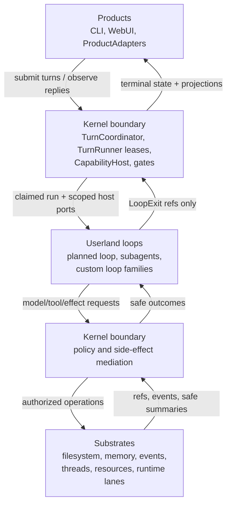
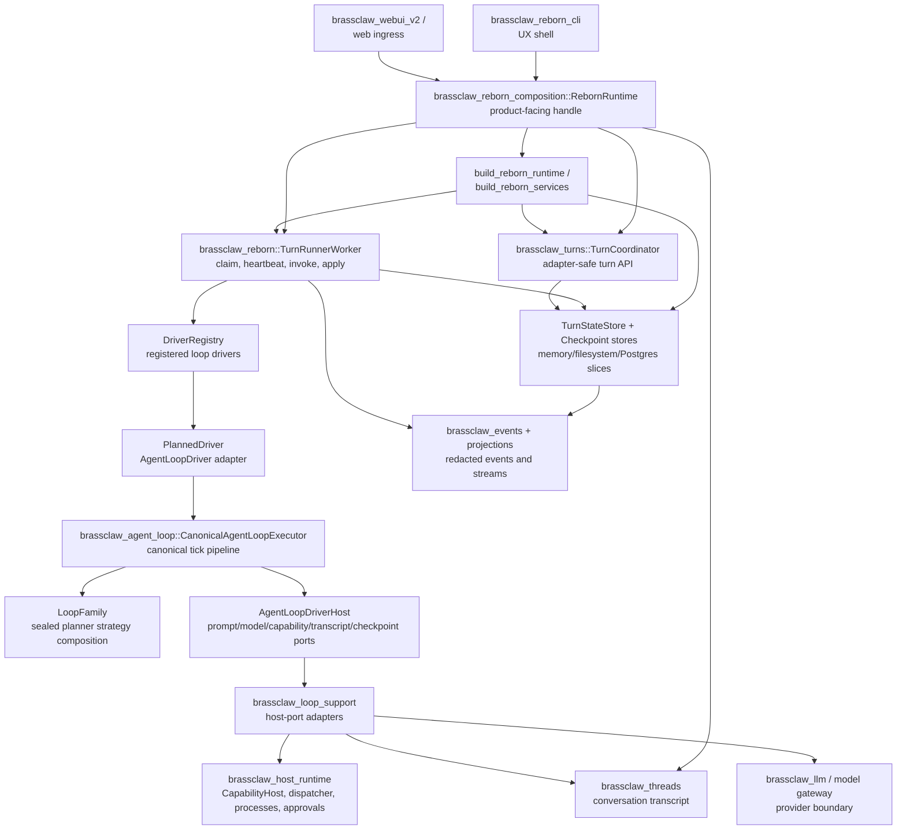
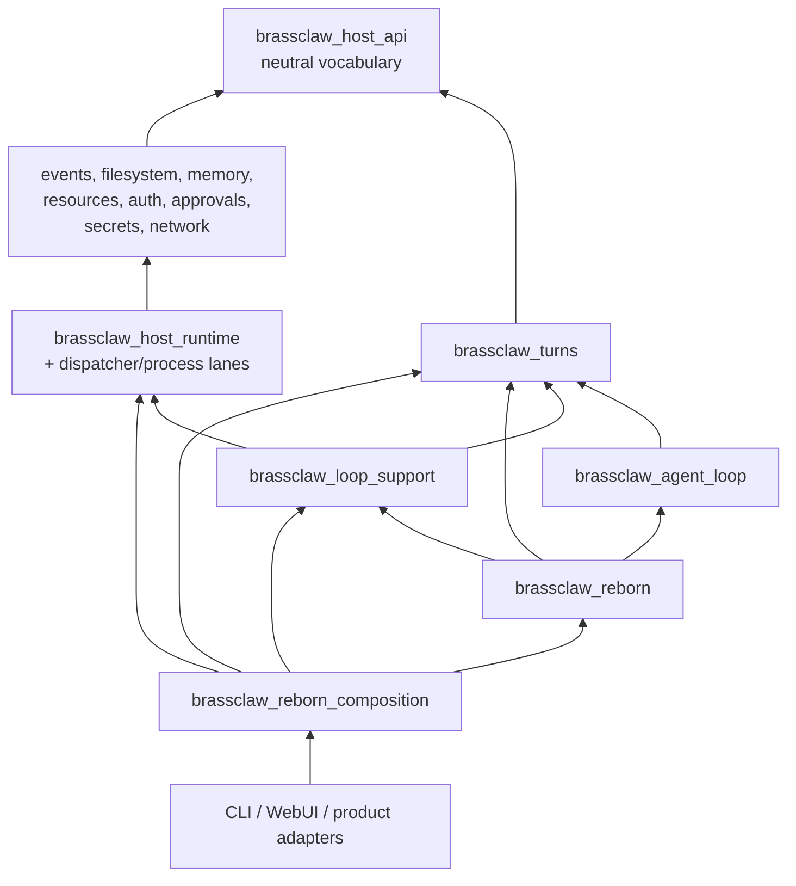
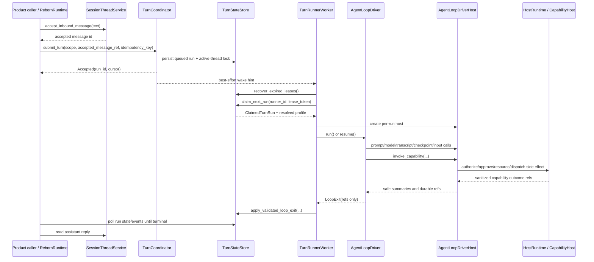
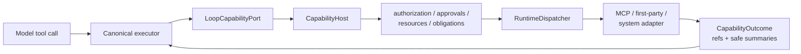
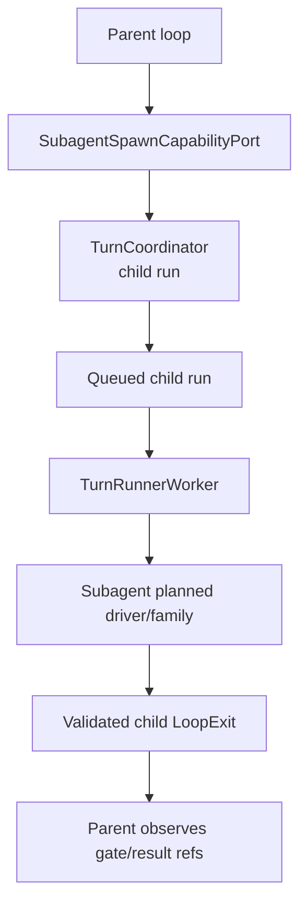

# BrassClaw Architecture Guide

This document is the single authoritative reference for the BrassClaw system. It is written for future AI agents and developers who need to deeply understand every component, contract, and design decision. Read it completely before making any architectural changes.

---

## Table of Contents

1. [System Overview](#system-overview)
2. [Architecture Thesis](#architecture-thesis)
3. [Four-Layer Mental Model](#four-layer-mental-model)
4. [Full Architecture Diagram](#full-architecture-diagram)
5. [Layer Ownership Matrix](#layer-ownership-matrix)
6. [Core Crates Reference](#core-crates-reference)
7. [Turn Data Flow](#turn-data-flow)
8. [Runner and Lease State Machine](#runner-and-lease-state-machine)
9. [Agent Loop Internals](#agent-loop-internals)
10. [Capability and Tool Flow](#capability-and-tool-flow)
11. [Prompt, Model, and Transcript Flow](#prompt-model-and-transcript-flow)
12. [Subagent Architecture](#subagent-architecture)
13. [Skills System](#skills-system)
14. [Token Budget System](#token-budget-system)
15. [Security and Trust Model](#security-and-trust-model)
16. [Runtime Lanes and Extensions](#runtime-lanes-and-extensions)
17. [Run Profiles and Policy Resolution](#run-profiles-and-policy-resolution)
18. [Events, Projections, and Replies](#events-projections-and-replies)
19. [Persistence and Data Model](#persistence-and-data-model)
20. [Configuration](#configuration)
21. [Deployment](#deployment)
22. [Non-Happy-Path Flows](#non-happy-path-flows)
23. [Composition Modes](#composition-modes)
24. [Key Invariants](#key-invariants)
25. [Change Recipes](#change-recipes)
26. [Directory Structure](#directory-structure)
27. [Evidence Pointers](#evidence-pointers)

---

## System Overview

BrassClaw is a **secure, local-first AI assistant** built on the IronClaw Reborn architecture. It runs entirely on consumer hardware, optimized for small LLMs (7B–14B parameters) within an **8,192-token context window**.

**Key characteristics:**
- ~70 Rust crates organized as a workspace
- Two-layer execution model: a stable Rust kernel (infrastructure, safety, persistence) + a self-modifiable Python orchestrator via Monty VM
- Multi-provider LLM support: vLLM, Ollama, OpenAI-compatible APIs, Anthropic
- Skills system for deterministic knowledge injection (no LLM involvement in selection)
- Process sandbox (`brassclaw_process_sandbox`) for untrusted tool subprocess execution — replaces the v1 WebAssembly sandbox removed in Phase 4
- PostgreSQL persistence (mandatory in production; the libSQL read path survives only as the upgrade-release migration gate)
- WebUI v2 (React SPA) + TUI/REPL + future Slack/Telegram adapters

---

## Architecture Thesis

The central design rule, which must guide every architectural decision:

```
Products own UX.
Loops own agent behavior.
The kernel boundary owns authority, recovery, and side-effect mediation.
Substrates own durable, reusable primitives.
```

These layers are **not peers**. Products and loops are replaceable userland code. The kernel boundary is the narrow authority surface they must use for any side effect. Substrates are reusable building blocks behind that boundary.

### Non-Goals

Reborn must **never** grow:
- One host core per product, vendor, or transport
- A privileged agent loop that bypasses `CapabilityHost`
- Product-specific orchestration inside substrate crates
- Direct dispatcher calls from loops or product entry points
- Ad-hoc persistence records carrying raw prompts, tool input, secrets, host paths, or backend diagnostics
- Separate subagent execution machinery outside the normal runner/driver loop
- Local-dev shortcuts that silently become hosted or production behavior

---

## Four-Layer Mental Model

```
Product/API surface
  accepts messages and exposes replies/events

Composition facade
  assembles storage, host runtime, drivers, workers, profiles, projections

Turn coordination
  owns turn/run records, active-thread lock, leases, wake hints, lifecycle

Runner worker
  claims queued runs, heartbeats leases, invokes one loop driver, applies exit

Agent-loop driver
  userland loop behavior; plans prompt/model/tool work and returns LoopExit

Agent-loop host ports
  scoped access to prompt, model, capabilities, transcript, checkpoints, input

Host runtime / substrates
  authorization, approvals, resources, filesystem, secrets, network, processes,
  runtime dispatch, events, memory, extensions
```

The loop is **intentionally not the security perimeter**. It asks for effects through host ports, and those host ports route privileged effects through the host runtime and `CapabilityHost` boundary.



### Products

Products decide how humans and external systems interact with Reborn. A product surface may create conversations, accept inbound messages, stream projections, render approvals, or expose auth interactions. It must **not** own agent-loop heuristics, tool authorization, runtime dispatch, or low-level persistence policy.

Product-facing assembly enters through `brassclaw_reborn_composition::RebornRuntime`. CLI and WebUI code must treat that facade as the public runtime handle instead of wiring `TurnStateStore`, `TurnRunnerWorker`, `HostRuntimeServices`, or concrete drivers directly.

### Userland Loops

Loops decide what the agent does next. They build prompt context from authorized host data, call the model through a host model port, interpret model output, request capability calls, checkpoint resumable state, and eventually return a `LoopExit`.

Loops are userland because their choices are **policy-constrained requests, not authority**. A loop can ask to call a capability, read context, write a reply, or spawn a subagent, but the host decides whether that request is allowed and how it is recorded. This is why `brassclaw_agent_loop` depends on neutral turn/host-port contracts instead of importing the dispatcher, secrets, network, or product adapters.

### Kernel Boundary

The kernel boundary is the security and recovery perimeter. It is **not** a single `brassclaw_kernel` crate; it is the set of mediated services that enforce:
- Scope and active-thread ownership
- Runner claim/heartbeat/recovery rules
- Exact capability invocation authorization and approvals
- Resource reservation and process ownership
- Scoped filesystem and memory access
- Network and secret policy
- Redacted event/audit emission
- Validated loop-exit application

### Substrates

Substrates are reusable service and storage primitives. They are deliberately less product-aware than the runtime facade and less behavior-aware than loops. Examples include event logs, projection stores, filesystem roots, memory services, approval/run-state stores, resource governors, thread services, and runtime lanes.

---

## Full Architecture Diagram



---

## Layer Ownership Matrix

Use this table when deciding where a new concern belongs.

| Layer | May call | Must not call | Owns | Typical crates |
|---|---|---|---|---|
| **Products** | Composition facade, product workflow, projection/read APIs | Raw stores, `RuntimeDispatcher`, concrete loop drivers, substrate internals | UX, transport normalization, user-visible replies/events, approval/auth UI | `brassclaw_reborn_cli`, `brassclaw_webui_v2`, product adapters |
| **Composition** | Turn coordinator, host runtime, loop driver registry, substrates through typed constructors | Product-specific branching in lower crates, test/dev escape hatches in production | Service graph, profile mode, readiness, facade handles | `brassclaw_reborn_composition`, `brassclaw_reborn` |
| **Userland loops** | `AgentLoopDriverHost` ports only | `CapabilityHost`, `RuntimeDispatcher`, secret/network stores, product adapters | Prompt/model/tool strategy, retry/stop/gate decisions, loop-local checkpoints | `brassclaw_agent_loop`, loop families |
| **Kernel boundary** | Substrates and runtime lanes through typed policy/authority APIs | Product UX decisions, loop strategy internals | Authorization, approvals, exact invocation leases, active locks, runner leases, validated exits, resource/process ownership | `brassclaw_turns`, `brassclaw_host_runtime`, `brassclaw_authorization`, `brassclaw_approvals` |
| **Substrates** | Lower neutral contracts and storage backends | Product facade APIs, loop behavior, direct authority escalation | Durable records, files, memory, events, projections, threads, resource stores, runtime adapters | `brassclaw_filesystem`, `brassclaw_memory`, `brassclaw_events`, `brassclaw_threads`, runtime lane crates |

Short version:
```
Product        -> Composition facade
Composition    -> Kernel boundary + substrates
Loop           -> AgentLoopDriverHost ports
Kernel boundary -> Substrates and runtime lanes
Substrate      -> neutral contracts only
Dispatcher     -> already-authorized routing only
```

### Dependency Direction

Lower layers must **never** import product/runtime orchestration. The dependency flow is strictly upward:



Boundary rules are mechanically checked in `brassclaw_architecture`, especially for Reborn dependency edges and public-surface restrictions.

---

## Core Crates Reference

### `brassclaw_reborn_cli`

Main binary entry point. All product traffic begins here.

**CLI commands:**
- `repl` — Interactive REPL session
- `run --message "..."` — Single-shot execution
- `serve` — WebUI + API server
- `config init/path` — Configuration management
- `models set-provider/status/list` — LLM provider management
- `doctor` — System diagnostics
- `skills` — Skill management

**Constraint:** Must not import lower-level Reborn crates directly. All behavior routes through `brassclaw_reborn_composition::RebornRuntime`.

---

### `brassclaw_reborn_composition`

Assembles everything. The product-facing runtime handle.

**Owns:**
- `RebornRuntime` — public facade used by CLI, WebUI, harness callers
- `build_reborn_runtime` / `build_reborn_services` — wires substrate services, thread/turn/checkpoint/event/approval/auth/skill/projection services, planned runtime, `TurnRunnerWorker`
- Local and production profile wiring
- WebUI/runtime integration
- Projection services

**Does not own:** Low-level policy internals or direct product traffic bypassing Reborn adapters.

---

### `brassclaw_reborn`

Driver-side Reborn loop integration.

**Owns:**
- `PlannedDriver` — adapts agent loop families to the runner-facing contract
- `TextLoopDriver` — legacy text-only driver
- `DriverRegistry` — driver registration and readiness
- `LoopDriverHost` — composes concrete loop host ports
- `LoopExitApplier` — validates and applies loop exits
- `TurnRunnerWorker` — manages individual conversation turns (claim, heartbeat, invoke, apply)

---

### `brassclaw_reborn_config`

Configuration resolution.

**Owns:**
- TOML config loading from `~/.brassclaw/reborn/config.toml`
- Environment variable resolution (`LLM_*`, `BRASSCLAW_REBORN_*`, etc.)
- Profile selection and merging
- Config path management

---

### `brassclaw_turns`

Turn/run contracts — the kernel boundary's durable coordination layer.

**Owns:**
- `TurnScope` — canonical tenant/agent/project/thread scope; active-lock and isolation key
- `TurnActor` — actor metadata for the accepted turn
- `TurnId` / `TurnRunId` — accepted inbound turn identity and executable run identity
- `TurnCoordinator` — adapter-safe turn API (submit, resume, cancel)
- `TurnRunnerWorker` transition ports
- `TurnRunState` — current status, resolved run profile, runner lease metadata, checkpoint/gate refs, event cursor
- `TurnActiveLockRecord` — one-active-run-per-canonical-thread lock
- `TurnIdempotencyRecord` — sanitized replay outcome
- `LoopExit` DTOs, run profiles, checkpoint contracts

**Does not own:** Runtime dispatch, product adapters, raw prompts/tool inputs/secrets.

---

### `brassclaw_agent_loop`

Core execution loop with pluggable, sealed strategies.

**Owns:**
- `CanonicalAgentLoopExecutor` — canonical tick pipeline
- `DefaultExecutorPipeline` — input → prompt/context → model → capability → gate/checkpoint → stop/exit stages
- `LoopFamily` — sealed planner strategy composition
- `LoopExecutionState` — resumable strategy state (iteration, last_checkpoint, assistant_refs, result_refs, last_gate, input_cursor, strategy slots, recent call/failure rings)

**Strategies (pluggable):**
- `CompactionStrategy` — context window management (default: 8,192 tokens)
- `BudgetStrategy` — iteration and time limits
- `CapabilityStrategy` — tool/action availability
- `ModelStrategy` — model selection and fallback
- `StopConditionStrategy` — loop termination detection
- `RecoveryStrategy` — error recovery

**Constraint:** Strategy slots are private. Downstream crates can hold a `LoopFamily` but cannot inspect or recompose planner internals. `brassclaw_agent_loop` must never import host services, runtime lanes, product transport, or provider auth.

---

### `brassclaw_loop_support`

Reusable adapters implementing loop host ports.

**Owns:**
- Host-port adapters over threads, model gateways, capabilities, skills, checkpoints, cancellation, subagents
- Implements `AgentLoopDriverHost` ports consumed by the executor

**Does not own:** Product-facing runtime facade or durable turn state ownership.

---

### `brassclaw_host_runtime`

Kernel-facing host runtime services — the security and side-effect boundary.

**Owns:**
- `CapabilityHost` — authorization, approvals, resource management, obligation handling
- `RuntimeDispatcher` — already-authorized adapter routing (below authorization; not the public workflow gate)
- Effect adapters — tool execution with safety controls
- LLM adapters — connect to vLLM, Ollama, OpenAI, Anthropic, etc.
- Store adapters — persistence layer
- Approval, resource, process, secrets, and network mediation

**Does not own:** Agent-loop planning or product conversation UX.

---

### `brassclaw_engine`

v2 engine with Python orchestrator (Monty VM).

**Owns:**
- `ExecutionLoop` — bootstraps Monty VM, loads orchestrator, runs step loop
- `Orchestrator` (`orchestrator/default.py`) — Python execution loop
- Host Functions — Rust functions callable from Python (`__llm_complete__`, `__execute_action__`, etc.)
- `SkillSelector` — deterministic skill scoring and injection
- `SkillTracker` — confidence tracking with rollback
- `ThreadManager` — spawn, stop, join threads
- `MissionManager` — learning missions lifecycle

---

### `brassclaw_llm`

LLM provider abstractions and implementations.

**Owns:**
- Multi-provider support via `rig-core`
- OpenAI-compatible API support (vLLM, llama.cpp, etc.)
- Ollama native support
- Anthropic API support
- Token counting and budget management
- Streaming response handling

---

### `brassclaw_skills`

Deterministic skills system (shared by both v1 and v2 engines).

**Owns:**
- `types.rs` — `SkillManifest`, `ActivationCriteria`, `LoadedSkill`
- `selector.rs` — deterministic 4-phase selection pipeline
- `parser.rs` — SKILL.md frontmatter parsing
- `validation.rs` — name/content escaping
- `gating.rs` — binary/env/config requirements checking

See [Skills System](#skills-system) for the full selection pipeline.

---

### `brassclaw_capabilities`

Capability invocation host.

**Owns:**
- Authorization and approval gates
- Run-state and lease management for capability invocations
- Dispatch routing to `RuntimeDispatcher`
- Obligation handling before side effects
- Scoped capability surface selection

---

### `brassclaw_safety`

Security and safety layer.

**Owns:**
- Prompt injection detection (pattern-based)
- Content sanitization and escaping
- Policy enforcement: Block / Warn / Review / Sanitize
- Tool output wrapping

---

### `brassclaw_process_sandbox`

Host-side isolation and command gating for tools that need to run sub-processes (shell, docker, git, etc.).

**Owns:**
- Single canonical docker-image validator (`image::validate_reference`) — applies to all processes_sandbox docker-exec invocations
- Capability-lease enforcement across process spawns
- Endpoint allowlisting + scoped filesystem mounts
- Credential injection at host boundary
- Leak detection (request/response scanning for outbound HTTP)
- Rate limiting per tool

> **Phase 4 update:** the v1 WASM sandbox (`brassclaw_wasm` / `brassclaw_wasm_sandbox_core` / `brassclaw_wasm_limiter`) and the bespoke script runtime (`brassclaw_scripts`, `brassclaw_host_runtime::services::script_runtime`) have been removed. New tool isolation comes from this `brassclaw_process_sandbox` crate combined with the `Mcp` / `FirstParty` / `System` runtime lanes in `brassclaw_extensions`. See `docs/brassclaw-architecture.md` § "Reborn v2 extension runtimes" for the replacement topology.

---

### `brassclaw_extensions`

Extension discovery and management.

**Owns:**
- Manifest parsing (TOML/JSON)
- Runtime kind detection: MCP, FirstParty, System (the WASM and Script lanes were removed in Phase 4)
- Extension lifecycle management
- Package/capability descriptor registry

**Rule:** Extensions declare capabilities; they do not execute during discovery.

---

### `brassclaw_threads`

Session thread and transcript service.

**Owns:**
- `SessionThreadService` — source of truth for accepted user messages and finalized assistant replies
- Accepted inbound message storage
- Assistant draft/final message storage
- Transcript state and ordering

---

### `brassclaw_events`

Typed redacted event/audit substrate.

**Owns:**
- `DurableEventLog` / `TurnEventSink` — redacted lifecycle, progress, capability, approval, and runtime metadata
- Projection streams and replay cursors
- Event delivery (failure must not corrupt turn state)

---

### `brassclaw_webui_v2`

WebUI v2 product adapter.

**Owns:**
- Product-level WebUI integration with `RebornRuntime`
- Auth/approval/runtime handle wiring
- Projection and event stream integration

---

### `brassclaw_webui_v2_static`

Embedded static assets for the WebUI.

**Owns:**
- Compiled React SPA (embedded at build time)
- Static asset serving

---

### `brassclaw_reborn_webui_ingress`

WebUI HTTP ingress layer.

**Owns:**
- Axum route definitions
- SSE streaming endpoints
- Chat API endpoints
- Bearer token authentication enforcement
- Origin/rate/body/auth boundary enforcement
- Memory/jobs/extensions/routines management endpoints

**Constraint:** Must not bypass bearer/origin/rate/body/auth boundaries.

---

### `brassclaw_gateway`

Web gateway for browser UI (legacy / v1).

**Owns:**
- SSE/WebSocket streaming
- Chat API endpoints
- Memory/jobs/extensions/routines management

---

### `brassclaw_tui`

Terminal user interface.

**Owns:**
- Rich text rendering
- Interactive REPL
- Status display

---

### `brassclaw_architecture`

Architectural boundary enforcement.

**Owns:**
- Compile-time and test-time dependency boundary checks
- Reborn dependency edge enforcement
- Public-surface restriction tests

---

## Turn Data Flow

The normal single-message flow — every turn follows this exact path:



**Step-by-step:**
1. Product/runtime caller writes user text to `SessionThreadService`
2. Caller submits `SubmitTurnRequest` to `TurnCoordinator`
3. `TurnCoordinator` persists turn/run state, enforces active-thread ownership, resolves the run profile, emits a wake hint
4. `TurnRunnerWorker` wakes or polls, recovers expired leases, atomically claims one queued run
5. Worker builds a per-run `AgentLoopDriverHost` from the host factory
6. Worker resolves the assigned `AgentLoopDriver` from `DriverRegistry`
7. `PlannedDriver` validates the request/profile and starts or resumes `CanonicalAgentLoopExecutor` with `LoopExecutionState`
8. Executor asks host ports for prompt context, model calls, tool/capability calls, transcript writes, checkpoints, input, progress, compaction, and cancellation
9. Executor returns a `LoopExit` containing durable refs only
10. Worker applies the `LoopExit` through `LoopExitApplier` and trusted runner transition ports
11. Product/runtime caller waits for terminal state, then reads the assistant reply from `SessionThreadService` and observes events/projections

---

## Runner and Lease State Machine

`TurnRunnerWorker` is the trusted worker-side control plane. It does not accept traffic directly; it claims durable work already accepted by `TurnCoordinator`.

```mermaid
stateDiagram-v2
    [*] --> Queued: submit_turn
    Queued --> Running: claim_next_run
    Running --> Running: heartbeat
    Running --> BlockedApproval: LoopExit::Blocked(approval)
    Running --> BlockedAuth: LoopExit::Blocked(auth)
    Running --> WaitingProcess: process/capability wait
    BlockedApproval --> Queued: resume_turn
    BlockedAuth --> Queued: resume_turn
    WaitingProcess --> Running: process completes
    Running --> Completed: validated Completed exit
    Running --> Failed: validated Failed exit
    Running --> Cancelled: validated Cancelled exit
    Running --> RecoveryRequired: lease expired or unsafe exit
    RecoveryRequired --> Cancelled: explicit cancellation
    Completed --> [*]
    Failed --> [*]
    Cancelled --> [*]
```

**Critical invariants:**
- `submit_turn` creates queued work, but no model/tool side effect runs before `claim_next_run` succeeds
- Heartbeats require the matching runner id and lease token
- Expired running or cancel-requested leases move to `RecoveryRequired`, not automatic retry
- `LoopExit` is a driver claim, not trusted durable state
- `LoopExitApplier` validates host-owned evidence before mapping the exit to a trusted transition

---

## Agent Loop Internals

The default planned loop is an adapter stack:

```
ResolvedRunProfile.loop_driver
  -> DriverRegistry key
  -> PlannedDriver
      -> opaque LoopFamily from LoopFamilyRegistry
      -> CanonicalAgentLoopExecutor
          -> DefaultExecutorPipeline
              -> input stage
              -> prompt/context stage
              -> model stage
              -> capability stage
              -> gate/checkpoint stage
              -> stop/exit stage
```

`brassclaw_agent_loop` keeps strategy slots private. Downstream crates can hold a `LoopFamily`, but cannot inspect or recompose the planner internals.

**`LoopExecutionState` fields:**

| Field | Purpose |
|---|---|
| `iteration` | Current loop iteration count |
| `last_checkpoint` | Ref to most recent checkpoint payload |
| `assistant_refs` | Durable refs to written assistant messages |
| `result_refs` | Durable refs to tool/capability results |
| `last_gate` | Ref to last approval/auth gate |
| `input_cursor` | Cursor tracking consumed input |
| `capability/model/context/recovery/stop/gate strategy slots` | Pluggable strategy state |
| `bounded recent call/failure rings` | Recent history for recovery decisions |

Checkpoint payloads serialize `LoopExecutionState` bytes. Schema id and checkpoint kind are store-side metadata; resume code first validates checkpoint metadata through host/store ports, then rehydrates state.

---

## Capability and Tool Flow

Capability execution is deliberately indirect — the loop **never** calls `RuntimeDispatcher` directly:



Full path:
```
model tool call / loop capability candidate
  -> AgentLoopDriverHost::invoke_capability
  -> loop-support capability port
  -> host runtime CapabilityHost
      -> extension/capability lookup
      -> authorization, approval, leases, resources, network/secrets policy
      -> RuntimeDispatcher
      -> MCP / first-party / system runtime adapter
  -> sanitized outcome refs and safe summaries
  -> executor state and transcript refs
```

`RuntimeDispatcher` is an already-authorized adapter router — not the public workflow gate. It routes an already-authorized request to a runtime adapter and normalizes the result.

---

## Prompt, Model, and Transcript Flow

Prompt assembly is loop/userland strategy over authorized host data:

**`LoopPromptPort`** resolves:
- Run profile, identity/system context, personal-context policy
- Skill context (from `brassclaw_skills` injection)
- Thread context (from `brassclaw_threads`)
- Hook materialization and safety context

**`LoopModelPort`** sends model requests through:
- Configured model gateway
- Policy/budget guards
- Model route snapshots persisted before side effects where present

**`LoopTranscriptPort`** writes:
- Draft/final assistant messages to thread storage
- Returns durable message refs used by `LoopExit` validation

**Critical rule:** Raw prompts, tool inputs, secrets, backend errors, and host paths must **never** be stored in turn state or exposed in loop exits. Events and diagnostics carry only redacted metadata or durable refs.

---

## Subagent Architecture

Subagent work is modeled as **child runs**, not as a second private loop engine. This keeps planning, execution, gates, checkpoints, retries, completion, and recovery on the same Reborn runner/driver/executor path as parent work.



Path:
```
parent loop capability
  -> subagent spawn capability port
  -> TurnCoordinator child-run reservation/submission
  -> queued child TurnRunId
  -> TurnRunnerWorker claims child run
  -> subagent planned driver/family executes on the same host/runner contracts
  -> child LoopExit is validated and recorded
  -> parent observes gate/result refs
```

---

## Skills System

Skills are Markdown files with YAML frontmatter that inject knowledge into the LLM context. They are the v2 replacement for both WASM API wrapper tools and static prompt extensions. **No LLM is involved in skill selection** — this prevents circular manipulation.

### How Skills Work

1. **Activation**: When a user message arrives, `SkillSelector` scores all available skills against the message content using keywords, patterns, and tags
2. **Selection**: Skills above a threshold score are selected, subject to the token budget (default: 2,048 tokens for all skills combined)
3. **Injection**: Selected skill content is injected into the system prompt as `<skill>` XML blocks
4. **Execution**: The LLM reads the skill content and uses the knowledge to construct tool calls (e.g., HTTP requests)

### Deterministic 4-Phase Selection Pipeline

```
Phase 1: Gating
  Check prerequisites (binary present, env vars set, config flags enabled)

Phase 2: Scoring
  keyword exact match:  10 pts each, cap 30 pts
  keyword substring:     5 pts each (no cap)
  tag match:             3 pts each, cap 15 pts
  regex pattern match:  20 pts each, cap 40 pts

Phase 3: Budget
  Fit selected skills within max_context_tokens budget (default: 2,048)
  Skills ranked by score; highest-scoring skills fill budget first

Phase 4: Attenuation
  Trust-based confidence factor applied to final selection
```

### Skill File Format

```yaml
---
name: skill-name
version: "1.0.0"
description: What this skill does
activation:
  keywords: ["keyword1", "keyword2"]
  exclude_keywords: ["not-this"]
  patterns: ["(?i)regex.*pattern"]
  tags: ["tag1", "tag2"]
  max_context_tokens: 256
credentials:
  - name: api_token
    provider: service_name
    location:
      type: bearer
    hosts:
      - "api.example.com"
---

# Skill Content (Markdown)

Instructions for the LLM on how to use this skill's capabilities.
```

### Built-in Skills

| Skill | Directory | Token Budget | Purpose |
|---|---|---|---|
| `caldav` | `skills/caldav/` | 384 tokens | CalDAV calendar integration |
| `notes` | `skills/notes/` | 192 tokens | Local notes management |
| `local-search` | `skills/local-search/` | 256 tokens | File search on local filesystem |
| `web-browse` | `skills/web-browse/` | 320 tokens | Browser automation |
| `github` | `skills/github/` | varies | GitHub API integration |

Skills live in the `skills/` directory at the repo root, one subdirectory per skill.

---

## Token Budget System

BrassClaw enforces strict token budgets for local LLM compatibility:

| Setting | Default | Description |
|---|---|---|
| `agent.max_prompt_tokens` | 8,192 | Total prompt token budget |
| `skills.max_context_tokens` | 2,048 | Skill injection budget |
| Compaction context limit | 8,192 | Agent loop context window |
| Compaction reserve | 2,048 | Reserved for new output |
| Compaction preserve tail | 1,024 | Recent messages to keep |

### Token Guard — Priority Drop Order

When the prompt exceeds budget, `CompactionStrategy` drops content in this priority order:

1. Low-scoring memory fragments
2. Low-scoring skills
3. Tool/capability descriptions
4. Droppable system-prompt sections
5. Old conversation history (oldest first, preserving tail)

The 1,024-token tail preserve ensures the most recent messages always remain in context regardless of budget pressure.

---

## Security and Trust Model

Security-sensitive behavior must remain **host-owned** and **fail closed**.

```
trust/source classification
  -> visibility and policy decisions
  -> exact invocation authorization
  -> approval/auth gates when required
  -> obligations prepared before side effects
  -> runtime dispatch only after authority is established
  -> redaction/output limits/audit after execution
```

### Defense in Depth

1. **Process Sandbox** (`brassclaw_process_sandbox`): untrusted tool subprocesses (shell, docker-exec, git) run with capability leases, scoped filesystems, endpoint allowlists, and a single canonical docker-image validator. **Phase 4 update:** this replaces the v1 WebAssembly sandbox (wasmtime) — the WASM-mediated lane has been removed; tool authors target `Mcp` (hosted) or `FirstParty` / `System` (native Rust) lanes and call into `brassclaw_process_sandbox` when they need subprocess isolation.
2. **Capability Leases**: Scoped, time-bound, use-limited access grants; exact-invocation scoped
3. **Policy Engine**: Deterministic allow/deny/require-approval decisions (Block/Warn/Review/Sanitize)
4. **Credential Injection**: Secrets injected at host boundary, never exposed to tools; staged for one runtime handoff and consumed before use
5. **Leak Detection**: Request/response scanning for secret exfiltration
6. **Prompt Injection Defense**: Pattern detection + content sanitization
7. **Endpoint Allowlisting**: HTTP only to approved hosts/paths
8. **Scoped Filesystems**: Runtime adapters receive narrowed mounts, not arbitrary host paths

### Effect Types

Every action declares its side effects before execution:

| Effect | Meaning |
|---|---|
| `ReadLocal` | Read from local filesystem |
| `ReadExternal` | Read from external service |
| `WriteLocal` | Write to local filesystem |
| `WriteExternal` | Write to external service |
| `CredentialedNetwork` | Network call with credentials |
| `Compute` | Local compute-only |
| `Financial` | Financial transaction |

### Trust Rules

- Trust class is assigned by the host, never by a loop, product adapter, or user-installed manifest
- Visible capability surfaces are **publication metadata, not grants** — direct invocation of a hidden or denied capability still fails closed
- Approval leases are exact-invocation scoped; broad reusable approval is not the default
- Raw secret material must not appear in logs, events, debug output, or command environments unless a profile explicitly allows that local-only behavior
- Network access is host-mediated through policy and runtime egress adapters
- Public errors use stable redacted categories

---

## Runtime Lanes and Extensions

Extensions declare capabilities; they do not execute during discovery.

```
ExtensionDiscovery / registry
  -> package/manifests/capability descriptors
  -> visible capability surface for a scoped run/profile
  -> exact capability invocation through CapabilityHost
  -> RuntimeDispatcher selects runtime kind
  -> runtime lane adapter executes with scoped host services
```

### Runtime Lane Types

| Lane | Role | Boundary |
|---|---|---|
| **MCP** | External MCP server/tool integration | HTTP/SSE egress must use host-mediated runtime HTTP where policy requires it |
| **First-party** | Host-owned built-in handlers | Still dispatches through `CapabilityHost` and `RuntimeDispatcher`; manifests cannot self-assign first-party/system authority |
| **System** | Deferred stricter host-only lane | Do not treat first-party as a shortcut to system authority |

> **Phase 4 update:** the `WASM` lane (wasmtime host imports) and the `Script` lane were removed. Sandboxable subprocess work now goes through `brassclaw_process_sandbox` behind the `ProcessExecutor`; extension manifests may declare only `mcp`, and the host assigns `first_party`/`system` (both `#[serde(skip_deserializing)]` on `RuntimeKind` in `brassclaw_host_api::runtime`).

---

## Run Profiles and Policy Resolution

Run profiles are the bridge between product intent, loop behavior, and kernel policy. A resolved run profile is captured on the run so execution can be recovered without re-resolving a different driver or policy after restart.

```
RunProfileRequest
  -> RunProfileResolver
  -> ResolvedRunProfile
      loop_driver id/version/checkpoint schema
      model profile
      capability surface profile
      context profile and personal-context policy
      checkpoint policy
      resource budget policy
      runtime constraints
      scheduling/concurrency class
      provenance and fingerprint
```

Profiles do not grant authority by themselves. They choose bounded surfaces and policies that host/kernel services enforce later:

```
profile selects visible capability surface
  but CapabilityHost still authorizes exact invocation

profile selects model/context policies
  but host ports still enforce safety, scope, and redaction

profile selects checkpoint policy
  but runner still validates durable checkpoint/result evidence

profile selects runtime constraints
  but deployment mode and host runtime policy may only reduce authority
```

**Deployment profiles** (`LocalDev`, `HostedDev`, `EnterpriseDev`) are a separate outer envelope. They may all run the same loop and capability contracts but resolve to different filesystem, process, network, secret, approval, and audit backends. **Deployment mode may reduce requested authority; it must never increase it.**

---

## Events, Projections, and Replies

Reborn distinguishes three separate stores:

```
TurnStateStore
  source of truth for turn/run lifecycle, locks, runner leases, checkpoints,
  idempotency, spawn tree state

SessionThreadService
  source of truth for accepted user messages and finalized assistant replies

DurableEventLog / TurnEventSink / projection services
  redacted progress, lifecycle, replay cursors, WebUI/event stream views
```

Event delivery failure must **not** corrupt turn state. Public projections must prefer redacted refs and summaries over raw runtime payloads.

### Observability Surface Matrix

| Surface | Answers | Must avoid |
|---|---|---|
| Turn state | What durable lifecycle state is the run in? | Raw prompts, raw tool input, backend errors |
| Transcript/thread storage | What user-visible messages exist? | Treating progress metadata as transcript |
| Event/projection streams | What redacted progress happened, and where can clients resume? | Corrupting run state on delivery failure |
| Audit/debug/traces | What authority decision or runtime event occurred? | Secrets, host paths, private URLs, unredacted payloads |

---

## Persistence and Data Model

### Core Data Records

| Data | Purpose | Owner |
|---|---|---|
| `TurnScope` | Canonical tenant/agent/project/thread scope; active-lock and isolation key | `brassclaw_turns` |
| `TurnActor` | Actor metadata for the accepted turn | `brassclaw_turns` |
| `AcceptedMessageRef` | Durable ref to the accepted inbound message in thread/transcript storage | `brassclaw_turns` + thread service |
| `SourceBindingRef` / `ReplyTargetBindingRef` | Canonical product binding refs for source and reply target | Product workflow / turns |
| `TurnId` | Accepted inbound turn identity | `brassclaw_turns` |
| `TurnRunId` | Executable run identity | `brassclaw_turns` |
| `TurnRunState` | Current status, resolved run profile, runner lease metadata, checkpoint/gate refs, event cursor | `TurnStateStore` |
| `TurnActiveLockRecord` | One-active-run-per-canonical-thread lock | `TurnStateStore` |
| `TurnIdempotencyRecord` | Sanitized replay outcome for adapter-facing mutations | `TurnStateStore` |
| `LoopExecutionState` | Loop-owned resumable strategy state, serialized as bounded checkpoint payload bytes | `brassclaw_agent_loop` |
| `LoopCheckpointStateRef` / `TurnCheckpointId` | Opaque checkpoint payload ref and public checkpoint metadata id | Checkpoint stores + turns |
| `LoopExit` | Driver claim containing durable refs only; never trusted by itself | Loop driver / turns |
| `LoopMessageRef` / `LoopResultRef` / `LoopGateRef` | Host-minted evidence refs used to validate exits and blocked gates | Host ports / turns |
| `CapabilityInvocation` / `CapabilityOutcome` | Scoped tool/capability request and sanitized result refs/summaries | Loop host ports + host runtime |
| `EventCursor` | Replay/projection cursor for redacted lifecycle and progress events | Events / turns |

### Persistence Placement

```
TurnStateStore
  turn/run lifecycle, active locks, runner leases, idempotency, checkpoint refs

CheckpointStateStore
  bounded loop checkpoint payload bytes keyed by opaque refs and scope/run

SessionThreadService
  accepted inbound messages, assistant drafts/finals, transcript state

Event/audit logs
  redacted lifecycle, progress, capability, approval, and runtime metadata
```

Turn records and events store **refs and metadata only**. Raw prompt text, raw assistant drafts, tool input JSON, secrets, host paths, raw runtime output, provider errors, and backend diagnostics must not enter turn persistence.

### Database Backends

PostgreSQL is the only production backend (Goal 2; see `Goals_pre_v3_review.md`). An embedded Postgres is used for single-host local deployments when `BRASSCLAW_PG_URL` is absent; an external Postgres is required for all non-local `BRASSCLAW_RUNTIME_PROFILE` values.

| Backend | Status | Use Case |
|---|---|---|
| PostgreSQL | Mandatory production backend | All deployments (embedded or external) |
| libSQL | Upgrade-release migration path only (`migrate-from-libsql` / `libsql` feature alias) | One-time data migration from legacy v1 installs; not a runtime backend |

There is no libSQL/PostgreSQL runtime parity requirement — only PostgreSQL carries production-facing contract tests.

---

## Configuration

### Config File

`~/.brassclaw/reborn/config.toml` (default location, overridable via `BRASSCLAW_REBORN_HOME`):

```toml
[llm.default]
provider_id = "openai_compatible"
model = "Qwen/Qwen2.5-7B-Instruct-AWQ"
api_key_env = "BRASSCLAW_VLLM_KEY"

[webui]
listen_host = "127.0.0.1"
listen_port = 3000
```

> The `[boot]` section previously held `profile = "..."`; that field was removed in Phase 11 (`BootSection` is empty and `deny_unknown_fields` rejects the old key). Use the `BRASSCLAW_RUNTIME_PROFILE` env var for per-invocation capability policy instead.

### Runtime profiles (capability policy only)

The composition/installation profiles (`RebornCompositionProfile`) and the `profiles/` directory at the repo root have been removed (Goal 1; see `Goals_pre_v3_review.md`). There is no `local_dev` vs `hosted` composition split and no profile→database mapping — PostgreSQL is always the backend.

The single surviving profile knob is the `BRASSCLAW_RUNTIME_PROFILE` env var, which controls **only the per-invocation capability/security resolver**, never the storage backend:

| `BRASSCLAW_RUNTIME_PROFILE` | Capability policy |
|---|---|
| `local_dev` (default) | Relaxed local development |
| `local_safe` | Local with sandbox/policy enforced |
| `local_yolo` | Local with policy relaxed (yolo) |
| `hosted_safe` | Hosted/server with sandbox enforced (requires `BRASSCLAW_PG_URL`) |

Setting the old `BRASSCLAW_REBORN_PROFILE` (composition-profile name) is a hard startup error.

### Environment Variables

| Variable | Purpose |
|---|---|
| `BRASSCLAW_REBORN_HOME` | State root (default: `~/.brassclaw/reborn`) |
| `BRASSCLAW_RUNTIME_PROFILE` | Per-invocation capability/security policy (`local_dev`, `local_safe`, `local_yolo`, `hosted_safe`). **`BRASSCLAW_REBORN_PROFILE` is a hard startup error** — do not set it. |
| `BRASSCLAW_REBORN_LOG` | Tracing filter (`RUST_LOG` format) |
| `BRASSCLAW_PG_URL` | External Postgres URL. Optional for local deployments (embedded Postgres used when absent). |
| `LLM_BACKEND` | LLM provider fallback |
| `LLM_BASE_URL` | OpenAI-compatible endpoint URL |
| `LLM_MODEL` | Model name |
| `LLM_API_KEY` | API key (or `"none"` for local) |
| `BRASSCLAW_VLLM_KEY` | vLLM API key |

---

## Deployment

### Recommended: DietPi + vLLM

BrassClaw is optimized for DietPi systems with vLLM:

1. **vLLM**: Serves `Qwen/Qwen2.5-7B-Instruct-AWQ` on port 8000
2. **BrassClaw**: Connects to vLLM as an OpenAI-compatible provider
3. **systemd**: Both services managed as systemd units

```
vllm.service (port 8000, GPU inference)
    └── brassclaw.service (depends on vllm)
```

Automated setup: `deploy/dietpi-setup.sh`

### WebUI Access

- URL: `http://host:3000/v2`
- Authentication: Bearer token (configured in config)

### Service Files

| File | Purpose |
|---|---|
| `deploy/vllm.service` | vLLM systemd unit |
| `deploy/brassclaw.service` | BrassClaw systemd unit |
| `deploy/env.example` | Environment template |
| `deploy/dietpi-setup.sh` | Full automated setup |

---

## Non-Happy-Path Flows

### Approval or Auth Block and Resume

```
loop requests capability
  -> CapabilityHost requires approval/auth
  -> host writes gate/checkpoint refs
  -> driver returns LoopExit::Blocked
  -> LoopExitApplier verifies gate + checkpoint evidence
  -> run moves to blocked_* and keeps active-thread lock
  -> product approval/auth UI resolves the gate
  -> TurnCoordinator::resume_turn requeues the same run/checkpoint
  -> runner claims it and driver resumes from checkpoint payload
```

The product renders the interaction; it does not decide that the run is safe to resume without the stored gate/checkpoint evidence.

### Cancellation

```
product/caller requests cancel
  -> TurnCoordinator records cancellation intent
  -> running host ports expose cancellation to the loop
  -> driver returns LoopExit::Cancelled when observed safely
  -> runner validates cancellation evidence
  -> terminal cancellation releases active lock
```

If an interrupt races ahead of durable cancellation state, the runner must prefer recovery over pretending the run was safely cancelled.

### Expired Lease Recovery

```
runner crashes or stops heartbeating
  -> reconciler sees expired Running/CancelRequested lease
  -> run moves to RecoveryRequired
  -> active-thread lock stays held
  -> duplicate/new submit remains ThreadBusy
  -> operator/user must explicitly cancel or recover
```

Reborn does **not** automatically retry uncertain side-effecting work after a lost lease.

### Invalid Loop Exit

```
driver returns LoopExit
  -> LoopExitApplier checks host-owned evidence
  -> valid refs map to Completed/Blocked/Failed/Cancelled
  -> missing or unverified evidence maps to sanitized failure or RecoveryRequired
```

A syntactically valid ref is not evidence by itself. The host/runner verifies the referenced transcript, result, checkpoint, gate, cancellation, or failure records before changing durable run state.

### Model or Provider Failure

```
model call fails through LoopModelPort
  -> host returns stable sanitized error category and optional diagnostic ref
  -> loop may retry or checkpoint according to strategy/profile budget
  -> terminal failure returns LoopExit::Failed with safe failure kind
  -> runner validates and records sanitized failure
```

Provider raw errors, request payloads, credentials, and backend diagnostics stay out of turn records and public events.

---

## Composition Modes

`brassclaw_reborn_composition::build_reborn_runtime` is the intended assembled entry point for CLI, WebUI, and harness callers. It:
- Builds substrate services with `build_reborn_services`
- Wires thread, turn, checkpoint, event, approval, auth, skill, and projection services
- Builds the default planned runtime through `brassclaw_reborn`
- Starts a `TurnRunnerWorker`
- Exposes task-level methods: `new_conversation`, `send_user_message`, cancellation, approval/auth interactions, WebUI handles, skill execution

Entry-point crates must **not** wire lower-level turn stores, loop drivers, host runtime handles, or runner workers directly unless a contract explicitly grants that surface.

| Mode | Shape | Important constraint |
|---|---|---|
| Local dev / local single user | Local workspace, optional local host process, local-friendly approvals | Local shortcuts must be explicit and must not leak into hosted production |
| Product-live | Production service graph with real host runtime handles, durable events/audit, cancellation, policy guards, budgets, and safety context | Missing handles fail closed during readiness/build |
| Migration/dry-run | Reborn facade and stores used to validate compatibility without silently taking over live traffic | No hidden bridge mode without migration contract |
| CLI / REPL | UX shell over `RebornRuntime` | Must not import lower-level Reborn crates directly |
| WebUI | Route/transport layer over runtime/projection/auth/approval handles | Must not bypass bearer/origin/rate/body/auth boundaries |
| Tests/harnesses | In-memory or fixture-backed ports for contract coverage | Test escape hatches must be clearly named and not become production constructors |

---

## Key Invariants

These invariants are architectural; violating them is not a bug, it is a security or correctness regression:

1. **One active run per canonical thread** — enforced before model/tool side effects via `TurnActiveLockRecord`
2. **Every capability effect goes through host-mediated authorization, approval, resource, filesystem, network, secret, and event boundaries** — no direct calls to `RuntimeDispatcher` from loops
3. **Loop drivers return refs through `LoopExit`** — they do not mutate durable run state directly
4. **Invalid or unverifiable loop exits must fail safely or require recovery** — `LoopExitApplier` is the validation gate
5. **Run profiles select bounded surfaces** — profiles choose; host/kernel enforces
6. **Personal context is opt-in by resolved run-profile policy** — not by channel or product default
7. **Product-facing code enters Reborn through the composition facade** — not by importing low-level substrate handles
8. **Lower crates stay neutral** — product/runtime composition depends downward; lower layers must not import upward
9. **Deployment mode may only reduce authority** — never increase it
10. **Secrets are consumed before use** — raw secret material never appears in logs, events, debug output, or command environments (unless a local-only profile explicitly permits it)

---

## Change Recipes

| Change | Start in | Also check | Avoid |
|---|---|---|---|
| Add product surface | Product adapter/WebUI/CLI crate, then `brassclaw_reborn_composition` facade if a new handle is needed | Product workflow, projection/auth/approval APIs, e2e harness | Direct store/worker/dispatcher imports from product code |
| Add loop family | `brassclaw_agent_loop` family/planner/executor tests, then `brassclaw_reborn` driver registration/profile wiring | Checkpoint schema, run profile, loop-exit validation | Exposing strategy slots or host runtime handles to loops |
| Add capability | Descriptor/extension registry, capability surface, host runtime/handler or runtime lane | Authorization, approvals, obligations, resource estimates, redaction, architecture tests | Calling dispatcher directly or treating visibility as authority |
| Add runtime lane | Owning runtime crate + `RuntimeDispatcher` adapter + host-runtime policy handoffs | Network/secrets/resources/process/audit contracts | Direct network/secrets/filesystem access inside the lane |
| Add persistence | Owning domain trait first, then PostgreSQL contract tests (libSQL is migration-only, not a runtime backend) | Contract tests, migration/backfill, idempotency/recovery semantics | Backend-only behavior divergence |
| Add projection/event | Owning event/projection crate, then product read/stream surface | Redaction, replay cursors, delivery failure semantics | Raw runtime/user payloads in public streams |
| Add security policy | Owning policy/host-runtime crate | Fail-closed behavior, audit, tests through caller side effects | Scattered product/loop conditionals |
| Add skill | New `skills/<name>/SKILL.md` with correct frontmatter | Token budget (sum of all injected skills ≤ 2,048), activation scoring, gating prereqs | Calling external services directly from skill content (skills inject knowledge; tools execute) |

---

## Directory Structure

```
brassclaw/
├── crates/                         # Rust workspace (~70 crates)
│   ├── brassclaw_reborn_cli/       # Main binary entry point
│   ├── brassclaw_reborn/           # Reborn runtime (PlannedDriver, TurnRunner)
│   ├── brassclaw_reborn_composition/ # Product-facing assembly facade
│   ├── brassclaw_reborn_config/    # Config resolution (TOML, env, profiles)
│   ├── brassclaw_agent_loop/       # Core agent loop + strategies
│   ├── brassclaw_loop_support/     # Host-port adapters for loops
│   ├── brassclaw_engine/           # v2 engine + Python orchestrator (Monty VM)
│   ├── brassclaw_turns/            # Turn/run contracts and coordination
│   ├── brassclaw_host_runtime/     # CapabilityHost, dispatcher, infrastructure bridge
│   ├── brassclaw_capabilities/     # Capability invocation host
│   ├── brassclaw_llm/              # LLM provider abstractions
│   ├── brassclaw_skills/           # Deterministic skills selection pipeline
│   ├── brassclaw_safety/           # Prompt injection defense, sanitization
│   ├── brassclaw_extensions/       # Extension discovery and lifecycle (Mcp/FirstParty/System lanes)
│   ├── brassclaw_process_sandbox/  # Process sandbox: docker-image validator, capability-lease subprocess gating
│   ├── brassclaw_threads/          # Session thread and transcript service
│   ├── brassclaw_events/           # Typed redacted event/audit substrate
│   ├── brassclaw_webui_v2/         # WebUI v2 product adapter
│   ├── brassclaw_webui_v2_static/  # Embedded React SPA assets
│   ├── brassclaw_reborn_webui_ingress/ # WebUI HTTP ingress (axum, SSE)
│   ├── brassclaw_gateway/          # Web gateway (legacy v1)
│   ├── brassclaw_tui/              # Terminal user interface
│   ├── brassclaw_architecture/     # Boundary enforcement tests
│   └── ...                         # ~50 more substrate/support crates
├── skills/                         # Skill definitions (SKILL.md files)
│   ├── caldav/                     # CalDAV calendar skill (384 tok)
│   ├── notes/                      # Local notes skill (192 tok)
│   ├── local-search/               # File search skill (256 tok)
│   ├── web-browse/                 # Browser automation skill (320 tok)
│   ├── github/                     # GitHub API skill
│   └── ...                         # More skills
├── deploy/                         # Deployment scripts
│   ├── dietpi-setup.sh             # DietPi automated setup
│   ├── vllm.service                # vLLM systemd unit
│   ├── brassclaw.service           # BrassClaw systemd unit
│   └── env.example                 # Environment template
├── docs/                           # Documentation
│   ├── brassclaw-architecture.md   # This file
│   └── reborn/contracts/           # Contract specs (authoritative for behavior)
├── registry/                       # Extension registry
├── src/                            # Legacy v1 application code
└── tests/                          # Integration tests
```

---

## Evidence Pointers

When implementing or debugging, these files are the authoritative sources for each subsystem:

| Subsystem | File |
|---|---|
| Turn/run contracts | `docs/reborn/contracts/turns-agent-loop.md` |
| Runner lease semantics | `docs/reborn/contracts/turn-runner.md` |
| Loop exit validation | `docs/reborn/contracts/loop-exit.md` |
| Turn persistence | `docs/reborn/contracts/turn-persistence.md` |
| Run profiles | `docs/reborn/contracts/runtime-profiles.md` |
| Capability invocation | `docs/reborn/contracts/capabilities.md` |
| Host runtime | `docs/reborn/contracts/host-runtime.md` |
| Events | `docs/reborn/contracts/events.md` |
| Event projections | `docs/reborn/contracts/events-projections.md` |
| Network policy | `docs/reborn/contracts/network.md` |
| Secrets policy | `docs/reborn/contracts/secrets.md` |
| Crate-level rules | `crates/AGENTS.md` |
| Architecture overview | `crates/Architecture.md` |
| Turn coordinator | `crates/brassclaw_turns/src/lib.rs` |
| Runner transitions | `crates/brassclaw_turns/src/runner.rs` |
| Loop driver profile | `crates/brassclaw_turns/src/run_profile/driver.rs` |
| Host profile | `crates/brassclaw_turns/src/run_profile/host.rs` |
| Canonical executor | `crates/brassclaw_agent_loop/src/executor.rs` |
| Loop family | `crates/brassclaw_agent_loop/src/family.rs` |
| Execution state | `crates/brassclaw_agent_loop/src/state.rs` |
| Planned driver | `crates/brassclaw_reborn/src/planned_driver.rs` |
| Turn runner worker | `crates/brassclaw_reborn/src/turn_runner.rs` |
| Runtime assembly | `crates/brassclaw_reborn/src/runtime.rs` |
| Loop driver host | `crates/brassclaw_reborn/src/loop_driver_host.rs` |
| Composition facade | `crates/brassclaw_reborn_composition/src/runtime.rs` |
| Boundary tests | `crates/brassclaw_architecture/tests/reborn_dependency_boundaries.rs` |
